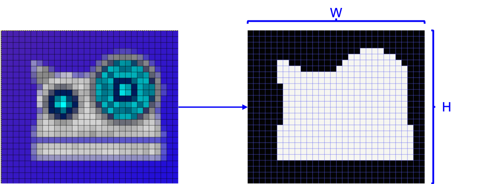
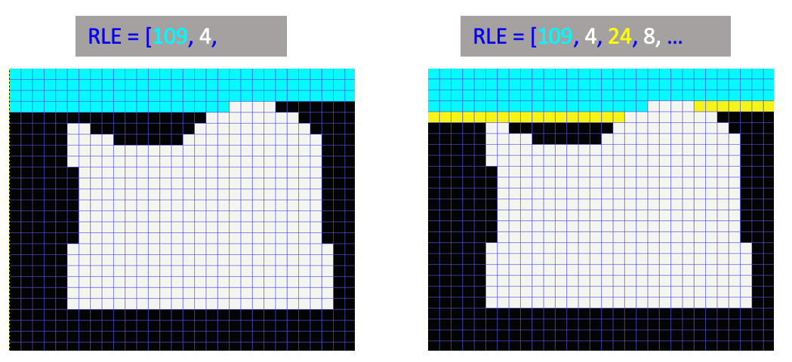

简体中文 | [English](./paddlevit-coco.md)

# PaddleViT 教程: 用于目标检测的COCO数据集
[COCO dataset](https://cocodataset.org/#home) 是计算机视觉领域中最流行的数据集之一，用于对各种视觉任务进行基准测试，例如目标检测、分割、关键点检测等。在本教程中，我们介绍了加载和处理COCO数据集以及进行目标检测的详细PaddleViT实现。我们将完成从使用`pycocotools`实现`CocoDataset`，到在`transforms`中应用于训练和评估的增强细节的实现。

本教程是开源项目[PaddleViT](../../)的一部分。

## Installation
需要安装pycocotools：

* pycocotools
    ```shell
    pip install pycocotools
    ```
## Download:
COCO数据集可以在[COCO official website](https://cocodataset.org/#download)下载。

请注意，对于目标检测，我们使用自2017年保持不变的`COCO2017`数据集。

在数据集中，有`118K`张图像用于训练，`5K`张图像用于验证。下载数据集后，目录中内容如下：

```
COCO dataset folder
├── annotations
│   ├── captions_train2017.json
│   ├── captions_val2017.json
│   ├── instances_train2017.json
│   ├── instances_val2017.json
│   ├── person_keypoints_train2017.json
│   └── person_keypoints_val2017.json
├── train2017
│   ├── 000000000009.jpg
│   ├── 000000000025.jpg
│   ├── 000000000030.jpg
│   ├── 000000000034.jpg
|   ...
└── val2017
    ├── 000000000139.jpg
    ├── 000000000285.jpg
    ├── 000000000632.jpg
    ├── 000000000724.jpg
    ...
```
## COCO Annotations:
本节中我们介绍了COCO标注的基础信息，在大多数情况下, COCO API 可以用于帮助我们从复杂的json注释文件中轻松访问数据和标签。更多详情请参考[官方文档](https://cocodataset.org/#format-data)。


例如`instances_train2017.json`的数据结构如下：

```json
{
    "info": {
        "description": "COCO 2017 Dataset",
        "url": "http://cocodataset.org",
        "version": "1.0",
        ...
    },
    "licenses": {
        {
            "url": "http://creativecommons.org/licenses/by-nc-sa/2.0/",
            "id": 1,
            "name": "Attribution-NonCommercial-ShareAlike License"
        },
        ...
    },
    "images": [
        {
            "license": 4,
            "file_name": "000000397133.jpg",
            "coco_url": "http://images.cocodataset.org/val2017/000000397133.jpg",
            "height": 427,
            "width": 640,
            "date_captured": "2013-11-14 17:02:52",
            "flickr_url": "http://farm7.staticflickr.com/6116/6255196340_da26cf2c9e_z.jpg",
            "id": 397133
        },
        ...
    ],
    "annotations": [
        {
            "segmentation": RLE or [polygon],
            "area": float,
            "iscrowd": 0 or 1,
            "image_id": int,
            "bbox": [x, y, width, height],
            "category_id": int,
            "id": int
        },
        ...
    ],
    "categories": [
        {
            "supercategory": str,
            "id": int,
            "name": str
        },
        ...
    ]
}
```

### `images`
`images`字段包含训练集的图像信息，如`filename`, `width`, `height`, 以及 `id`。其中， `id`对于每个图像都是唯一的，用于索引数据集中的图像数据。

### `categories` 
`categories`字段包含 class/label 名称作为字符串，每一个类别都分配了唯一的类别`id`以便于访问.

### `annotations`
`annotations`字段包含所有的**object instances**, 每一个实例都标有一系列注释。

> 注意：目标实例的数量通常大于图像的水昂，因为一张图像中通常有多个目标。 

每一个`annotation`都有以下字段：
#### -`id`
  * int, 实例 id, 每个注释都有唯一的id.
#### -`image_id`
  * int, 用于标识当前目标属于哪一张图像.
#### -`category_id`
  * int, 用于识别类别.
#### -`bbox`
  * [x, y, width, height], 边界框坐标.
  
    格式为 **[box top-left corner x, box top-left corner y, box width, box height]**. 请注意，[0,0]坐标是图像的左上角。
  
#### -`iscrowd`
  * 0 or 1, `iscrowd=1` 用于标记一大群人。
#### -`segmentation`
  * `RLE` or `[polygon]`, if `iscrowd=0`, return `[polygon]`.
    
     `[polygon]`是目标掩码的一组点，用于单个目标。格式为 `[x0, y0, x1, y1, x2, y2, ...]`.

     `RLE(Run Length Encoding)` 用于一组目标， `RLE` 格式为:
    ```json
    segmentation:
    {
        "counts": [179, 27, 392 ...],
        "size": [
            426,
            640,
        ]
    }
    ```
    RLE是一种用于表示每个像素属于前景还是背景的编码方式。 `size`存储图像的长度和高度。 `counts`连续存储前景或背景中的像素数量。

    例如，我们有以下图像和掩码：
    
    RLE编码对属于背景的像素数进行计数（从左上角开始，逐行），直到遇到前景像素，将这个数字存储在`counts`中，然后计算前景像素的数量并存储在`counts`中。
 
    


> 更加直观的视频说明详见[here](https://www.youtube.com/watch?v=h6s61a_pqfM).

在大多数情况下，我们在为模型创建训练数据集时无需担心注释格式。 `COCO API`为我们提供了一系列的api函数，方便我们获取任务的图像数据和目标标签。

## PaddleViT: COCODataset
COCO数据集有一个名为`pycocotools`的 python API，供用户轻松加载和使用COCO数据集进行检测、分割和其他cv任务。 在本节中，我们将基于 `pycocotools` 实现COCO检测数据集的PaddleViT实现，并用于训练和验证。


### `CocoDataset` Class
`CocoDataset` 类由 `paddle.io.Dataset` 类实现, 并需要两个函数 `__getitem__` 与 `__len__` , 即:
```python
class CocoDetection(paddle.io.Dataset):
    def __init__(self, image_folder, anno_file, transforms, return_mask):
        super().__init__()
        ...
    def __getitem__(self, idx):
        ...
    def __len__(self):
        ...
```

#### `__init__` method
在类的初始化方法中：
1. 通过调用pycocotools api加载coco数据集的anno文件。
2. 获取图像id并删除没有注释的图像。
3. 通过init参数设置数据转换（预处理器）。
4. 定义标签转换方法。（详情见下节）

```python
from pycocotools.coco import COCO
...
class CocoDataset():
    def __init__(self):
        super().__init__()
        # step1
        self.coco = COCO(anno_file)
        # step2
        ids = list(sorted(self.coco.imgs.keys()))
        self.ids = self._remove_images_without_annotations(ids)
        # step3
        self._transforms = transforms
        # step4
        self.prepare = ConvertCocoPolysToMasks(return_masks)
        self.root = img_folder
```


#### `__getitem__` method
`__getitem__`方法将索引作为输入，并输出包含单张图像及其目标标签的`(image, target)` 对。在coco检测中，这个目标是一个类似于以下形式的 `dict` :
```
target = {'image_id': image_id, 'annotations': target}
```
> `image_id` 是在coco注释中相同的图像id.

> `target` 是键值对的字典，例如 `bbox` 和 `mask`. （英文版单词拼写错误）

`__getitem__` 方法定义：
1. 使用COCO API加载指定的图像及其标签
2. 转换标签（如将掩码从多边形转换为掩码数组）
3. 输入数据的预处理转换

```python
def __getitem__(self, idx):
    image_id = self.ids[idx]
    image = self._load_image(image_id)
    target = self._load_target(image_id)
    target = {'image_id': image_id, 'annotations': target}

    image, target = self.prepare(image, target)
    if self._transform is not None:
        image, target = self._transform(image, target)
    return image, target
```


#### `__len__` method
返回数据集中的样本数，与`ids`长度相同：

```python
def __len__(self):
    return len(self.ids)
```


#### `_load_image`, `_load_target` methods
`PIL.Image` 和 `COCO API` 用于根据给定索引获取图像数据和原始目标标签.
```python
def _load_image(self, idx):
    """ Return PIL Image (RGB) according to COCO image id"""
    path = self.coco.loadImgs(idx)[0]['file_name']
    return Image.open(os.path.join(self.root, path)).convert('RGB')
  
def _load_target(self, idx):
    """ Return image annos according to COCO image id"""
    return self.coco.loadAnns(self.coco.getAnnIds(idx))
```
   
### `ConvertCocoPolysToMasks` Class
该类定义了以图像和标签为输入并输出图像数组和处理后的标签。
This class defines class calls that takes image and label as input and outputs image array and processed labels.

专门对于目标标签的处理：
1. 去掉`iscrowd=1`的图像；
2. 将`[x1, y1, x2, y2]`中的包围框转换为numpy数组类型，然后根据包围框裁剪图像；
3. 将类标签转换为numpy数组；
4. 如果返回掩码（对于分割任务），使用coco api将多边形数据转换为掩码数组；
5. 如果返回关键点（用于关键点检测），则将关键点加载到数组中；
6. 消除面积为0的包围框；
7. 将处理后的标签保存在`target`字典中。

> 注意：我们使用numpy数组而不是paddle张量，因为当前paddlepaddle可能会在使用GPU张量的数据压缩中引起错误。

详细的实现可以在源代码中找到[here](https://github.com/BR-IDL/PaddleViT/blob/5ba4761845f06f66ba3a89907e0769e1850bcab2/object_detection/DETR/coco.py#L117).

### `Transforms` Module
在转换模块(`transforms.py`)中定义了多种数据压缩方法。 定义我们自己的模块而不是使用paddle视觉转换的原因是，每个数据变换都必须应用于图像数据集其目标标签，例如bbox和掩码。假设在训练期间对图像数据应用类随机裁剪操作，则该图像中的bbox必需应用相同的裁剪。

#### Validation transforms
DETR 的验证转换具有以下操作：
* `RandomResize()`: 将图像和标签调整为具有相同比例的特定大小。
* `ToTensor()`: 将图像数据转换为 `paddle.Tensor`
* `Normalize()`: 均值$-mean$和$/std$

#### Training transforms
DETR的训练转换具有以下操作：

* `RandomHorizontalFlip()` 随机水平翻转数据。
* `RandomSelect()` 随机选择两个子操作之一： (1) 一个单个 `RandomResize` 步骤; (2) 一个 三步骤操作: `RandomReize`, `RandomSizeCrop`, 以及 `RandomResize`
* `ToTensor()`: 将图像数据转换为 `paddle.Tensor`
* `Normalize()`: 图像数据标准化， $-mean$ 和 $/std$

#### `RandomHorizontalFlip()`
此变换需要初始化参数中的概率用来控制是否应用反转的随机性。

```
class RandomHorizontalFlip():
    def __init__(self, p=0.5):
        self.p = p

    def __call__(self, image, target):
        if random.random() < self.p:
            return hflip(image, target)
        return image, target
```

`hflip` 方法定义了图像和目标（包含包围框和盐吗的真实标注值的字典）的水平翻转操作。

#### `RandomSelect()`
`RandomSelect()`有一个prob值控制选择它的两个子操作之一的随机性。
```python
class RandomSelect():
    """ Random select one the transforms to apply with probablity p"""
    def __init__(self, transforms1, transforms2, p=0.5):
        self.transforms1 = transforms1
        self.transforms2 = transforms2
        self.p = p

    def __call__(self, image, target):
        if random.random() > self.p:
            return self.transforms1(image, target)
        return self.transforms2(image, target)
 ```

两个转换操作在DETR训练中使用：
 - `RandomResize()`
 - `RandomResize()` + `RandomSizeCrop()` + `RandomResize()`


#### `RandomResize()`
`RandomResize`有两个参数：`sizes` 和 `max_size`. 该方法随机选择`sizes`中的一个值作为图像短边的目标尺寸，同时保持图像的比例不变。但是，如果图像的长边大于`max_size`（当使用所选尺寸作为短边时），则将图像的长边设置为`max_size`，而较短的尺寸需要重新计算以保持图像长宽比例不变。

必须在bbox和掩码使用相同的尺寸调整操作。 通过乘以高度和宽度的比例可以转换包围框。可以通过插值和二值化来转换掩码以获得缩放掩码（如果 values > 0.5则设置为1，否则设置为0）。

#### `RandomSizeCrop()`
`RandomSizeCrop` 将`min_size`和`max_size` 作为输入，然后将裁减图像中的随机区域作为输出。输出区域的尺寸为 `[randint(min_size, max_size), randint(min_size, max_size)]`.

`RandomSizeCrop` 分为三个步骤实现:
* STEP1: 给定 `min_size`, `max_size` 和原始图像尺寸，生成随机图像宽度和图像高度。
* STEP2: 给定裁剪后的图像大小，随机选择图像内裁减区域的位置。这个区域可以用 `[top, left, height, width]`表示.
* STEP3: 给定裁剪区域，裁剪图像和目标的标签，例如 包围框和掩码.

具体来说，我们实现了一个`crop`方法，其输入(1)在`[top, left, height, width]`中的裁剪区域，(2) 原始图像 以及 (3) 目标标签，然后返回裁剪后的图像和裁剪后的标签。请注意，在裁剪之后，原始包围框或者掩码也会被裁剪，甚至在裁剪后的图像中看不到，因此，我们必须从目标标签中消除那些无效的框和掩吗。

#### `ToTensor()`
`ToTensor` 将图像数据从PIL.Image转换为paddle.Tensor, 返回图像张量和相应的标签，通过以下方式可以实现：
```python
import paddle.vision.transforms as T
class ToTensor:
    def __call__(self, image, target):
        return T.to_tensor(image), target
```

#### `Normalize()`
在 `Normalize`方法中, 除了数据归一化(-mean & /std), 我们还将包围框从 `[x0, y0, x1, y1]` 归一化为 `[cx, cy, w, h]`, 根据图像尺寸归一化为相对坐标. 实现方式如下:
```python
class Normalize():
    def __init__(self, mean, std):
        self.mean = mean
        self.std = std

    def __call__(self, image, target=None):
        # -mean, / std
        image = T.functional.normalize(image, mean=self.mean, std=self.std)
        if target is None:
            return image, None
        target = target.copy()
        # from xyxy -> cxcywh -> relative coords
        h, w = image.shape[-2:]
        if 'boxes' in target and target['boxes'].shape[0] != 0:
            boxes = target['boxes']
            boxes = box_xyxy_to_cxcywh_numpy(boxes)
            boxes = boxes / np.array([w, h, w, h], dtype='float32')
            target['boxes'] = boxes

        return image, target
```
