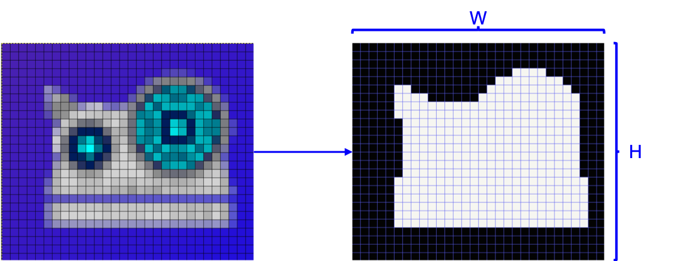
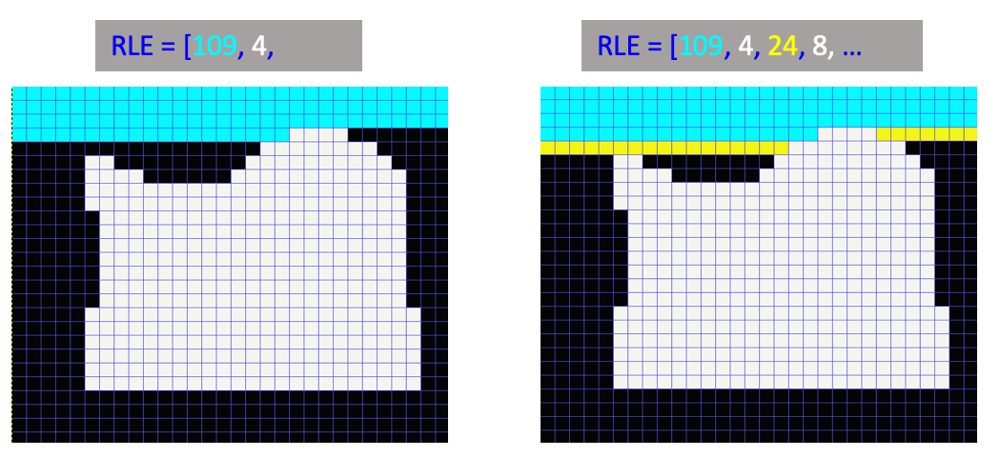

# PaddleViT Tutorial: COCO Datast for Object Detection
[COCO dataset](https://cocodataset.org/#home) is one of the most popular datasets in computer vision community for benchmarking a variety of vision tasks such as object detection, segmentation, and keypoint detection, etc. In this tutorial, we present the detailed PaddleViT implementations of loading and processing COCO dataset for object detection. We will go through the whole procedures from implementing our `CocoDataset` by utilizing `pycocotools`, to the augmentation details that applied for both training and evaluation in `transforms`.

This tutorial is part of the open source project [PaddleViT](../../).


## Installation
It is required to install the following package:
* pycocotools
    ```shell
    pip install pycocotools
    ```
## Download:
The COCO dataset can be downloaded from [COCO official website](https://cocodataset.org/#download).

Note that for object detection, we are using the socalled `COCO2017` dataset which stayed unchanged since 2017. 

In the dataset, there are 118K (`118,287`) images used for training and 5K (`5,000`) images for validation. Once the dataset is downloaded, you should have the following directories:

```
COCO dataset folder
├── annotations
│   ├── captions_train2017.json
│   ├── captions_val2017.json
│   ├── instances_train2017.json
│   ├── instances_val2017.json
│   ├── person_keypoints_train2017.json
│   └── person_keypoints_val2017.json
├── train2017
│   ├── 000000000009.jpg
│   ├── 000000000025.jpg
│   ├── 000000000030.jpg
│   ├── 000000000034.jpg
|   ...
└── val2017
    ├── 000000000139.jpg
    ├── 000000000285.jpg
    ├── 000000000632.jpg
    ├── 000000000724.jpg
    ...
```
## COCO Annotations:
We are preseting the basics of the COCO annotations in this section, since in most cases the COCO API is used to help us easily access the data and labels from the complex json annotation files. More details please refer to the [official documentation](https://cocodataset.org/#format-data).

For example, the data structure of `instances_train2017.json` is as follows:
```json
{
    "info": {
        "description": "COCO 2017 Dataset",
        "url": "http://cocodataset.org",
        "version": "1.0",
        ...
    },
    "licenses": {
        {
            "url": "http://creativecommons.org/licenses/by-nc-sa/2.0/",
            "id": 1,
            "name": "Attribution-NonCommercial-ShareAlike License"
        },
        ...
    },
    "images": [
        {
            "license": 4,
            "file_name": "000000397133.jpg",
            "coco_url": "http://images.cocodataset.org/val2017/000000397133.jpg",
            "height": 427,
            "width": 640,
            "date_captured": "2013-11-14 17:02:52",
            "flickr_url": "http://farm7.staticflickr.com/6116/6255196340_da26cf2c9e_z.jpg",
            "id": 397133
        },
        ...
    ],
    "annotations": [
        {
            "segmentation": RLE or [polygon],
            "area": float,
            "iscrowd": 0 or 1,
            "image_id": int,
            "bbox": [x, y, width, height],
            "category_id": int,
            "id": int
        },
        ...
    ],
    "categories": [
        {
            "supercategory": str,
            "id": int,
            "name": str
        },
        ...
    ]
}
```

### `images`
`images` field contains the image information of the training set, such as `filename`, `width`, `height`, and `id`. The `id` is unique for each image and is used to index the image data from the dataset.

### `categories` 
`categories` field contains the class/label names as strings. Each category is assigned a unique category `id` for easy access.

### `annotations`
`annotations` field contains all the **object instances**, each labeled with a series of annotations.
> Note that the number of object instances is usually much larger than the number of images, since there are often multple objects in one image.

Each `annotation` has the following fields:
#### -`id`
  * int, the instance id, each annotation has one unique id.
#### -`image_id`
  * int, is used to indentify which image the current object belongs to.
#### -`category_id`
  * int, is used to identify the category
#### -`bbox`
  * [x, y, width, height], the bounding box coordinates.
  
    The format is **[box top-left corner x, box top-left corner y, box width, box height]**. Note that the [0, 0] coordinates is the top-left corner of the image.
#### -`iscrowd`
  * 0 or 1, `iscrowd=1` is used to label large groups of people.
#### -`segmentation`
  * `RLE` or `[polygon]`, if `iscrowd=0`, return `[polygon]`.
    
    The `[polygon]` is a set of points for the object mask, used for single object. The format is `[x0, y0, x1, y1, x2, y2, ...]`.

    The `RLE(Run Length Encoding)` is , used for group of objects. `RLE` fields looks like:
    ```json
    segmentation:
    {
        "counts": [179, 27, 392 ...],
        "size": [
            426,
            640,
        ]
    }
    ```
    RLE is an encoding scheme used to represent if each pixel belongs to either foreground or background. The `size` field stores the width and height of the image. The `counts` fields stores the number of pixels in either foreground or background continuously. 
    
    For example, we have the following image and the target mask:
    
    The RLE encoding counts the number of pixels belongs to background (from top-left corner, row by row), until meets the foreground pixel. This number is stored in `counts`, then the number of foreground pixels are counted and stored in the `counts`:
    


> An intuitive illustration of coco annotation can be found in YouTube video [here](https://www.youtube.com/watch?v=h6s61a_pqfM).

In most cases, we do not need to worry about the annotation format when we are creating the training dataset for our model. The `COCO API` provides a series of api functions for us to easily obtain the image data and the target labels for our task.

## PaddleViT: COCODataset
COCO dataset has a public python API named `pycocotools` for users to easily load and use COCO dataset for detection, segmentation and other cv tasks. In this section, we will go through the PaddleViT implementation of COCO detection dataset by utilizing the `pycocotools` for both training and validation.

### `CocoDataset` Class
`CocoDataset` class is created which implements `paddle.io.Dataset` class, two method `__getitem__` and `__len__` are required, i.e.:
```python
class CocoDetection(paddle.io.Dataset):
    def __init__(self, image_folder, anno_file, transforms, return_mask):
        super().__init__()
        ...
    def __getitem__(self, idx):
        ...
    def __len__(self):
        ...
```

#### `__init__` method
In the class init method:
1. Load the anno file of coco dataset, by calling pycocotools api.
2. Obtain image ids and remove those without annotations.
3. Set data transforms (preprocessor) by init argument (we discuss this part in next section).
4. Define labeling conversion methods. (details in next sections)
```python
from pycocotools.coco import COCO
...
class CocoDataset():
    def __init__(self):
        super().__init__()
        # step1
        self.coco = COCO(anno_file)
        # step2
        ids = list(sorted(self.coco.imgs.keys()))
        self.ids = self._remove_images_without_annotations(ids)
        # step3
        self._transforms = transforms
        # step4
        self.prepare = ConvertCocoPolysToMasks(return_masks)
        self.root = img_folder
```


#### `__getitem__` method
`__getitem__` method takes an index as input and outputs an `(image, target)` pair which contains a single image data and its target labels. In coco detection, this target is a `dict` similar to:
```
target = {'image_id': image_id, 'annotations': target}
```
`image_id` is the same image id in coco annotations.
`targe` is a dict of keys-value pairs such as `bbox` and `mask`.

The `__getitem__` method defines:
1. loads the specified image and its labels using COCO API
2. convert the labels (such as convert the mask from polygon to mask array)
3. feed into the transforms for data preprocessing

```python
def __getitem__(self, idx):
    image_id = self.ids[idx]
    image = self._load_image(image_id)
    target = self._load_target(image_id)
    target = {'image_id': image_id, 'annotations': target}

    image, target = self.prepare(image, target)
    if self._transform is not None:
        image, target = self._transform(image, target)
    return image, target
```


#### `__len__` method
Return the number of samples in the dataset, which is the same as the length of `ids`:
```python
def __len__(self):
    return len(self.ids)
```


#### `_load_image`, `_load_target` methods
`PIL.Image` and `COCO API` is used to obtain image data and the original target labels, given the index.
```python
def _load_image(self, idx):
    """ Return PIL Image (RGB) according to COCO image id"""
    path = self.coco.loadImgs(idx)[0]['file_name']
    return Image.open(os.path.join(self.root, path)).convert('RGB')
  
def _load_target(self, idx):
    """ Return image annos according to COCO image id"""
    return self.coco.loadAnns(self.coco.getAnnIds(idx))
```
   
### `ConvertCocoPolysToMasks` Class
This class defines class calls that takes image and label as input and outputs image array and processed labels.

Specifically for the target labels:
1. Eliminate the images that `iscrowd=1`
2. Convert the bboxes in `[x1, y1, x2, y2]` as type numpy ndarray, then clip the bbox inside the image
3. Convert the class labels to numpy ndarray
4. If returns mask (for segmentation), convert the polygon data into mask array by using coco api.
5. If returns keypoints (for keypoint detection), load the keypoints into ndarray.
6. Eliminate the boxes which areas are 0
7. Save the processed labels in `target` dict.

> Note: we are using numpy ndarray instead of paddle tensor because current paddlepaddle may raise errors in data propressing using GPU tensors.

Detailed implementations are available in the source code [here](https://github.com/BR-IDL/PaddleViT/blob/5ba4761845f06f66ba3a89907e0769e1850bcab2/object_detection/DETR/coco.py#L117).

### `Transforms` Module
Multiple data propressing methods are defined in transforms module (`transforms.py`). The reason of defining our own module instead of using paddle vision transforms is that each data transform must be applied on both the image data and its target labels such as bbox and mask. Assume a random crop op is applied on image data during the training, the bboxes in this image must apply the same cropping.

#### Validation transforms
Validation transforms for DETR has the following ops:
* `RandomResize()`: resize the image and labels to certrain size with same aspect ratio.
* `ToTensor()`: convert the image data into `paddle.Tensor`
* `Normalize()`: $-mean$ and $/std$

#### Training transforms
Training transforms for DETR has the following ops:

* `RandomHorizontalFlip()` that randomly flip the data horizontally.
* `RandomSelect()` that randomly selects one of two its sub operations: (1) a single `RandomResize` step; (2) a 3-step op: `RandomReize`, `RandomSizeCrop`, and `RandomResize`
* `ToTensor()`: convert the image data into `paddle.Tensor`
* `Normalize()`: image data normalization, $-mean$ and $/std$

#### `RandomHorizontalFlip()`
This transform takes a probability as init argument controls the randomness of applying flip or not. 
```
class RandomHorizontalFlip():
    def __init__(self, p=0.5):
        self.p = p

    def __call__(self, image, target):
        if random.random() < self.p:
            return hflip(image, target)
        return image, target
```
The `hflip` method defines the horizontal flip operation for both the image and the target (dict contains the ground truth such as bounding boxes and masks).

#### `RandomSelect()`
`RandomSelect()` has a prob value controls the randomness of which one of its two sub op is selected.
```python
class RandomSelect():
    """ Random select one the transforms to apply with probablity p"""
    def __init__(self, transforms1, transforms2, p=0.5):
        self.transforms1 = transforms1
        self.transforms2 = transforms2
        self.p = p

    def __call__(self, image, target):
        if random.random() > self.p:
            return self.transforms1(image, target)
        return self.transforms2(image, target)
 ```

 Two transform ops are used in DETR training:
 - `RandomResize()`
 - `RandomResize()` + `RandomSizeCrop()` + `RandomResize()`


#### `RandomResize()`
`RandomResize` takes two arguments: `sizes` and `max_size`. The method randomly select one of the value in `sizes` as the target size of the **shorter side** of the image, while keep the aspect ratio unchanged. However, if the **longer side** of the image is larger then the `max_size` (when using the selected size as the shorter side), the longer side of the image is set as the `max_size` while the shorter size is re-calculated (not the selected size) to keep the image aspect ratio unchanged.

The same resize op must be applied to the bboxes and masks. The boxes can be converted by multiplying the height and width scale ratios. The masks can be converted by an interpolation and binarization (where values > 0.5 are set to 1 otherwise 0) to get the scaled masks.


#### `RandomSizeCrop()`
`RandomSizeCrop` takes `min_size` and `max_size` as inputs,  then a random region within the image is cropped as the output. This region is of size `[randint(min_size, max_size), randint(min_size, max_size)]`.

`RandomSizeCrop` is implemented in 3 steps:
* STEP1: Generate random image width and image height given `min_size`, `max_size` and original image size.
* STEP2: Given the cropped image size, randomly select the position of the crop region within the image. This region can be represented by `[top, left, height, width]`.
* STEP3: Given the cropped region, crop the image and the target labels, such as bboxes and masks.

Specifically, we implement a `crop` method with its inputs (1) cropped region in `[top, left, height, width]`, (2) original image and (3) target labels, and returns the cropped image and cropped labels. Note that after the crop, the original boxes or masks will also be cropped or even unseen in the cropped image, therefore we have to eliminate those invalid boxes and masks from the target labels.

#### `ToTensor()`
`ToTensor` converts the image data from PIL.Image to paddle.Tensor, returns the image tensor and the corresponding labels. It can be easily implemented like:
```python
import paddle.vision.transforms as T
class ToTensor:
    def __call__(self, image, target):
        return T.to_tensor(image), target
```

#### `Normalize()`
In `Normalize` method, besides the data nomalization (-mean & /std), we also normalize the bboxes from `[x0, y0, x1, y1]` to `[cx, cy, w, h]`, and rescale to the relative coordinates according to the image size. Specifically:
```python
class Normalize():
    def __init__(self, mean, std):
        self.mean = mean
        self.std = std

    def __call__(self, image, target=None):
        # -mean, / std
        image = T.functional.normalize(image, mean=self.mean, std=self.std)
        if target is None:
            return image, None
        target = target.copy()
        # from xyxy -> cxcywh -> relative coords
        h, w = image.shape[-2:]
        if 'boxes' in target and target['boxes'].shape[0] != 0:
            boxes = target['boxes']
            boxes = box_xyxy_to_cxcywh_numpy(boxes)
            boxes = boxes / np.array([w, h, w, h], dtype='float32')
            target['boxes'] = boxes

        return image, target
```
