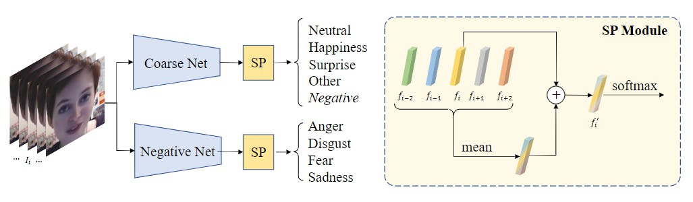

# Coarse-to-Fine Cascaded Networks with Smooth Predicting for Video Facial Expression Recognition, [arxiv](https://arxiv.org/abs/2203.13052)

Offical PaddlePaddle training/validation code and pretrained models for facial expression recognition from "Coarse-to-Fine Cascaded Networks with Smooth Predicting for Video Facial Expression Recognition".

This implementation contains the code and model weights for our soluiton for [**CVPR 2022: 3rd Workshop and Competition on Affective Behavior Analysis in-the-wild (ABAW)**](https://ibug.doc.ic.ac.uk/resources/cvpr-2022-3rd-abaw/)

We (team *AlphaAff*) got the **3rd winner** in thie competition in track **"Expression Classification Challenge"** ([Leaderboard](https://drive.google.com/file/d/1v3XBE97HDhKiq0gxqmjf0ym4t3KIE6v6/view?usp=sharing)).

This implementation is developed by [PaddleViT](https://github.com/BR-IDL/PaddleViT.git).


<p align="center">

<h4 align="center">Model Overview</h4>
</p>

### Update
- Update (2022.04.28): Code is released and weights are uploaded.

## Abstract
We propose a coarse-to-fine cascaded network with smooth predicting (CFC-SP)  to perform video facial expression recognition in the 3rd ABAW Competition.

CFC-SP contains two core components, namely Coarse-to-Fine Cascaded networks (CFC) and Smooth Predicting (SP). For CFC, it first groups several similar emotions to form a rough category, and then employs a network to conduct a coarse but accurate classification. Later, an additional network for these grouped emotions is further used to obtain fine-grained predictions.  For SP, it improves the recognition capability of the model by capturing both universal and unique expression features. To be specific, the universal features denote the general characteristic of facial emotions within a period and the unique features denote the specific characteristic at this moment.


## Models Zoo
| Model                         | Acc@1 | Image Size | Crop_pct | Interpolation | Link         |
|-------------------------------|-------|------------|----------|---------------|--------------|
| ABAW3_SwinS_Coarse  | 57.96 | 224 | 1.0 | bicubic | [google](https://drive.google.com/file/d/1Z6BrkDEMZU3KVDDwKmkkcwqN7QhFJZAv/view?usp=sharing)/[baidu](https://pan.baidu.com/s/12fxVGKXEJ8gQVWutPBcMRA?pwd=a2ic)
| ABAW3_SwinS_Negative| 60.17 | 224 | 1.0 | bicubic | [google](https://drive.google.com/file/d/1QsiDtulK9Ve7a_37RHyVW2XwTExvubPR/view?usp=sharing)/[baidu](https://pan.baidu.com/s/1dsZQW8RG9Dr5b3iNyIy7Cw?pwd=prhw) 

> *The results are evaluated on validation set.

> For coarse model, the labels of all validation images are converted to our "coarse" setting. 
> For negative model, the labels of all validation images are converted to our "negative" setting. 

The final results of validation set is computed by use the two models together, more details can be found in our paper ([arxiv](https://arxiv.org/abs/2203.13052)). 
## Coase to fine setting
The original expression labels in the dataset are:
```python
  class_names_original = ['Neutral', 'Anger', 'Disgust', 'Fear', 'Happiness', 'Sadness', 'Surprise', 'Other']
```
To construct the coarse-to-fine cascaded network for face expression recognition, we split the dataset into 2 levels: **coarse** and **negative**.

Specifically, the **coarse** level contains the experssions:
```python
class_names_coarse = ['Neutral', 'Happiness', 'Surprise', 'Other', 'Negative']
```
where we fold the 'negative' experessions as one class in this setting.

Then the **negative** level contains the experessions:
```python
 class_names_negative = ['Anger', 'Disgust', 'Fear', 'Sadness']
```

The final prediction is conducted by apllying the two models which are trained based on these coarse and fine levels.

## Data Preprocessing

- We first use the [FFmpeg](https://ffmpeg.org/) to extract raw frames from videos. 
- The MTCNN is then adopted to detect and align faces in the frames.
- All the aligned face images are then resized to `224x224`.

We eliminated the frames where the face detection failed and the remained cropped and aligned face images are used as the training and validation set, respectively.

## Data organization

[Aff-Wild2](https://ibug.doc.ic.ac.uk/resources/aff-wild2/) dataset is used and the cropped and aligned images are in the following file structure:
```
├── aligned_dataset
│   ├── 100-29-1080x1920
│   │   ├── 00001.jpg
│   │   ├── 00002.jpg
│   │   ├── 00003.jpg
│   │   ├── ...
│   ├── 101-30-1080x1920
│   │   ├── 00001.jpg
│   │   ├── 00002.jpg
│   │   ├── 00003.jpg
│   │   ├── ...
│   ├── 102
│   │   ├── 00001.jpg
│   │   ├── 00002.jpg
│   │   ├── 00003.jpg
│   │   ├── ...
...
```

## Evaluation
To evaluate the mode preformance on Aff-Wild2 dataset, run the following script using command line:
```shell
sh run_eval_multi_coarse.sh  # evaluate coarse setting performance
sh run_eval_multi_negative.sh  # evaluate negative setting performance
```
> You need to change the related file paths or gpu numbers in the script.

## Training
To train the model, run the following script using command line:
```shell
sh run_train_multi_coarse.sh  # coarse setting
sh run_train_multi_negative.sh  # negative setting
```

The detailed scrip is:
```shell
GLOG_v=0 python3 -m paddle.distributed.launch --gpus="0,1,2,3" \
   main_multi_gpu.py \
   -cfg="./swin_small_patch4_window7_224.yaml" \
   -dataset="ABAW" \
   -batch_size=128 \
   -data_folder="./dataset/aligned" \
   -anno_folder="./dataset/EXPR_Classification_Challenge/" \
   -class_type="negative" \  # change to "coarse" for coarse setting
   -pretrained="./Swin-S-MS1M-Epoch_17.pdparams"
   -amp
```

> The pretrained model weight can be downloaded here: [google](https://drive.google.com/file/d/1Bsd3eLnOcawKC6XRUez3ksWAkRL6jvx3/view?usp=sharing)/[baidu](https://pan.baidu.com/s/1RCVNx0xstTbvlfSCKnYZsQ?pwd=fp9c)


## Reference

```
@article{xue2022coarse,
  title={Coarse-to-Fine Cascaded Networks with Smooth Predicting for Video Facial Expression Recognition},
  author={Xue, Fanglei and Tan, Zichang and Zhu, Yu and Ma, Zhongsong and Guo, Guodong},
  journal={arXiv preprint arXiv:2203.13052},
  year={2022}
}
```


