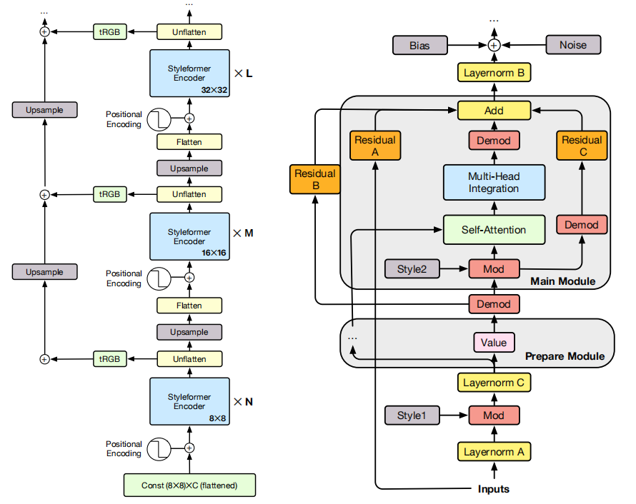

# Styleformer: Transformer based Generative Adversarial Networks with Style Vector, [arxiv](https://arxiv.org/abs/2106.07023v2) 

PaddlePaddle training/validation code and pretrained models for **Styleformer**.

The official pytorch implementation is [here](https://github.com/Jeeseung-Park/Styleformer).

This implementation is developed by [PPViT](https://github.com/xperzy/PPViT/tree/master).



<figcaption align = "center">Styleformer Model Overview</figcaption>

### Update 
Update (2021-08-17): Code is released and ported weights are uploaded.

## Models Zoo
| Model                          | FID | Image Size | Crop_pct | Interpolation | Link        |
|--------------------------------|-----|------------|----------|---------------|--------------|
| styleformer_cifar10            |2.82 | 32         | 1.0      | lanczos       | [google](https://drive.google.com/file/d/1T2RF5P232Jdbmy7OVfOq9hIQg7Nd1M0_/view?usp=sharing)/[baidu](https://pan.baidu.com/s/1B8pmQdjpxf1mNWum8kwLiw)(il2u) |
| styleformer_stl10              |15.17| 48         | 1.0      | lanczos       | [google](https://drive.google.com/file/d/1yp2b1BQuraSxPqFbts2T5_PYI4gjkcVt/view?usp=sharing)/[baidu](https://pan.baidu.com/s/1K3PdG4BTun1vaO82ghB_aw)(z2t0) |
| styleformer_celeba             |3.66 | 64         | 1.0      | lanczos       | [google](https://drive.google.com/file/d/1yR-i-l3OXyf1E4e7tolAIegKqLumc6h-/view?usp=sharing)/[baidu](https://pan.baidu.com/s/13vuTVWegq3wd81p80bfwHg)(v873) |
| styleformer_lsun               |7.99 | 128        | 1.0      | lanczos       | [google](https://drive.google.com/file/d/1S95NxEtTkBm7C1tWt2WaBEo09cV5F96b/view?usp=sharing)/[baidu](https://pan.baidu.com/s/1zCP7tBDa7lcESINdA_3Onw)(9i1s) |
> *The results are evaluated on Cifar10, STL10, Celeba and LSUNchurch dataset.
## Notebooks
We provide a few notebooks in aistudio to help you get started:

**\*(coming soon)\***


## Requirements
- Python>=3.6
- yaml>=0.2.5
- lmdb>=1.2.1
- [PaddlePaddle](https://www.paddlepaddle.org.cn/documentation/docs/en/install/index_en.html)>=2.1.0
- [yacs](https://github.com/rbgirshick/yacs)>=0.1.8

## Data 
STL10, Celeba and LSUNchurch dataset is used in the following folder structure:
```
│STL10/
├── train_X.bin
│── train_y.bin
├── test_X.bin
│── test_y.bin
│── unlabeled.bin
```
```
│Celeba/
├──img_align_celeba/
│  ├── 000017.jpg
│  │── 000019.jpg
│  ├── 000026.jpg
│  │── unlabeled.bin
│  │── ......
```
```
│LSUNchurch/
├──church_outdoor_train_lmdb/
│  ├── data.mdb
│  │── lock.mdb
```

## Usage
To use the model with pretrained weights, download the `.pdparam` weight file and change related file paths in the following python scripts. The model config files are located in `./configs/`.

For example, assume the downloaded weight file is stored in `./cifar10.pdparams`, to use the `styleformer_cifar10` model in python:
```python
from config import get_config
from generator import Generator
# config files in ./configs/
config = get_config('./configs/styleformer_cifar10.yaml')
# build model
model = Generator(config)
# load pretrained weights, .pdparams is NOT needed
model_state_dict = paddle.load('./cifar10')
model.set_dict(model_state_dict)
```

## Evaluation
To evaluate Styleformer model performance on Cifar10 with a single GPU, run the following script using command line:
```shell
sh run_eval.sh
```
or
```shell
CUDA_VISIBLE_DEVICES=0 \
python main_single_gpu.py \
    -cfg='./configs/styleformer_cifar10.yaml' \
    -dataset='cifar10' \
    -batch_size=32 \
    -eval \
    -pretrained='./cifar10'
```

<details>

<summary>
Run evaluation using multi-GPUs:
</summary>


```shell
sh run_eval_multi.sh
```
or
```shell
CUDA_VISIBLE_DEVICES=0,1,2,3 \
python main_single_gpu.py \
    -cfg='./configs/styleformer_cifar10.yaml' \
    -dataset='cifar10' \
    -batch_size=32 \
    -eval \
    -pretrained='./cifar10'
```

</details>


## Training
To train the Styleformer Transformer model on Cifar10 with single GPU, run the following script using command line:
```shell
sh run_train.sh
```
or
```shell
CUDA_VISIBLE_DEVICES=0 \
python main_single_gpu.py \
    -cfg='./configs/styleformer_cifar10.yaml' \
    -dataset='cifar10' \
    -batch_size=32 \
    -pretrained='./cifar10'
```

<details>

<summary>
Run training using multi-GPUs:
</summary>


```shell
sh run_train_multi.sh
```
or
```shell
CUDA_VISIBLE_DEVICES=0,1,2,3,4,5,6,7 \
python main_single_gpu.py \
    -cfg='./configs/styleformer_cifar10.yaml' \
    -dataset='cifar10' \
    -batch_size=32 \
    -pretrained='./cifar10'
```

</details>


## Visualization Generate Image When Training
**(coming soon)**

## Reference
```
@article{park2021styleformer,
      title={Styleformer: Transformer based Generative Adversarial Networks with Style Vector}, 
      author={Jeeseung Park and Younggeun Kim},
      year={2021},
      eprint={2106.07023},
      archivePrefix={arXiv},
      primaryClass={cs.CV}
}
```
