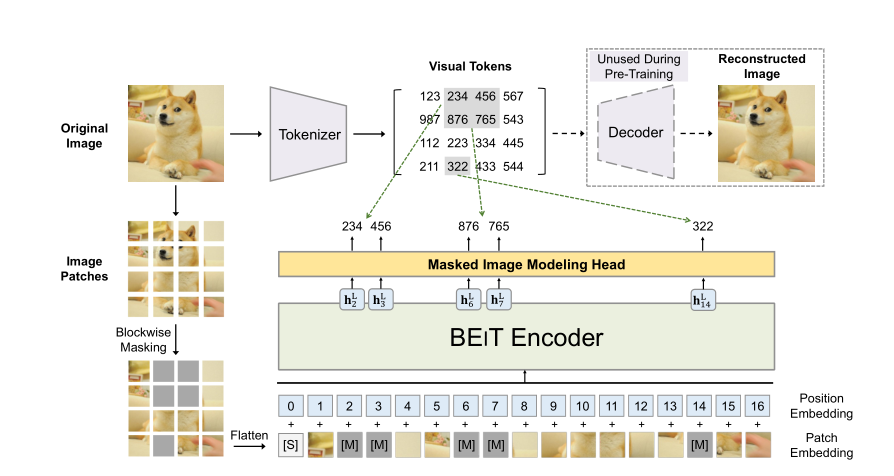

# BEiT: BERT Pre-Training of Image Transformers, [arxiv](https://arxiv.org/abs/2106.08254) 

PaddlePaddle training/validation code and pretrained models for **BEiT**.

The official and 3rd party pytorch implementation are [here](https://github.com/microsoft/unilm/tree/master/beit).


This implementation is developed by [PaddleViT](https://github.com/BR-IDL/PaddleViT).

<p align="center">

<h4 align="center">BEiT Model Overview</h4>
</p>


### Update 
- Update (2021-10-19): Bug fix and weights links are updated.
- Update (2021-09-27): Code is released and ported weights are uploaded.

## Models Zoo

| Model                         | Acc@1 | Acc@5 | #Params | FLOPs  | Image Size | Crop_pct | Interpolation | Link         |
|-------------------------------|-------|-------|---------|--------|------------|----------|---------------|--------------|
| beit_base_patch16_224   | 85.21 | 97.66 | 87M    | 12.7G   | 224        | 0.9      | bicubic       | [google](https://drive.google.com/file/d/1lq5NeQRDHkIQi7U61OidaLhNsXTWfh_Z/view?usp=sharing)/[baidu](https://pan.baidu.com/s/1pjblqaESqfXVrpgo58oR6Q)(fshn) |
| beit_base_patch16_384   | 86.81 | 98.14 | 87M    | 37.3G   | 384        | 1.0      | bicubic       | [google](https://drive.google.com/file/d/1wn2NS7kUdlERkzWEDeyZKmcRbmWL7TR2/view?usp=sharing)/[baidu](https://pan.baidu.com/s/1WVbNjxuIUh514pKAgZZEzg)(arvc) |
| beit_large_patch16_224  | 87.48 | 98.30 | 304M   | 45.0G   | 224        | 0.9      | bicubic       | [google](https://drive.google.com/file/d/11OR1FKxzfafqT7GzTW225nIQjxmGSbCm/view?usp=sharing)/[baidu](https://pan.baidu.com/s/1bvhERVXN2TyRcRJFzg7sIA)(2ya2) |
| beit_large_patch16_384  | 88.40 | 98.60 | 304M   | 131.7G  | 384        | 1.0      | bicubic       | [google](https://drive.google.com/file/d/10EraafYS8CRpEshxClOmE2S1eFCULF1Y/view?usp=sharing)/[baidu](https://pan.baidu.com/s/1H76G2CGLY3YmmYt4-suoRA)(qtrn) |
| beit_large_patch16_512  | 88.60 | 98.66 | 304M   | 234.0G  | 512        | 1.0      | bicubic       | [google](https://drive.google.com/file/d/1xIIocftsB1PcDHZttPqLdrJ-G4Tyfrs-/view?usp=sharing)/[baidu](https://pan.baidu.com/s/1WtTVK_Wvg-izaF0M6Gzw-Q)(567v) |


> *The results are evaluated on ImageNet2012 validation set.
>
> *These models have been fine-tuned (ImageNet 22k -> 1k)
>
> Note: BEiT weights are ported from [here](https://github.com/microsoft/unilm/tree/master/beit)


## Notebooks
We provide a few notebooks in aistudio to help you get started:

**\*(coming soon)\***


## Requirements
- Python>=3.6
- yaml>=0.2.5
- [PaddlePaddle](https://www.paddlepaddle.org.cn/documentation/docs/en/install/index_en.html)>=2.1.0
- [yacs](https://github.com/rbgirshick/yacs)>=0.1.8

## Data 
ImageNet2012 dataset is used in the following folder structure:
```
│imagenet/
├──train/
│  ├── n01440764
│  │   ├── n01440764_10026.JPEG
│  │   ├── n01440764_10027.JPEG
│  │   ├── ......
│  ├── ......
├──val/
│  ├── n01440764
│  │   ├── ILSVRC2012_val_00000293.JPEG
│  │   ├── ILSVRC2012_val_00002138.JPEG
│  │   ├── ......
│  ├── ......
```

## Usage
To use the model with pretrained weights, download the `.pdparam` weight file and change related file paths in the following python scripts. The model config files are located in `./configs/`.

For example, assume the downloaded weight file is stored in `./beit_base_patch16_224_ft22kto1k.pdparams`, to use the `beit_base_patch16_224_ft22kto1k` model in python:
```python
from config import get_config
from beit import build_beit as build_model
# config files in ./configs/
config = get_config('./configs/beit_base_patch16_224.yaml')
# build model
model = build_model(config)
# load pretrained weights, .pdparams is NOT needed
model_state_dict = paddle.load('./beit_base_patch16_224_ft22kto1k')
model.set_dict(model_state_dict)
```

## Evaluation
To evaluate BEiT model performance on ImageNet2012 with a single GPU, run the following script using command line:
```shell
sh run_eval.sh
```
or
```shell
CUDA_VISIBLE_DEVICES=0 \
python main_single_gpu.py \
    -cfg='./configs/beit_base_patch16_224.yaml' \
    -dataset='imagenet2012' \
    -batch_size=16 \
    -data_path='/dataset/imagenet' \
    -eval \
    -pretrained='./beit_base_patch16_224_ft22kto1k'
```

<details>

<summary>
Run evaluation using multi-GPUs:
</summary>


```shell
sh run_eval_multi.sh
```
or
```shell
CUDA_VISIBLE_DEVICES=0,1,2,3 \
python main_multi_gpu.py \
    -cfg='./configs/beit_base_patch16_224.yaml' \
    -dataset='imagenet2012' \
    -batch_size=16 \
    -data_path='/dataset/imagenet' \
    -eval \
    -pretrained='./beit_base_patch16_224_ft22kto1k'
```

</details>

## Training
To train the BEiT Transformer model on ImageNet2012 with single GPUs, run the following script using command line:
```shell
sh run_train.sh
```
or
```shell
CUDA_VISIBLE_DEVICES=0 \
python main_single_gpu.py \
  -cfg='./configs/beit_base_patch16_224.yaml' \
  -dataset='imagenet2012' \
  -batch_size=32 \
  -data_path='/dataset/imagenet' \
```

<details>

<summary>
Run training using multi-GPUs:
</summary>


```shell
sh run_train_multi.sh
```
or
```shell
CUDA_VISIBLE_DEVICES=0,1,2,3 \
python main_multi_gpu.py \
    -cfg='./configs/beit_base_patch16_224.yaml' \
    -dataset='imagenet2012' \
    -batch_size=16 \
    -data_path='/dataset/imagenet' \ 
```

</details>


## Visualization Attention Map
**(coming soon)**

## Reference
```
@article{beit,
      title={{BEiT}: {BERT} Pre-Training of Image Transformers}, 
      author={Hangbo Bao and Li Dong and Furu Wei},
      year={2021},
      eprint={2106.08254},
      archivePrefix={arXiv},
      primaryClass={cs.CV}
}
```
