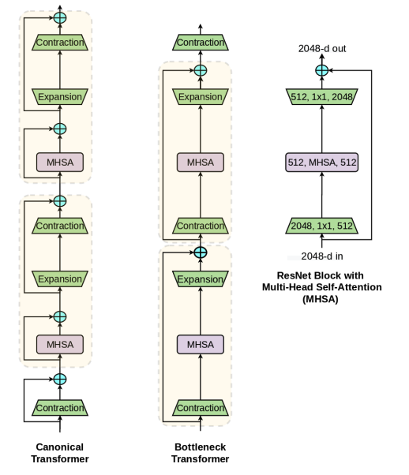

# Bottleneck Transformers for Visual Recognition, [arxiv](https://arxiv.org/abs/2101.11605) 

PaddlePaddle training/validation code and pretrained models for **BoTNet**.

The official pytorch implementation is N/A. The 3rd party timm pytorch implementation is [here](rwightman/pytorch-image-models)

This implementation is developed by [PaddleViT](https://github.com/BR-IDL/PaddleViT.git).


<p align="center">

    <h4 align="center">BotNet architecture</h4>
</p>

### Update 
* Update (2021-12-22): Initial code and ported weights are released.

## Models Zoo
| Model          | Acc@1 	| Acc@5 | #Params | FLOPs  | Image Size | Crop_pct | Interpolation | Link         |
|----------------|----------|-------|---------|--------|------------|----------|---------------|--------------|
| botnet50 	 | 77.38	| 93.56	| 20.9M    | 5.3G   | 224        | 0.875     | bicubic       |[google](https://drive.google.com/file/d/1S4nxgRkElT3K4lMx2JclPevmP3YUHNLw/view?usp=sharing)/[baidu](https://pan.baidu.com/s/1CW40ShBJQYeFgdBIZZLSjg)(wh13)  |


> *The results are evaluated on ImageNet2012 validation set.


## Notebooks
We provide a few notebooks in aistudio to help you get started:

**\*(coming soon)\***


## Requirements
- Python>=3.6
- yaml>=0.2.5
- [PaddlePaddle](https://www.paddlepaddle.org.cn/documentation/docs/en/install/index_en.html)>=2.1.0
- [yacs](https://github.com/rbgirshick/yacs)>=0.1.8

## Data 
ImageNet2012 dataset is used in the following folder structure:
```
│imagenet/
├──train/
│  ├── n01440764
│  │   ├── n01440764_10026.JPEG
│  │   ├── n01440764_10027.JPEG
│  │   ├── ......
│  ├── ......
├──val/
│  ├── n01440764
│  │   ├── ILSVRC2012_val_00000293.JPEG
│  │   ├── ILSVRC2012_val_00002138.JPEG
│  │   ├── ......
│  ├── ......
```

## Usage
To use the model with pretrained weights, download the `.pdparam` weight file and change related file paths in the following python scripts. The model config files are located in `./configs/`.

For example, assume the downloaded weight file is stored in `./botnet50.pdparams`, to use the `botnet50` model in python:
```python
from config import get_config
from botnet import build_botnet50 
# config files in ./configs/
config = get_config('./configs/botnet50.yaml')
# build model
model = build_model(config)
# load pretrained weights, .pdparams is NOT needed
model_state_dict = paddle.load('./botnet50')
model.set_dict(model_state_dict)
```

## Evaluation
To evaluate botnet50 model performance on ImageNet2012 with a single GPU, run the following script using command line:
```shell
sh run_eval.sh
```
or
```shell
CUDA_VISIBLE_DEVICES=0 \
python main_single_gpu.py \
    -cfg='./configs/botnet50.yaml' \
    -dataset='imagenet2012' \
    -batch_size=16 \
    -data_path='/dataset/imagenet' \
    -eval \
    -pretrained='./botnet50'
```

<details>

<summary>
Run evaluation using multi-GPUs:
</summary>


```shell
sh run_eval_multi.sh
```
or
```shell
CUDA_VISIBLE_DEVICES=0,1,2,3 \
python main_multi_gpu.py \
    -cfg='./configs/botnet50.yaml' \
    -dataset='imagenet2012' \
    -batch_size=16 \
    -data_path='/dataset/imagenet' \
    -eval \
    -pretrained='./botnet50'
```

</details>


## Training
To train the botnet50 model on ImageNet2012 with single GPU, run the following script using command line:
```shell
sh run_train.sh
```
or
```shell
CUDA_VISIBLE_DEVICES=0 \
python main_singel_gpu.py \
  -cfg='./configs/botnet50.yaml' \
  -dataset='imagenet2012' \
  -batch_size=32 \
  -data_path='/dataset/imagenet' \
```

<details>

<summary>
Run training using multi-GPUs:
</summary>


```shell
sh run_train_multi.sh
```
or
```shell
CUDA_VISIBLE_DEVICES=0,1,2,3 \
python main_multi_gpu.py \
    -cfg='./configs/botnet50.yaml' \
    -dataset='imagenet2012' \
    -batch_size=16 \
    -data_path='/dataset/imagenet' \
```

</details>


## Visualization Attention Map
**(coming soon)**

## Reference
```
@inproceedings{srinivas2021bottleneck,
  title={Bottleneck transformers for visual recognition},
  author={Srinivas, Aravind and Lin, Tsung-Yi and Parmar, Niki and Shlens, Jonathon and Abbeel, Pieter and Vaswani, Ashish},
  booktitle={Proceedings of the IEEE/CVF Conference on Computer Vision and Pattern Recognition},
  pages={16519--16529},
  year={2021}
}
```
