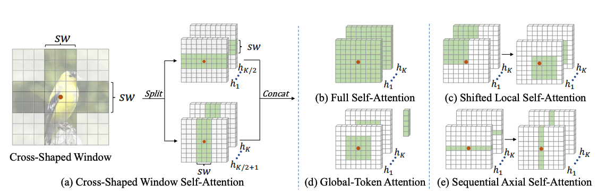
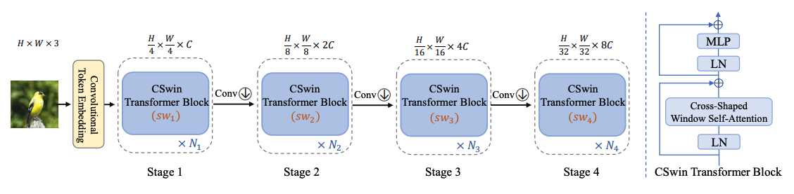

# CSWin Transformer: A General Vision Transformer Backbone with Cross-Shaped Windows, [arxiv](https://arxiv.org/pdf/2107.00652.pdf) 

PaddlePaddle training/validation code and pretrained models for **CSWin Transformer**.

The official pytorch implementation is [here](https://github.com/microsoft/CSWin-Transformer).

This implementation is developed by [PaddleViT](https://github.com/BR-IDL/PaddleViT.git).


<p align="center">



    <h4 align="center">CSWin Transformer Model Overview</h4>
</p>


### Update 
- Update (2021-09-27): Model FLOPs and # params are uploaded.
- Update (2021-08-11): Code is released and ported weights are uploaded.

## Models Zoo
| Model                         | Acc@1 | Acc@5 | #Params | FLOPs  | Image Size | Crop_pct | Interpolation | Link         |
|-------------------------------|-------|-------|---------|--------|------------|----------|---------------|--------------|
| cswin_tiny_224  				| 82.81 | 96.30 | 22.3M   | 4.2G   | 224        | 0.9      | bicubic       | [google](https://drive.google.com/file/d/1l-JY0u7NGyD6SjkyiyNnDx3wFFT1nAYO/view?usp=sharing)/[baidu](https://pan.baidu.com/s/1L5FqU7ImWAhQHAlSilqVAw)(4q3h) |
| cswin_small_224 				| 83.60 | 96.58 | 34.6M   | 6.5G   | 224        | 0.9      | bicubic       | [google](https://drive.google.com/file/d/10eEBk3wvJdQ8Dy58LvQ11Wk1K2UfPy-E/view?usp=sharing)/[baidu](https://pan.baidu.com/s/1FiaNiWyAuWu1IBsUFLUaAw)(gt1a) |
| cswin_base_224  				| 84.23 | 96.91 | 77.4M   | 14.6G  | 224        | 0.9      | bicubic       | [google](https://drive.google.com/file/d/1YufKh3DKol4-HrF-I22uiorXSZDIXJmZ/view?usp=sharing)/[baidu](https://pan.baidu.com/s/1koy8hXyGwvgAfUxdlkWofg)(wj8p) |
| cswin_base_384  				| 85.51 | 97.48 | 77.4M   | 43.1G  | 384        | 1.0      | bicubic       | [google](https://drive.google.com/file/d/1qCaFItzFoTYBo-4UbGzL6M5qVDGmJt4y/view?usp=sharing)/[baidu](https://pan.baidu.com/s/1WNkY7o_vP9KJ8cd5c7n2sQ)(rkf5) |
| cswin_large_224 				| 86.52 | 97.99 | 173.3M  | 32.5G  | 224        | 0.9      | bicubic       | [google](https://drive.google.com/file/d/1V1hteGK27t1nI84Ac7jdWfydBLLo7Fxt/view?usp=sharing)/[baidu](https://pan.baidu.com/s/1KgIX6btML6kPiPGkIzvyVA)(b5fs) |
| cswin_large_384 				| 87.49 | 98.35 | 173.3M  | 96.1G  | 384        | 1.0      | bicubic       | [google](https://drive.google.com/file/d/1LRN_6qUz71yP-OAOpN4Lscb8fkUytMic/view?usp=sharing)/[baidu](https://pan.baidu.com/s/1eCIpegPj1HIbJccPMaAsew)(6235) | 

> *The results are evaluated on ImageNet2012 validation set.

## Notebooks
We provide a few notebooks in aistudio to help you get started:

**\*(coming soon)\***


## Requirements
- Python>=3.6
- yaml>=0.2.5
- [PaddlePaddle](https://www.paddlepaddle.org.cn/documentation/docs/en/install/index_en.html)>=2.1.0
- [yacs](https://github.com/rbgirshick/yacs)>=0.1.8

## Data 
ImageNet2012 dataset is used in the following folder structure:
```
│imagenet/
├──train/
│  ├── n01440764
│  │   ├── n01440764_10026.JPEG
│  │   ├── n01440764_10027.JPEG
│  │   ├── ......
│  ├── ......
├──val/
│  ├── n01440764
│  │   ├── ILSVRC2012_val_00000293.JPEG
│  │   ├── ILSVRC2012_val_00002138.JPEG
│  │   ├── ......
│  ├── ......
```

## Usage
To use the model with pretrained weights, download the `.pdparam` weight file and change related file paths in the following python scripts. The model config files are located in `./configs/`.

For example, assume the downloaded weight file is stored in `./cswin_base_224.pdparams`, to use the `cswin_base_224` model in python:
```python
from config import get_config
from cswin import build_cswin as build_model
# config files in ./configs/
config = get_config('./configs/cswin_base_224.yaml')
# build model
model = build_model(config)
# load pretrained weights
model_state_dict = paddle.load('./cswin_base_224.pdparams')
model.set_dict(model_state_dict)
```

## Evaluation
To evaluate CSWin model performance on ImageNet2012 with a single GPU, run the following script using command line:
```shell
sh run_eval.sh
```
or
```shell
CUDA_VISIBLE_DEVICES=0 \
python main_single_gpu.py \
    -cfg=./configs/cswin_base_224.yaml \
    -dataset=imagenet2012 \
    -batch_size=16 \
    -data_path=/path/to/dataset/imagenet/val \
    -eval \
    -pretrained=/path/to/pretrained/model/cswin_base_224  # .pdparams is NOT needed
```

<details>

<summary>
Run evaluation using multi-GPUs:
</summary>


```shell
sh run_eval_multi.sh
```
or
```shell
CUDA_VISIBLE_DEVICES=0,1,2,3 \
python main_multi_gpu.py \
    -cfg=./configs/cswin_base_224.yaml \
    -dataset=imagenet2012 \
    -batch_size=16 \
    -data_path=/path/to/dataset/imagenet/val \
    -eval \
    -pretrained=/path/to/pretrained/model/cswin_base_224  # .pdparams is NOT needed
```

</details>

## Training
To train the CSWin model on ImageNet2012 with single GPU, run the following script using command line:
```shell
sh run_train.sh
```
or
```shell
CUDA_VISIBLE_DEVICES=0 \
python main_single_gpu.py \
  -cfg=./configs/cswin_base_224.yaml \
  -dataset=imagenet2012 \
  -batch_size=32 \
  -data_path=/path/to/dataset/imagenet/train \
```

<details>

<summary>
Run training using multi-GPUs:
</summary>


```shell
sh run_train_multi.sh
```
or
```shell
CUDA_VISIBLE_DEVICES=0,1,2,3 \
python main_multi_gpu.py \
    -cfg=./configs/cswin_base_224.yaml \
    -dataset=imagenet2012 \
    -batch_size=16 \
    -data_path=/path/to/dataset/imagenet/train \
```

</details>

## Visualization Attention Map
**(coming soon)**

## Reference
```
@article{dong2021cswin,
  title={CSWin Transformer: A General Vision Transformer Backbone with Cross-Shaped Windows},
  author={Dong, Xiaoyi and Bao, Jianmin and Chen, Dongdong and Zhang, Weiming and Yu, Nenghai and Yuan, Lu and Chen, Dong and Guo, Baining},
  journal={arXiv preprint arXiv:2107.00652},
  year={2021}
}
```
