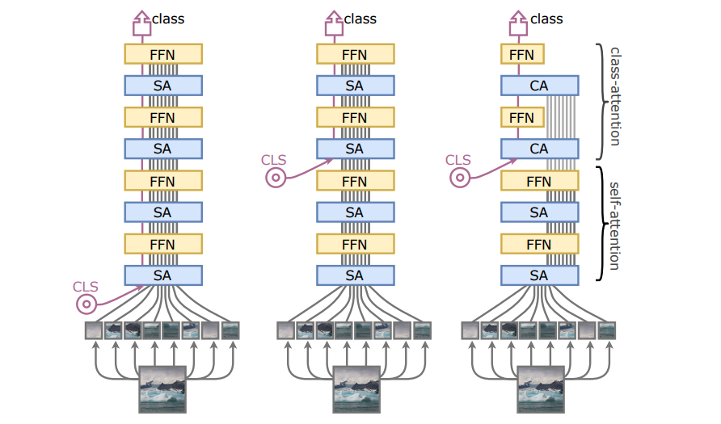

# Going deeper with Image Transformers, [arxiv](https://arxiv.org/abs/2103.17239) 

PaddlePaddle training/validation code and pretrained models for **CaiT**.

The official pytorch implementation is [here](https://github.com/facebookresearch/deit).

This implementation is developed by [PaddleViT](https://github.com/BR-IDL/PaddleViT.git).


<p align="center">

    <h4 align="center">CaiT Model Overview</h4>
</p>


### Update 
- Update (2022-07-12): Model weights trained from scratch using PaddleViT is updated.
- Update (2022-03-17): Code is refactored and bugs are fixed.
- Update (2021-09-27): More weights are uploaded.
- Update (2021-08-11): Code is released and ported weights are uploaded.

## Models Zoo
| Model                         | Acc@1 | Acc@5 | #Params | FLOPs  | Image Size | Crop_pct | Interpolation | Link         |
|-------------------------------|-------|-------|---------|--------|------------|----------|---------------|--------------|
| cait_xxs24_224                | 78.38 | 94.32 | 11.9M   | 2.2G   | 224        | 1.0      | bicubic       | [google](https://drive.google.com/file/d/1LKsQUr824oY4E42QeUEaFt41I8xHNseR/view?usp=sharing)/[baidu](https://pan.baidu.com/s/1YIaBLopKIK5_p7NlgWHpGA?pwd=j9m8) |
| cait_xxs36_224                | 79.75 | 94.88 | 17.2M   | 33.1G  | 224        | 1.0      | bicubic       | [google](https://drive.google.com/file/d/1zZx4aQJPJElEjN5yejUNsocPsgnd_3tS/view?usp=sharing)/[baidu](https://pan.baidu.com/s/1pdyFreRRXUn0yPel00-62Q?pwd=nebg) |
| cait_xxs24_384                | 80.97 | 95.64 | 11.9M   | 6.8G   | 384        | 1.0      | bicubic       | [google](https://drive.google.com/file/d/1J27ipknh_kwqYwR0qOqE9Pj3_bTcTx95/view?usp=sharing)/[baidu](https://pan.baidu.com/s/1uYSDzROqCVT7UdShRiiDYg?pwd=2j95) |
| cait_xxs36_384                | 82.20 | 96.15 | 17.2M   | 10.1G  | 384        | 1.0      | bicubic       | [google](https://drive.google.com/file/d/13IvgI3QrJDixZouvvLWVkPY0J6j0VYwL/view?usp=sharing)/[baidu](https://pan.baidu.com/s/1GafA8B6T3h_vtmNNq2HYKg?pwd=wx5d) |
| cait_s24_224                  | 83.45 | 96.57 | 46.8M   | 8.7G   | 224        | 1.0      | bicubic       | [google](https://drive.google.com/file/d/1sdCxEw328yfPJArf6Zwrvok-91gh7PhS/view?usp=sharing)/[baidu](https://pan.baidu.com/s/1BPsAMEcrjtnbOnVDQwZJYw?pwd=m4pn) |
| cait_xs24_384                 | 84.06 | 96.89 | 26.5M   | 15.1G  | 384        | 1.0      | bicubic       | [google](https://drive.google.com/file/d/1zKL6cZwqmvuRMci-17FlKk-lA-W4RVte/view?usp=sharing)/[baidu](https://pan.baidu.com/s/1w10DPJvK8EwhOCm-tZUpww?pwd=scsv) |
| cait_s24_384                  | 85.05 | 97.34 | 46.8M   | 26.5G  | 384        | 1.0      | bicubic       | [google](https://drive.google.com/file/d/1klqBDhJDgw28omaOpgzInMmfeuDa7NAi/view?usp=sharing)/[baidu](https://pan.baidu.com/s/1-aNO6c7Ipm9x1hJY6N6G2g?pwd=dnp7) |
| cait_s36_384                  | 85.45 | 97.48 | 68.1M   | 39.5G  | 384        | 1.0      | bicubic       | [google](https://drive.google.com/file/d/1m-55HryznHbiUxG38J2rAa01BYcjxsRZ/view?usp=sharing)/[baidu](https://pan.baidu.com/s/1-uWg-JHLEKeMukFFctoufg?pwd=e3ui) |
| cait_m36_384                  | 86.06 | 97.73 | 270.7M  | 156.2G | 384        | 1.0      | bicubic       | [google](https://drive.google.com/file/d/1WJjaGiONX80KBHB3YN8mNeusPs3uDhR2/view?usp=sharing)/[baidu](https://pan.baidu.com/s/1aZ9bEU5AycmmfmHAqZIaLA?pwd=r4hu) |
| cait_m48_448                  | 86.49 | 97.75 | 355.8M  | 287.3G | 448        | 1.0      | bicubic       | [google](https://drive.google.com/file/d/1lJSP__dVERBNFnp7im-1xM3s_lqEe82-/view?usp=sharing)/[baidu](https://pan.baidu.com/s/179MA3MkG2qxFle0K944Gkg?pwd=imk5) |

> *The results are evaluated on ImageNet2012 validation set.

## Model weights trained from scratch using PaddleViT
| Model                         | Acc@1 | Acc@5 | #Params | FLOPs  | Image Size | Crop_pct | Interpolation | Link         | Log |
|-------------------------------|-------|-------|---------|--------|------------|----------|---------------|--------------|--------------|
| cait_xxs24_224                | 78.24 | 96.26 | 11.9M   | 2.2G   | 224        | 1.0      | bicubic       | [google](https://drive.google.com/file/d/11BHchbYKAyw3IBccLGKokIdGYF12BVi3/view?usp=sharing)/[baidu](https://pan.baidu.com/s/1RsCSHclSLGLPzXG5wtAwSw?pwd=b6u3)| [google](https://drive.google.com/file/d/1wBLwp0a69DYRYUMmTu2xfzjb8P985rYG/view?usp=sharing)/[baidu](https://pan.baidu.com/s/1YaXsSyfKg6jmZwef16xerQ?pwd=9f1x)|


## Data Preparation
ImageNet2012 dataset is used in the following file structure:
```
│imagenet/
├──train_list.txt
├──val_list.txt
├──train/
│  ├── n01440764
│  │   ├── n01440764_10026.JPEG
│  │   ├── n01440764_10027.JPEG
│  │   ├── ......
│  ├── ......
├──val/
│  ├── n01440764
│  │   ├── ILSVRC2012_val_00000293.JPEG
│  │   ├── ILSVRC2012_val_00002138.JPEG
│  │   ├── ......
│  ├── ......
```
- `train_list.txt`: list of relative paths and labels of training images. You can download it from: [google](https://drive.google.com/file/d/10YGzx_aO3IYjBOhInKT_gY6p0mC3beaC/view?usp=sharing)/[baidu](https://pan.baidu.com/s/1G5xYPczfs9koDb7rM4c0lA?pwd=a4vm?pwd=a4vm)
- `val_list.txt`: list of relative paths and labels of validation images. You can download it from: [google](https://drive.google.com/file/d/1aXHu0svock6MJSur4-FKjW0nyjiJaWHE/view?usp=sharing)/[baidu](https://pan.baidu.com/s/1TFGda7uBZjR7g-A6YjQo-g?pwd=kdga?pwd=kdga) 


## Usage
To use the model with pretrained weights, download the `.pdparam` weight file and change related file paths in the following python scripts. The model config files are located in `./configs/`.

For example, assume weight file is downloaded in `./cait_xxs24_224.pdparams`, to use the `cait_xxs24_224` model in python:
```python
from config import get_config
from cait import build_cait as build_model
# config files in ./configs/
config = get_config('./configs/cait_xxs24_224.yaml')
# build model
model = build_model(config)
# load pretrained weights
model_state_dict = paddle.load('./cait_xxs24_224.pdparams')
model.set_state_dict(model_state_dict)
```

## Evaluation
To evaluate CaiT model performance on ImageNet2012, run the following script using command line:
```shell
sh run_eval_multi.sh
```
or
```shell
CUDA_VISIBLE_DEVICES=0,1,2,3,4,5,6,7 \
python main_multi_gpu.py \
-cfg='./configs/cait_xxs24_224.yaml' \
-dataset='imagenet2012' \
-batch_size=256 \
-data_path='/dataset/imagenet' \
-eval \
-pretrained='./cait_xxs24_224.pdparams' \
-amp
```
> Note: if you have only 1 GPU, change device number to `CUDA_VISIBLE_DEVICES=0` would run the evaluation on single GPU.


## Training
To train the CaiT model on ImageNet2012, run the following script using command line:
```shell
sh run_train_multi.sh
```
or
```shell
CUDA_VISIBLE_DEVICES=0,1,2,3,4,5,6,7 \
python main_multi_gpu.py \
-cfg='./configs/cait_xxs24_224.yaml' \
-dataset='imagenet2012' \
-batch_size=256 \
-data_path='/dataset/imagenet' \
-amp
```
> Note: it is highly recommanded to run the training using multiple GPUs / multi-node GPUs.

## Finetuning
To finetune the CaiT model on ImageNet2012, run the following script using command line:
```shell
CUDA_VISIBLE_DEVICES=0,1,2,3,4,5,6,7 \
python main_multi_gpu.py \
-cfg='./configs/cait_xxs24_384.yaml' \
-dataset='imagenet2012' \
-batch_size=16 \
-data_path='/dataset/imagenet' \
-pretrained='./cait_xxs24_224.pdparams' \
-amp
```
> Note: use `-pretrained` argument to set the pretrained model path, you may also need to modify the hyperparams defined in config file.


## Reference
```
@InProceedings{Touvron_2021_ICCV,
    author    = {Touvron, Hugo and Cord, Matthieu and Sablayrolles, Alexandre and Synnaeve, Gabriel and J\'egou, Herv\'e},
    title     = {Going Deeper With Image Transformers},
    booktitle = {Proceedings of the IEEE/CVF International Conference on Computer Vision (ICCV)},
    month     = {October},
    year      = {2021},
    pages     = {32-42}
}
```
