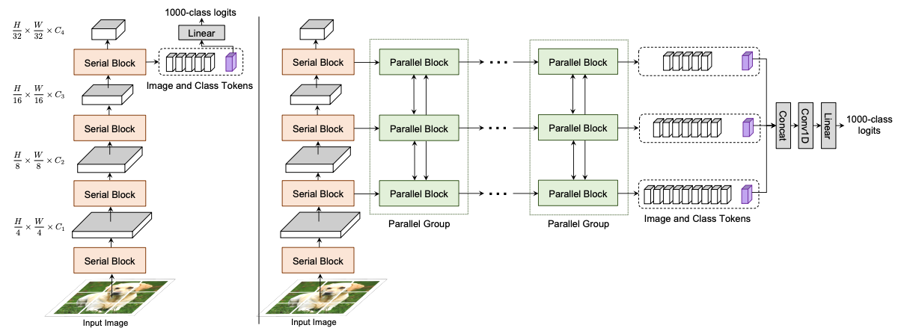

# Co-Scale Conv-Attentional Image Transformers, [arxiv](https://arxiv.org/abs/2104.06399)
PaddlePaddle training/validation code and pretrained models for the model released in ICCV2021: **CoaT**.

The official PyTorch implementation is [here](https://github.com/mlpc-ucsd/CoaT).

This implementation is developed by [PaddleViT](https://github.com/BR-IDL/PaddleViT.git).

<p align="center">

<h4 align="center">ConvNeXt Model Overview</h4>
</p>

### Update

- Update (2022-05-16): Code is released and ported weights are uploaded.

## Models Zoo


| Model      | Acc@1 | Acc@5 | #Params | FLOPs | Image Size | Crop_pct | Interpolation | Link                                                                                                                                                           |
| ---------- | ----- | ----- | ------- | ----- | ---------- | -------- | ------------- | -------------------------------------------------------------------------------------------------------------------------------------------------------------- |
| CoaT-Lite Tiny   | 77.51 | 93.92 | 5.7M   | 1.7G   | 224        | 0.9      | bicubic       | [google](https://drive.google.com/file/d/1DVZzFvMrDx8VcpZ7ceDsvmUGspP0uz5i/view?usp=sharing)/[baidu](https://pan.baidu.com/s/1EDixd2DZNyr2I8MsXyRQzQ?pwd=hi4y) |
| CoaT-Lite Mini   | 79.10 | 94.61 | 11.0M  | 2.1G   | 224        | 0.9      | bicubic       | [google](https://drive.google.com/file/d/1iTYV5gmzyHT3k_YBDwtcfAO6upOU7seZ/view?usp=sharing)/[baidu](https://pan.baidu.com/s/1uCcg5CF0CNLAGwX2823R1g?pwd=e5ka) |
| CoaT-Lite Small  | 81.83 | 95.58 | 19.8M  | 4.2G   | 224        | 0.9      | bicubic       | [google](https://drive.google.com/file/d/18qAwntCB56-cdv1bfdY3yrnUr0pxXHga/view?usp=sharing)/[baidu](https://pan.baidu.com/s/1EWSyMShAJ80bkjDrtRRocw?pwd=rsn6) |
| CoaT-Lite Medium | 83.60 | 96.73 | 44.6M  | 10.5G  | 224        | 0.9      | bicubic       | [google](https://drive.google.com/file/d/1hmgBhcag5H3Vh1eA6gW4IgVkbTmv6465/view?usp=sharing)/[baidu](https://pan.baidu.com/s/1funugCLyC4i0rQQ9JbKEyw?pwd=f1sp) |
| CoaT Tiny        | 78.45 | 94.07 | 7.7M   | 4.8G   | 224        | 0.9      | bicubic       | [google](https://drive.google.com/file/d/1hJI1kaL6KkIldmIeBrZViNC_NAmRwMWa/view?usp=sharing)/[baidu](https://pan.baidu.com/s/1qOY16SSg2QdfKQDymvNx0g?pwd=5bz7) |
| CoaT Mini        | 81.27 | 95.38 | 14.8M  | 7.3G   | 224        | 0.9      | bicubic       | [google](https://drive.google.com/file/d/16yXAAt9-vtYAH-ZUbdsKIb9YVBCMSwf_/view?usp=sharing)/[baidu](https://pan.baidu.com/s/1u9ei9w6sih_OdoJPdl-rOw?pwd=g3ce) |
| CoaT Small       | 82.36 | 96.21 | 31.5M  | 13.3G  | 224        | 0.9      | bicubic       | [google](https://drive.google.com/file/d/1DE1qia_BNsw8fzVFozmlmxzcPe3itVRC/view?usp=sharing)/[baidu](https://pan.baidu.com/s/1ytNXJsh4HuopRIdBBLD-2g?pwd=key2) |


> \*The results are evaluated on ImageNet2012 validation set.

## Data Preparation

ImageNet2012 dataset is used in the following file structure:

```
│imagenet/
├──train_list.txt
├──val_list.txt
├──train/
│  ├── n01440764
│  │   ├── n01440764_10026.JPEG
│  │   ├── n01440764_10027.JPEG
│  │   ├── ......
│  ├── ......
├──val/
│  ├── n01440764
│  │   ├── ILSVRC2012_val_00000293.JPEG
│  │   ├── ILSVRC2012_val_00002138.JPEG
│  │   ├── ......
│  ├── ......
```

- `train_list.txt`: list of relative paths and labels of training images. You can download it from: [google](https://drive.google.com/file/d/10YGzx_aO3IYjBOhInKT_gY6p0mC3beaC/view?usp=sharing)/[baidu](https://pan.baidu.com/s/1G5xYPczfs9koDb7rM4c0lA?pwd=a4vm?pwd=a4vm)
- `val_list.txt`: list of relative paths and labels of validation images. You can download it from: [google](https://drive.google.com/file/d/1aXHu0svock6MJSur4-FKjW0nyjiJaWHE/view?usp=sharing)/[baidu](https://pan.baidu.com/s/1TFGda7uBZjR7g-A6YjQo-g?pwd=kdga?pwd=kdga)

## Usage

To use the model with pretrained weights, download the `.pdparam` weight file and change related file paths in the following python scripts. The model config files are located in `./configs/`.

For example, assume weight file is downloaded in `./coat_tiny.pdparams`, to use the `coat_tiny` model in python:

```python
from config import get_config
from coat import build_coat as build_model
# config files in ./configs/
config = get_config('./configs/coat_tiny.yaml')
# build model
model = build_model(config)
# load pretrained weights
model_state_dict = paddle.load('./coat_tiny.pdparams')
model.set_state_dict(model_state_dict)
```

## Evaluation

To evaluate model performance on ImageNet2012, run the following script using command line:

```shell
sh run_eval_multi.sh
```

or

```shell
CUDA_VISIBLE_DEVICES=0,1,2,3,4,5,6,7 \
python main_multi_gpu.py \
-cfg='./configs/coat_tiny.yaml' \
-dataset='imagenet2012' \
-batch_size=256 \
-data_path='/dataset/imagenet' \
-eval \
-pretrained='./coat_tiny.pdparams' \
-amp
```

> Note: if you have only 1 GPU, change device number to `CUDA_VISIBLE_DEVICES=0` would run the evaluation on single GPU.

## Training

To train the model on ImageNet2012, run the following script using command line:

```shell
sh run_train_multi.sh
```

or

```shell
CUDA_VISIBLE_DEVICES=0,1,2,3,4,5,6,7 \
python main_multi_gpu.py \
-cfg='./configs/coat_tiny.yaml' \
-dataset='imagenet2012' \
-batch_size=256 \
-data_path='/dataset/imagenet' \
-amp
```

> Note: it is highly recommanded to run the training using multiple GPUs / multi-node GPUs.

## Reference

```
@InProceedings{Xu_2021_ICCV,
    author    = {Xu, Weijian and Xu, Yifan and Chang, Tyler and Tu, Zhuowen},
    title     = {Co-Scale Conv-Attentional Image Transformers},
    booktitle = {Proceedings of the IEEE/CVF International Conference on Computer Vision (ICCV)},
    month     = {October},
    year      = {2021},
    pages     = {9981-9990}
}
```
