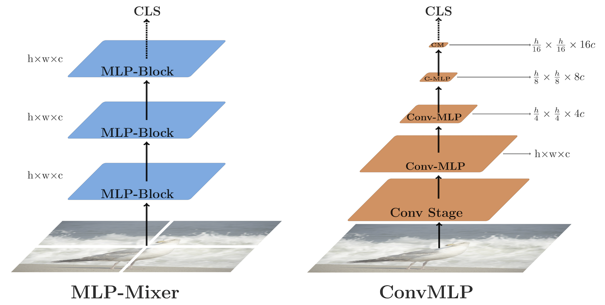

# ConvMLP: Hierarchical Convolutional MLPs for Vision, [arxiv](https://arxiv.org/abs/2109.04454) 

PaddlePaddle training/validation code and pretrained models for **ConvMLP**.

The official and 3rd party pytorch implementation are [here](https://github.com/SHI-Labs/Convolutional-MLPs).


This implementation is developed by [PPViT](https://github.com/xperzy/PPViT/tree/master).

<p align="center">

<h4 align="center">ViP Model Overview</h4>
</p>


### Update 
Update (2021-09-26): Code is released and ported weights are uploaded.

## Models Zoo
| Model                          | # Params | Acc@1 | Acc@5 | Image Size | Crop_pct | Interpolation | Link        |
|:------------------------------:|:-----:|:-----:|:----------:|:--------:|:-------------:|:------------:|:------------:|
| convmlp_s   | 9M | 76.76 | 93.40 | 224        | 0.875    | bicubic       |  |
| convmlp_m |  17.4M   |       |  | 224        | 0.875      | bicubic      |  |
| convmlp_l | 42.7M |  |  | 224        | 0.875      | bicubic      |  |

> *The results are evaluated on ImageNet2012 validation set.
> 
> Note: ConvMLP weights are ported from [here](https://github.com/SHI-Labs/Convolutional-MLPs)


## Notebooks
We provide a few notebooks in aistudio to help you get started:

**\*(coming soon)\***


## Requirements
- Python>=3.6
- yaml>=0.2.5
- [PaddlePaddle](https://www.paddlepaddle.org.cn/documentation/docs/en/install/index_en.html)>=2.1.0
- [yacs](https://github.com/rbgirshick/yacs)>=0.1.8

## Data 
ImageNet2012 dataset is used in the following folder structure:
```
│imagenet/
├──train/
│  ├── n01440764
│  │   ├── n01440764_10026.JPEG
│  │   ├── n01440764_10027.JPEG
│  │   ├── ......
│  ├── ......
├──val/
│  ├── n01440764
│  │   ├── ILSVRC2012_val_00000293.JPEG
│  │   ├── ILSVRC2012_val_00002138.JPEG
│  │   ├── ......
│  ├── ......
```

## Usage
To use the model with pretrained weights, download the `.pdparam` weight file and change related file paths in the following python scripts. The model config files are located in `./configs/`.

For example, assume the downloaded weight file is stored in `./convmlp_s.pdparams`, to use the `convmlp_s` model in python:
```python
from config import get_config
from convmlp import build_convmlp as build_model
# config files in ./configs/
config = get_config('./configs/convmlp_s.yaml')
# build model
model = build_model(config)
# load pretrained weights, .pdparams is NOT needed
model_state_dict = paddle.load('./convmlp_s7')
model.set_dict(model_state_dict)
```

## Evaluation
To evaluate Conv	MLP model performance on ImageNet2012 with a single GPU, run the following script using command line:
```shell
sh run_eval.sh
```
or
```shell
CUDA_VISIBLE_DEVICES=0 \
python main_single_gpu.py \
    -cfg='./configs/convmlp_s.yaml' \
    -dataset='imagenet2012' \
    -batch_size=16 \
    -data_path='/dataset/imagenet' \
    -eval \
    -pretrained='./convmlp_s'
```

<details>

<summary>
Run evaluation using multi-GPUs:
</summary>


```shell
sh run_eval_multi.sh
```
or
```shell
CUDA_VISIBLE_DEVICES=0,1,2,3 \
python main_multi_gpu.py \
    -cfg='./configs/convmlp_s.yaml' \
    -dataset='imagenet2012' \
    -batch_size=16 \
    -data_path='/dataset/imagenet' \
    -eval \
    -pretrained='./convmlp_s'
```

</details>

## Training
To train the ConvMLP Transformer model on ImageNet2012 with single GPUs, run the following script using command line:
```shell
sh run_train.sh
```
or
```shell
CUDA_VISIBLE_DEVICES=0 \
python main_single_gpu.py \
  -cfg='./configs/convmlp_s.yaml' \
  -dataset='imagenet2012' \
  -batch_size=32 \
  -data_path='/dataset/imagenet' \
```

<details>

<summary>
Run training using multi-GPUs:
</summary>


```shell
sh run_train_multi.sh
```
or
```shell
CUDA_VISIBLE_DEVICES=0,1,2,3 \
python main_multi_gpu.py \
    -cfg='./configs/convmlp_s.yaml' \
    -dataset='imagenet2012' \
    -batch_size=16 \
    -data_path='/dataset/imagenet' \ 
```

</details>


## Visualization Attention Map
**(coming soon)**

## Reference
```
@article{li2021convmlp,
      title={ConvMLP: Hierarchical Convolutional MLPs for Vision}, 
      author={Jiachen Li and Ali Hassani and Steven Walton and Humphrey Shi},
      year={2021},
      eprint={2109.04454},
      archivePrefix={arXiv},
      primaryClass={cs.CV}
}
}
```
