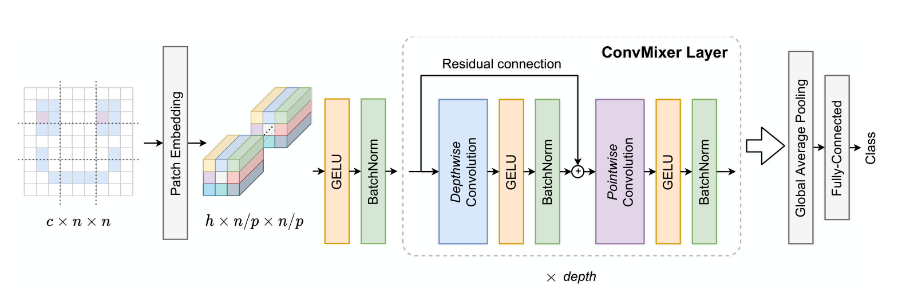

# ConvMixer: Patches Are All You Need? 🤷, [OpenReview](https://openreview.net/forum?id=TVHS5Y4dNvM)

PaddlePaddle training/validation code and pretrained models for **ConvMixer**.

The official pytorch implementation is [here](https://github.com/tmp-iclr/convmixer).

This implementation is developed by [PaddleViT](https://github.com/BR-IDL/PaddleViT.git).

<p align="center">

<h4 align="center">ConvMixer Model Overview</h4>
</p>


### Update 
- Update (2021-11-04): Model weights are updated.
- Update (2021-10-13): Code is released and ported weights are uploaded.

## Models Zoo
| Model                         | Acc@1 | Acc@5 | #Params | FLOPs  | Image Size | Crop_pct | Interpolation | Link         |
|-------------------------------|-------|-------|---------|--------|------------|----------|---------------|--------------|
| convmixer_1024_20  			| 76.94 | 93.35 | 24.5M   | 9.5G   |    224     | 0.96     | bicubic       | [google](https://drive.google.com/file/d/1R7zUSl6_6NFFdNOe8tTfoR9VYQtGfD7F/view?usp=sharing)/[baidu](https://pan.baidu.com/s/1DgGA3qYu4deH4woAkvjaBw)(qpn9) |
| convmixer_768_32  			| 80.16 | 95.08 | 21.2M   | 20.8G  |    224     | 0.96     | bicubic       | [google](https://drive.google.com/file/d/196Lg_Eet-hRj733BYASj22g51wdyaW2a/view?usp=sharing)/[baidu](https://pan.baidu.com/s/17CbRNzY2Sy_Cu7cxNAkWmQ)(m5s5) |
| convmixer_1536_20  			| 81.37 | 95.62 | 51.8M   | 72.4G  |    224     | 0.96     | bicubic       | [google](https://drive.google.com/file/d/1-LlAlADiu0SXDQmE34GN2GBhqI-RYRqO/view?usp=sharing)/[baidu](https://pan.baidu.com/s/1R-gSzhzQNfkuZVxsaE4vEw)(xqty) |
> *The results are evaluated on ImageNet2012 validation set.
## Notebooks
We provide a few notebooks in aistudio to help you get started:

**\*(coming soon)\***


## Requirements
- Python>=3.6
- yaml>=0.2.5
- [PaddlePaddle](https://www.paddlepaddle.org.cn/documentation/docs/en/install/index_en.html)>=2.1.0
- [yacs](https://github.com/rbgirshick/yacs)>=0.1.8

## Data 
ImageNet2012 dataset is used in the following folder structure:
```
│imagenet/
├──train/
│  ├── n01440764
│  │   ├── n01440764_10026.JPEG
│  │   ├── n01440764_10027.JPEG
│  │   ├── ......
│  ├── ......
├──val/
│  ├── n01440764
│  │   ├── ILSVRC2012_val_00000293.JPEG
│  │   ├── ILSVRC2012_val_00002138.JPEG
│  │   ├── ......
│  ├── ......
```

## Usage
To use the model with pretrained weights, download the `.pdparam` weight file and change related file paths in the following python scripts. The model config files are located in `./configs/`.

For example, assume the downloaded weight file is stored in `./convmixer_768_32.pdparams`, to use the `convmixer_768_32` model in python:
```python
from config import get_config
from convmixer import build_convmixer as build_model
# config files in ./configs/
config = get_config('./configs/convmixer_768_32.yaml')
# build model
model = build_model(config)
# load pretrained weights, .pdparams is NOT needed
model_state_dict = paddle.load('./convmixer_768_32')
model.set_dict(model_state_dict)
```

## Evaluation
To evaluate ConvMixer model performance on ImageNet2012 with a single GPU, run the following script using command line:
```shell
sh run_eval.sh
```
or
```shell
CUDA_VISIBLE_DEVICES=0 \
python main_single_gpu.py \
    -cfg='./configs/convmixer_768_32.yaml' \
    -dataset='imagenet2012' \
    -batch_size=16 \
    -data_path='/dataset/imagenet' \
    -eval \
    -pretrained='./convmixer_768_32'
```

<details>

<summary>
Run evaluation using multi-GPUs:
</summary>


```shell
sh run_eval_multi.sh
```
or
```shell
CUDA_VISIBLE_DEVICES=0,1,2,3 \
python main_multi_gpu.py \
    -cfg='./configs/convmixer_768_32.yaml' \
    -dataset='imagenet2012' \
    -batch_size=16 \
    -data_path='/dataset/imagenet' \
    -eval \
    -pretrained='./convmixer_768_32'
```

</details>


## Training
To train the ConvMixer Transformer model on ImageNet2012 with single GPU, run the following script using command line:
```shell
sh run_train.sh
```
or
```shell
CUDA_VISIBLE_DEVICES=0 \
python main_single_gpu.py \
  -cfg='./configs/convmixer_768_32.yaml' \
  -dataset='imagenet2012' \
  -batch_size=16 \
  -data_path='/dataset/imagenet' \
```

<details>

<summary>
Run training using multi-GPUs:
</summary>


```shell
sh run_train_multi.sh
```
or
```shell
CUDA_VISIBLE_DEVICES=0,1,2,3,4,5,6,7 \
python main_multi_gpu.py \
    -cfg='./configs/convmixer_768_32.yaml' \
    -dataset='imagenet2012' \
    -batch_size=32 \
    -data_path='/dataset/imagenet' \
```

</details>


## Visualization Attention Map
**(coming soon)**

