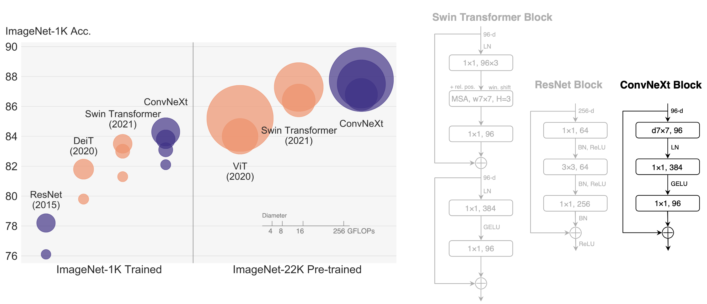

# A ConvNet for the 2020s, [arxiv](https://arxiv.org/abs/2201.03545)
PaddlePaddle training/validation code and pretrained models for the model released in CVPR2022: **ConvNeXt**.

The official PyTorch implementation is [here](https://github.com/facebookresearch/ConvNeXt).

This implementation is developed by [PaddleViT](https://github.com/BR-IDL/PaddleViT.git).

<p align="center">

<h4 align="center">ConvNeXt Model Overview</h4>
</p>

### Update

- Update (2022-05-16): Code is released and ported weights are uploaded.

## Models Zoo


| Model      | Acc@1 | Acc@5 | #Params | FLOPs | Image Size | Crop_pct | Interpolation | Link                                                                                                                                                           |
| ---------- | ----- | ----- | ------- | ----- | ---------- | -------- | ------------- | -------------------------------------------------------------------------------------------------------------------------------------------------------------- |
| ConvNeXt-T(22kft1k)  | 82.91 | 96.62 | 28.6M   | 4.5G   | 224        | 0.9      | bicubic       | [google](https://drive.google.com/file/d/1BkIy0LZHcqG15di84TMr6n1zU6g1h6or/view?usp=sharing)/[baidu](https://pan.baidu.com/s/1h1y-opZUzLYmgu85skd2zg?pwd=mct6) |
| ConvNeXt-S(22kft1k)  | 84.57 | 97.39 | 50.2M   | 8.8G   | 224        | 0.9      | bicubic       | [google](https://drive.google.com/file/d/1Is8nOgOpLmvgm3q8hyjtHAEpPAKWYRPe/view?usp=sharing)/[baidu](https://pan.baidu.com/s/1yeCDTbsWqzUVC6L-q4nYCQ?pwd=npvk) |
| ConvNeXt-B(22kft1k)  | 85.82 | 97.87 | 88.6M   | 15.5G  | 224        | 0.9      | bicubic       | [google](https://drive.google.com/file/d/1aKWxqRmew1JEnR_0p1ZalVA64UrDtulE/view?usp=sharing)/[baidu](https://pan.baidu.com/s/1iTqCcV_yYGQOMibe_6xNzw?pwd=sr4f) |
| ConvNeXt-L(22kft1k)  | 86.64 | 98.03 | 197.7M  | 34.6G  | 224        | 0.9      | bicubic       | [google](https://drive.google.com/file/d/1wTW8Dzw0SEW5CN005KLKrs38A6wxuQ6h/view?usp=sharing)/[baidu](https://pan.baidu.com/s/19XXJWXI7TIafN_tWmQ_Rkw?pwd=pgh4) |
| ConvNeXt-XL(22kft1k) | 87.01 | 98.20 | 350.2M  | 61.3G  | 224        | 0.9      | bicubic       | [google](https://drive.google.com/file/d/1_Gy0GYw3c_FkwAzPgPxJNKtbpnbTFr60/view?usp=sharing)/[baidu](https://pan.baidu.com/s/1cfmNtdzvIDKGlpvkGOvArg?pwd=bx1p) |


> \*The results are evaluated on ImageNet2012 validation set.

## Data Preparation

ImageNet2012 dataset is used in the following file structure:

```
│imagenet/
├──train_list.txt
├──val_list.txt
├──train/
│  ├── n01440764
│  │   ├── n01440764_10026.JPEG
│  │   ├── n01440764_10027.JPEG
│  │   ├── ......
│  ├── ......
├──val/
│  ├── n01440764
│  │   ├── ILSVRC2012_val_00000293.JPEG
│  │   ├── ILSVRC2012_val_00002138.JPEG
│  │   ├── ......
│  ├── ......
```

- `train_list.txt`: list of relative paths and labels of training images. You can download it from: [google](https://drive.google.com/file/d/10YGzx_aO3IYjBOhInKT_gY6p0mC3beaC/view?usp=sharing)/[baidu](https://pan.baidu.com/s/1G5xYPczfs9koDb7rM4c0lA?pwd=a4vm?pwd=a4vm)
- `val_list.txt`: list of relative paths and labels of validation images. You can download it from: [google](https://drive.google.com/file/d/1aXHu0svock6MJSur4-FKjW0nyjiJaWHE/view?usp=sharing)/[baidu](https://pan.baidu.com/s/1TFGda7uBZjR7g-A6YjQo-g?pwd=kdga?pwd=kdga)

## Usage

To use the model with pretrained weights, download the `.pdparam` weight file and change related file paths in the following python scripts. The model config files are located in `./configs/`.

For example, assume weight file is downloaded in `./convnext_tiny.pdparams`, to use the `convnext_tiny` model in python:

```python
from config import get_config
from convnext import build_convnext as build_model
# config files in ./configs/
config = get_config('./configs/convnext_tiny.yaml')
# build model
model = build_model(config)
# load pretrained weights
model_state_dict = paddle.load('./convnext_tiny.pdparams')
model.set_state_dict(model_state_dict)
```

## Evaluation

To evaluate model performance on ImageNet2012, run the following script using command line:

```shell
sh run_eval_multi_distill.sh
```

or

```shell
CUDA_VISIBLE_DEVICES=0,1,2,3,4,5,6,7 \
python main_multi_gpu_distill.py \
-cfg='./configs/convnext_tiny.yaml' \
-dataset='imagenet2012' \
-batch_size=256 \
-data_path='/dataset/imagenet' \
-eval \
-pretrained='./convnext_tiny.pdparams' \
-amp
```

> Note: if you have only 1 GPU, change device number to `CUDA_VISIBLE_DEVICES=0` would run the evaluation on single GPU.

## Training

To train the model on ImageNet2012, run the following script using command line:

```shell
sh run_train_multi.sh
```

or

```shell
CUDA_VISIBLE_DEVICES=0,1,2,3,4,5,6,7 \
python main_multi_gpu_distill.py \
-cfg='./configs/convnext_tiny.yaml' \
-dataset='imagenet2012' \
-batch_size=256 \
-data_path='/dataset/imagenet' \
-teacher_model_path='./regnety_160.pdparams' \
-amp
```

> Note: it is highly recommanded to run the training using multiple GPUs / multi-node GPUs.

## Reference

```
@Article{liu2022convnet,
  author  = {Zhuang Liu and Hanzi Mao and Chao-Yuan Wu and Christoph Feichtenhofer and Trevor Darrell and Saining Xie},
  title   = {A ConvNet for the 2020s},
  journal = {Proceedings of the IEEE/CVF Conference on Computer Vision and Pattern Recognition (CVPR)},
  year    = {2022},
}
```
