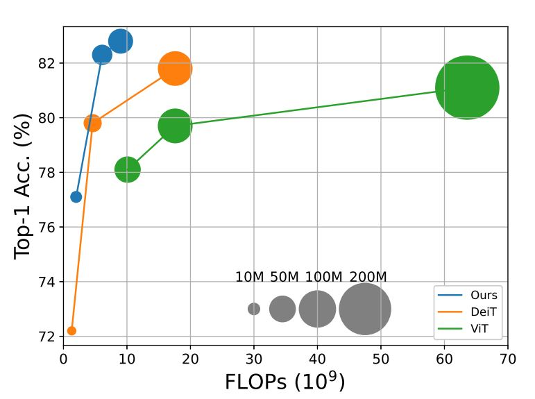
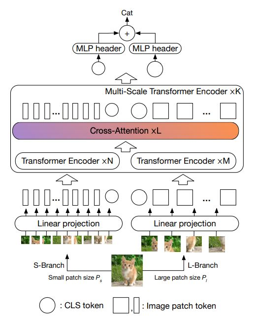

# PPViT CrossViT
origin repository [CrossViT](https://github.com/IBM/CrossViT) install requirement
or local install
```
cd your path/PaddleViT/image_classification/CrossViT/
pip install -r requirement.txt
```


## Quick Start
```
cd your path/PaddleViT
step 1
python image_classification/CrossViT/prot_weights/load_pytorch_weights.py

step 2
In Demo.py change your generate pd_crossvit_base_224.pdparams path
def main():
    paddle.set_device('cpu')
    paddle_model = pd_crossvit_base_224()
    state_dict=paddle.load('port_weights/pd_crossvit_base_224.pdparams')
    paddle_model.load_dict(state_dict)
    paddle_model.eval()

step 3
python Demo.py

zebra in imagenet dataset index is 340
# 340 n02391049 zebra 斑马
Demo result show as below
# ----------------------------------
# ----------------------------------
# ----------------------------------
# +++++++++++++++++++++++++++++++++++
# (1, 3, 224, 224)
# [1, 3, 224, 224]
# == == == == == == == == == == == == == == == == == == == == == == == == == == == ==
# 340
# done!
```
# ImageNet acc
```buildoutcfg
base_224
ImageNet val acc: 0.66896

sub mean by std
ImageNet val acc: 0.70484 
```
##paddle implement detials

## CrossViT

This repository is the official implementation of CrossViT: Cross-Attention Multi-Scale Vision Transformer for Image Classification. [ArXiv](https://arxiv.org/abs/2103.14899)

If you use the codes and models from this repo, please cite our work. Thanks!

```
@inproceedings{
    chen2021crossvit,
    title={{CrossViT: Cross-Attention Multi-Scale Vision Transformer for Image Classification}},
    author={Chun-Fu (Richard) Chen and Quanfu Fan and Rameswar Panda},
    booktitle={International Conference on Computer Vision (ICCV)},
    year={2021}
}
```