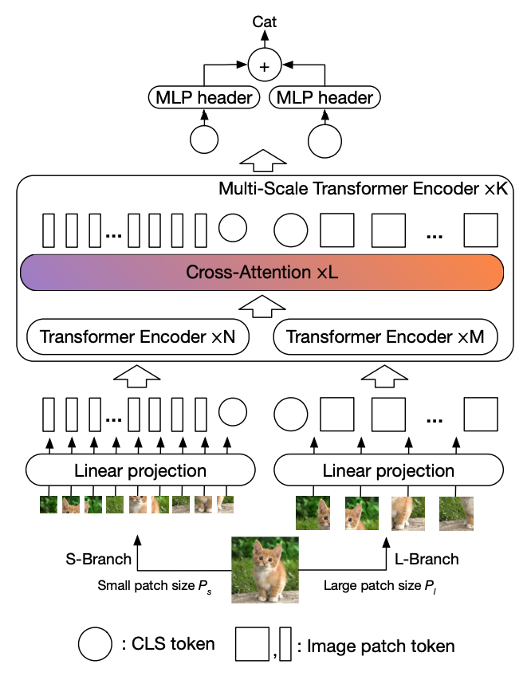

# CrossViT: Cross-Attention Multi-Scale Vision Transformer for Image Classification, [arxiv](https://arxiv.org/abs/2103.14899) 

PaddlePaddle training/validation code and pretrained models for **CrossViT**.

The official pytorch implementation is [here](https://github.com/IBM/CrossViT).

This implementation is developed by [PPViT](https://github.com/BR-IDL/PaddleViT).



<figcaption align = "center">CrossVit Model Overview</figcaption>

### Update 
- Update (2022-03-28): Code is refactored and bugs are fixed
- Update (2021-09-27): Model FLOPs and # params are uploaded.
- Update (2021-09-16): Code is released and ported weights are uploaded.
- Update (2021-09-22): Support more models eval.

## Models Zoo
| Model                         | Acc@1 | Acc@5 | #Params | FLOPs  | Image Size | Crop_pct | Interpolation | Link         |
|-------------------------------|-------|-------|---------|--------|------------|----------|---------------|--------------|
| cross_vit_tiny_224 			| 73.20 | 91.90 | 6.9M    | 1.3G   | 224   	    | 0.875    | bicubic       | [google](https://drive.google.com/file/d/1ILTVwQtetcb_hdRjki2ZbR26p-8j5LUp/view?usp=sharing)/[baidu](https://pan.baidu.com/s/1byeUsM34_gFL0jVr5P5GAw?pwd=scvb) |
| cross_vit_small_224 			| 81.01 | 95.33 | 26.7M   | 5.2G   | 224   	    | 0.875    | bicubic       | [google](https://drive.google.com/file/d/1ViOJiwbOxTbk1V2Go7PlCbDbWPbjWPJH/view?usp=sharing)/[baidu](https://pan.baidu.com/s/1I9CrpdPU_D5LniqIVBoIPQ?pwd=32us) |
| cross_vit_base_224 			| 82.12 | 95.87 | 104.7M  | 20.2G  | 224   	    | 0.875    | bicubic       | [google](https://drive.google.com/file/d/1vTorkc63O4JE9cYUMHBRxFMDOFoC-iK7/view?usp=sharing)/[baidu](https://pan.baidu.com/s/1TR_aBHQ2n1J0RgHFoVh_bw?pwd=jj2q) |
| cross_vit_9_224 				| 73.78 | 91.93 | 8.5M    | 1.6G   | 224   	    | 0.875    | bicubic       | [google](https://drive.google.com/file/d/1UCX9_mJSx2kDAmEd_xDXyd4e6-Mg3RPf/view?usp=sharing)/[baidu](https://pan.baidu.com/s/1M8r5vqMHJ-rFwBoW1uL2qQ?pwd=mjcb) |
| cross_vit_15_224 				| 81.51 | 95.72 | 27.4M   | 5.2G   | 224   	    | 0.875    | bicubic       | [google](https://drive.google.com/file/d/1HwkLWdz6A3Nz-dVbw4ZUcCkxUbPXgHwM/view?usp=sharing)/[baidu](https://pan.baidu.com/s/1wiO_Gjk4fvSq08Ud8xKwVw?pwd=n55b) |
| cross_vit_18_224 				| 82.29 | 96.00 | 43.1M   | 8.3G   | 224   	    | 0.875    | bicubic       | [google](https://drive.google.com/file/d/1C4b_a_6ia8NCEXSUEMDdCEFzedr0RB_m/view?usp=sharing)/[baidu](https://pan.baidu.com/s/1w7VJ7DNqq6APuY7PdlKEjA?pwd=xese) |
| cross_vit_9_dagger_224 		| 76.92 | 93.61 | 8.7M    | 1.7G   | 224   	    | 0.875    | bicubic       | [google](https://drive.google.com/file/d/1_cXQ0M8Hr9UyugZk07DrsBl8dwwCA6br/view?usp=sharing)/[baidu](https://pan.baidu.com/s/1F1tRSaG4EfCV_WiTEwXxBw?pwd=58ah) |
| cross_vit_15_dagger_224 		| 82.23 | 95.93 | 28.1M   | 5.6G   | 224   	    | 0.875    | bicubic       | [google](https://drive.google.com/file/d/1cCgBoozh2WFtSz42LwEUUPPyC5KmkAFg/view?usp=sharing)/[baidu](https://pan.baidu.com/s/1xJ4P2zy3r9RcNFSMtzvZgg?pwd=qwup) |
| cross_vit_18_dagger_224 		| 82.51 | 96.03 | 44.1M   | 8.7G   | 224   	    | 0.875    | bicubic       | [google](https://drive.google.com/file/d/1sdAbWxKL5k3QIo1zdgHzasIOtpy_Ogpw/view?usp=sharing)/[baidu](https://pan.baidu.com/s/15qYHgt0iRxdhtXoC_ct2Jg?pwd=qtw4) |
| cross_vit_15_dagger_384 		| 83.75 | 96.75 | 28.1M   | 16.4G  | 384   	    | 1.0      | bicubic       | [google](https://drive.google.com/file/d/12LQjYbs9-LyrY1YeRt46x9BTB3NJuhpJ/view?usp=sharing)/[baidu](https://pan.baidu.com/s/1d-BAm03azLP_CyEHF3c7ZQ?pwd=w71e) |
| cross_vit_18_dagger_384 		| 84.17 | 96.82 | 44.1M   | 25.8G  | 384   	    | 1.0 	   | bicubic       | [google](https://drive.google.com/file/d/1CeGwB6Tv0oL8QtL0d7Ar-d02Lg_PqACr/view?usp=sharing)/[baidu](https://pan.baidu.com/s/1l_6PTldZ3IDB7XWgjM6LhA?pwd=99b6) |
|


> *The results are evaluated on ImageNet2012 validation set.
## Data Preparation
ImageNet2012 dataset is used in the following file structure:
```
│imagenet/
├──train_list.txt
├──val_list.txt
├──train/
│  ├── n01440764
│  │   ├── n01440764_10026.JPEG
│  │   ├── n01440764_10027.JPEG
│  │   ├── ......
│  ├── ......
├──val/
│  ├── n01440764
│  │   ├── ILSVRC2012_val_00000293.JPEG
│  │   ├── ILSVRC2012_val_00002138.JPEG
│  │   ├── ......
│  ├── ......
```
- `train_list.txt`: list of relative paths and labels of training images. You can download it from: [google](https://drive.google.com/file/d/10YGzx_aO3IYjBOhInKT_gY6p0mC3beaC/view?usp=sharing)/[baidu](https://pan.baidu.com/s/1G5xYPczfs9koDb7rM4c0lA?pwd=a4vm?pwd=a4vm)
- `val_list.txt`: list of relative paths and labels of validation images. You can download it from: [google](https://drive.google.com/file/d/1aXHu0svock6MJSur4-FKjW0nyjiJaWHE/view?usp=sharing)/[baidu](https://pan.baidu.com/s/1TFGda7uBZjR7g-A6YjQo-g?pwd=kdga?pwd=kdga) 


## Usage
To use the model with pretrained weights, download the `.pdparam` weight file and change related file paths in the following python scripts. The model config files are located in `./configs/`.

For example, assume weight file is downloaded in `./crossvit_tiny_224.pdparams`, to use the `crossvit_tiny_224` model in python:
```python
from config import get_config
from crossvit import build_crossvit as build_model
# config files in ./configs/
config = get_config('./configs/crossvit_tiny_224.yaml')
# build model
model = build_model(config)
# load pretrained weights
model_state_dict = paddle.load('./crossvit_tiny_224.pdparams')
model.set_state_dict(model_state_dict)
```

## Evaluation
To evaluate model performance on ImageNet2012, run the following script using command line:
```shell
sh run_eval_multi.sh
```
or
```shell
CUDA_VISIBLE_DEVICES=0,1,2,3,4,5,6,7 \
python main_multi_gpu.py \
-cfg='./configs/crossvit_tiny_224.yaml' \
-dataset='imagenet2012' \
-batch_size=256 \
-data_path='/dataset/imagenet' \
-eval \
-pretrained='./crossvit_tiny_224.pdparams' \
-amp
```
> Note: if you have only 1 GPU, change device number to `CUDA_VISIBLE_DEVICES=0` would run the evaluation on single GPU.


## Training
To train the model on ImageNet2012, run the following script using command line:
```shell
sh run_train_multi.sh
```
or
```shell
CUDA_VISIBLE_DEVICES=0,1,2,3,4,5,6,7 \
python main_multi_gpu.py \
-cfg='./configs/crossvit_tiny_224.yaml' \
-dataset='imagenet2012' \
-batch_size=256 \
-data_path='/dataset/imagenet' \
-amp
```
> Note: it is highly recommanded to run the training using multiple GPUs / multi-node GPUs.


## Reference
```
@article{chen2021crossvit,
  title={Crossvit: Cross-attention multi-scale vision transformer for image classification},
  author={Chen, Chun-Fu and Fan, Quanfu and Panda, Rameswar},
  journal={arXiv preprint arXiv:2103.14899},
  year={2021}
}
```