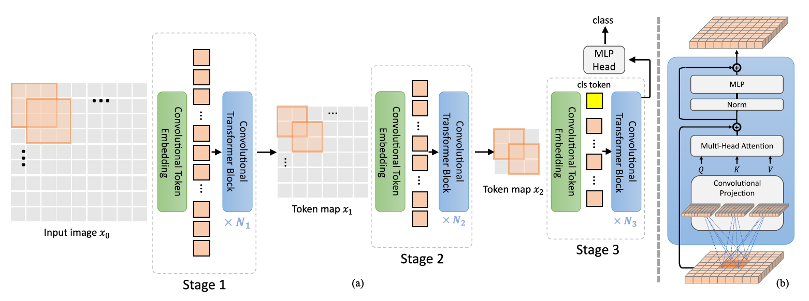

# CvT: Introducing Convolutions to Vision Transformers, [arxiv](https://arxiv.org/abs/2103.15808) 

PaddlePaddle training/validation code and pretrained models for **CvT**.

The official pytorch implementation is [here](https://github.com/microsoft/CvT/).


This implementation is developed by [PaddleViT](https://github.com/BR-IDL/PaddleViT.git).

<p align="center">

    <h4 align="center">CvT Model Overview</h4>
</p>


### Update 
- Update (2022-04-08): Code is updated.
- Update (2021-12-24): Code is released and ported weights are uploaded.


## Models Zoo
| Model                         | Acc@1 | Acc@5 | #Params | FLOPs  | Image Size | Crop_pct | Interpolation | Link         |
|-------------------------------|-------|-------|---------|--------|------------|----------|---------------|--------------|
| CvT-13-224      | 81.59 | 95.67 | 20M    | 4.5G    | 224        | 0.875      | bicubic       | [google](https://drive.google.com/file/d/1r0fnHn1bRPmN0mi8RwAPXmD4utDyOxEf/view?usp=sharing)/[baidu](https://pan.baidu.com/s/13xNwCGpdJ5MVUi369OGl5Q?pwd=vev9) |
| CvT-21-224      | 82.46 | 96.00 | 32M    | 7.1G    | 224        | 0.875      | bicubic       | [google](https://drive.google.com/file/d/18s7nRfvcmNdbRuEpTQe02AQE3Y9UWVQC/view?usp=sharing)/[baidu](https://pan.baidu.com/s/1mOjbMNoQb7X3VJD3LV0Hhg?pwd=t2rv) |
| CvT-13-384   	  | 83.00 | 96.36 | 20M    | 16.3G   | 384        | 1.0        | bicubic       | [google](https://drive.google.com/file/d/1J0YYPUsiXSqyExBPtOPrOLL9c16syllg/view?usp=sharing)/[baidu](https://pan.baidu.com/s/1upITRr5lNHLjbBJtIr-jdg?pwd=wswt) |
| CvT-21-384   	  | 83.27 | 96.16 | 32M    | 24.9G   | 384        | 1.0        | bicubic       | [google](https://drive.google.com/file/d/1tpXv_yYXtvyArlYi7AFcHUOqemhyMWHW/view?usp=sharing)/[baidu](https://pan.baidu.com/s/1hXKi3Kb7mNxPFVmR6cdkMg?pwd=hcem) |
| CvT-13-384-22k  | 83.26 | 97.09 | 20M    | 16.3G   | 384        | 1.0        | bicubic       | [google](https://drive.google.com/file/d/18djrvq422u1pGLPxNfWAp6d17F7C5lbP/view?usp=sharing)/[baidu](https://pan.baidu.com/s/1YYv5rKPmroxKCnzkesUr0g?pwd=c7m9) |
| CvT-21-384-22k  | 84.91 | 97.62 | 32M    | 24.9G   | 384        | 1.0        | bicubic       | [google](https://drive.google.com/file/d/1NVXd7vxVoRpL-21GN7nGn0-Ut0L0Owp8/view?usp=sharing)/[baidu](https://pan.baidu.com/s/1N3xNU6XFHb1CdEOrnjKuoA?pwd=9jxe) |
| CvT-w24-384-22k | 87.58 | 98.47 | 277M   | 193.2G  | 384        | 1.0        | bicubic       | [google](https://drive.google.com/file/d/1M3bg46N4SGtupK8FcvAOE0jltOwP5yja/view?usp=sharing)/[baidu](https://pan.baidu.com/s/1MNJurm8juHRGG9SAw3IOkg?pwd=bbj2) |


> *The results are evaluated on ImageNet2012 validation set.

## Data Preparation
ImageNet2012 dataset is used in the following file structure:
```
│imagenet/
├──train_list.txt
├──val_list.txt
├──train/
│  ├── n01440764
│  │   ├── n01440764_10026.JPEG
│  │   ├── n01440764_10027.JPEG
│  │   ├── ......
│  ├── ......
├──val/
│  ├── n01440764
│  │   ├── ILSVRC2012_val_00000293.JPEG
│  │   ├── ILSVRC2012_val_00002138.JPEG
│  │   ├── ......
│  ├── ......
```
- `train_list.txt`: list of relative paths and labels of training images. You can download it from: [google](https://drive.google.com/file/d/10YGzx_aO3IYjBOhInKT_gY6p0mC3beaC/view?usp=sharing)/[baidu](https://pan.baidu.com/s/1G5xYPczfs9koDb7rM4c0lA?pwd=a4vm?pwd=a4vm)
- `val_list.txt`: list of relative paths and labels of validation images. You can download it from: [google](https://drive.google.com/file/d/1aXHu0svock6MJSur4-FKjW0nyjiJaWHE/view?usp=sharing)/[baidu](https://pan.baidu.com/s/1TFGda7uBZjR7g-A6YjQo-g?pwd=kdga?pwd=kdga) 


## Usage
To use the model with pretrained weights, download the `.pdparam` weight file and change related file paths in the following python scripts. The model config files are located in `./configs/`.

For example, assume weight file is downloaded in `./cvt-13-224x224.pdparams`, to use the `cvt-13-224x224` model in python:
```python
from config import get_config
from cvt import build_cvt as build_model
# config files in ./configs/
config = get_config('./configs/cvt-13-224x224.yaml')
# build model
model = build_model(config)
# load pretrained weights
model_state_dict = paddle.load('./cvt-13-224x224.pdparams')
model.set_state_dict(model_state_dict)
```

## Evaluation
To evaluate model performance on ImageNet2012, run the following script using command line:
```shell
sh run_eval_multi.sh
```
or
```shell
CUDA_VISIBLE_DEVICES=0,1,2,3,4,5,6,7 \
python main_multi_gpu.py \
-cfg='./configs/cvt-13-224x224.yaml' \
-dataset='imagenet2012' \
-batch_size=256 \
-data_path='/dataset/imagenet' \
-eval \
-pretrained='./cvt-13-224x224.pdparams' \
-amp
```
> Note: if you have only 1 GPU, change device number to `CUDA_VISIBLE_DEVICES=0` would run the evaluation on single GPU.


## Training
To train the model on ImageNet2012, run the following script using command line:
```shell
sh run_train_multi.sh
```
or
```shell
CUDA_VISIBLE_DEVICES=0,1,2,3,4,5,6,7 \
python main_multi_gpu.py \
-cfg='./configs/cvt-13-224x224.yaml' \
-dataset='imagenet2012' \
-batch_size=256 \
-data_path='/dataset/imagenet' \
-amp
```
> Note: it is highly recommanded to run the training using multiple GPUs / multi-node GPUs.


## Reference
```
@article{wu2021cvt,
title={CvT: Introducing Convolutions to Vision Transformers},
author={Haiping Wu, Bin Xiao, Noel Codella, Mengchen Liu, Xiyang Dai, Lu Yuan, Lei Zhang},
journal={arXiv preprint arXiv:2103.15808},
year={2021}
}
```
