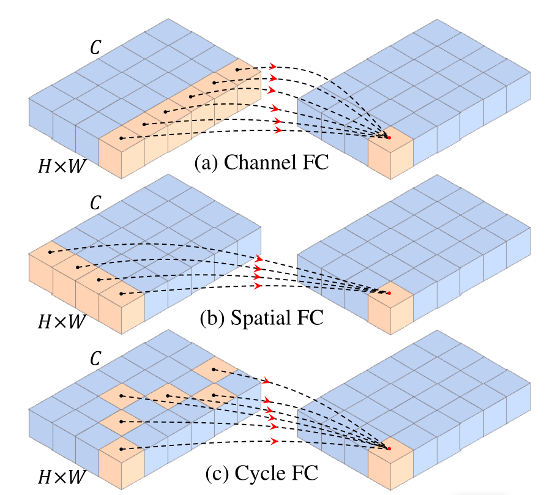

# CycleMLP: A MLP-like Architecture for Dense Prediction, [arXiv](https://arxiv.org/abs/2107.10224)

PaddlePaddle training/validation code and pretrained models for **CycleMLP**.

The official and 3rd party pytorch implementation are [here](https://github.com/ShoufaChen/CycleMLP).


This implementation is developed by [PPViT](https://github.com/xperzy/PPViT/tree/master).

<p align="center">

<h4 align="center">CycleMLP Model Overview</h4>
</p>


### Update 
Update (2021-09-24): Code is released and ported weights are uploaded.

## Models Zoo
| Model                         | Acc@1 | Acc@5 | #Params | FLOPs  | Image Size | Crop_pct | Interpolation | Link         |
|-------------------------------|-------|-------|---------|--------|------------|----------|---------------|--------------|
| cyclemlp_b1 					 | 78.85 | 94.60 | 15.1M   |  2.1G  | 224   	    | 0.9    | bicubic       | [google](https://drive.google.com/file/d/10WQenRy9lfOJF4xEHc9Mekp4zHRh0mJ_/view?usp=sharing)/[baidu](https://pan.baidu.com/s/11UQp1RkWBsZFOqit_uU80w)(mnbr) |
| cyclemlp_b2 					 | 81.58 | 95.81 | 26.8M   |  3.9G  | 224   	    | 0.9    | bicubic       | [google](https://drive.google.com/file/d/1dtQHCwtxNh9jgiHivN5iYpHe7uKRUjhk/view?usp=sharing)/[baidu](https://pan.baidu.com/s/1Js-Oq5vyiB7oPagn43cn3Q)(jwj9) |
| cyclemlp_b3 					 | 82.42 | 96.07 | 38.3M   |  6.9G  | 224   	    | 0.9    | bicubic       | [google](https://drive.google.com/file/d/11kMq112tAwVE5llJIepIIixz74AjaJhU/view?usp=sharing)/[baidu](https://pan.baidu.com/s/1b7cau1yPxqATA8X7t2DXkw)(v2fy) |
| cyclemlp_b4 					 | 82.96 | 96.33 | 51.8M   |  10.1G  | 224   	    | 0.875  | bicubic       | [google](https://drive.google.com/file/d/1vwJ0eD9Ic-NvLvCz1zEAmn7RxBMtd_v2/view?usp=sharing)/[baidu](https://pan.baidu.com/s/1P3TlnXRFGWj9nVP5xBGGWQ)(fnqd) |
| cyclemlp_b5 					 | 83.25 | 96.44 | 75.7M   |  12.3G  | 224   	    | 0.875  | bicubic       | [google](https://drive.google.com/file/d/12_I4cfOBfp7kC0RvmnMXFqrSxww6plRW/view?usp=sharing)/[baidu](https://pan.baidu.com/s/1-Cka1tNqGUQutkAP3VZXzQ)(s55c) |


> *The results are evaluated on ImageNet2012 validation set.
> 
> Note: CycleMLP weights are ported from [here](https://github.com/ShoufaChen/CycleMLP)


## Notebooks
We provide a few notebooks in aistudio to help you get started:

**\*(coming soon)\***


## Requirements
- Python>=3.6
- yaml>=0.2.5
- [PaddlePaddle](https://www.paddlepaddle.org.cn/documentation/docs/en/install/index_en.html)>=2.1.0
- [yacs](https://github.com/rbgirshick/yacs)>=0.1.8

## Data 
ImageNet2012 dataset is used in the following folder structure:
```
│imagenet/
├──train/
│  ├── n01440764
│  │   ├── n01440764_10026.JPEG
│  │   ├── n01440764_10027.JPEG
│  │   ├── ......
│  ├── ......
├──val/
│  ├── n01440764
│  │   ├── ILSVRC2012_val_00000293.JPEG
│  │   ├── ILSVRC2012_val_00002138.JPEG
│  │   ├── ......
│  ├── ......
```

## Usage
To use the model with pretrained weights, download the `.pdparam` weight file and change related file paths in the following python scripts. The model config files are located in `./configs/`.

For example, assume the downloaded weight file is stored in `./cyclemlp_b1.pdparams`, to use the `cyclemlp_b1` model in python:
```python
from config import get_config
from cyclemlp import build_cyclemlp as build_model
# config files in ./configs/
config = get_config('./configs/cyclemlp_b1.yaml')
# build model
model = build_model(config)
# load pretrained weights, .pdparams is NOT needed
model_state_dict = paddle.load('./cyclemlp_b1')
model.set_dict(model_state_dict)
```

## Evaluation
To evaluate CycleMLP model performance on ImageNet2012 with a single GPU, run the following script using command line:
```shell
sh run_eval.sh
```
or
```shell
CUDA_VISIBLE_DEVICES=0 \
python main_single_gpu.py \
    -cfg='./configs/cyclemlp_b1.yaml' \
    -dataset='imagenet2012' \
    -batch_size=16 \
    -data_path='/dataset/imagenet' \
    -eval \
    -pretrained='./cyclemlp_b1'
```

<details>

<summary>
Run evaluation using multi-GPUs:
</summary>


```shell
sh run_eval_multi.sh
```
or
```shell
CUDA_VISIBLE_DEVICES=0,1,2,3 \
python main_multi_gpu.py \
    -cfg='./configs/cyclemlp_b1.yaml' \
    -dataset='imagenet2012' \
    -batch_size=16 \
    -data_path='/dataset/imagenet' \
    -eval \
    -pretrained='./cyclemlp_b1'
```

</details>

## Training
To train the CycleMLP Transformer model on ImageNet2012 with single GPUs, run the following script using command line:
```shell
sh run_train.sh
```
or
```shell
CUDA_VISIBLE_DEVICES=0 \
python main_single_gpu.py \
  -cfg='./configs/cyclemlp_b1.yaml' \
  -dataset='imagenet2012' \
  -batch_size=32 \
  -data_path='/dataset/imagenet' \
```

<details>

<summary>
Run training using multi-GPUs:
</summary>


```shell
sh run_train_multi.sh
```
or
```shell
CUDA_VISIBLE_DEVICES=0,1,2,3 \
python main_multi_gpu.py \
    -cfg='./configs/cyclemlp_b1.yaml' \
    -dataset='imagenet2012' \
    -batch_size=16 \
    -data_path='/dataset/imagenet' \ 
```

</details>


## Visualization Attention Map
**(coming soon)**

## Reference
```
@article{chen2021cyclemlp,
  title={CycleMLP: A MLP-like Architecture for Dense Prediction},
  author={Chen, Shoufa and Xie, Enze and Ge, Chongjian and Liang, Ding and Luo, Ping},
  journal={arXiv preprint arXiv:2107.10224},
  year={2021}
}
```
