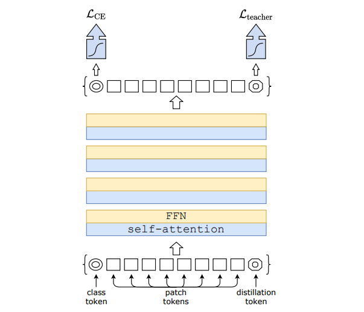

# Training data-efficient image transformers & distillation through attention, [arxiv](https://arxiv.org/abs/2012.12877) 

PaddlePaddle training/validation code and pretrained models for **DeiT**.

The official pytorch implementation is [here](https://github.com/facebookresearch/deit).

This implementation is developed by [PPViT](https://github.com/xperzy/PPViT/tree/master).


<p align="center">

<h4 align="center">DeiT Model Overview</h4>
</p>

### Update 
Update (2021-08-11): Code is released and ported weights are uploaded.

## Models Zoo
| Model                          | Acc@1 | Acc@5 | Image Size | Crop_pct | Interpolation | Link        |
|--------------------------------|-------|-------|------------|----------|---------------|--------------|
| deit_base_distilled_patch16_224| 83.32  | 96.49 | 224        | 0.875    | bicubic       | [google](https://drive.google.com/file/d/12_x6-NN3Jde2BFUih4OM9NlTwe9-Xlkw/view?usp=sharing)/[baidu](https://pan.baidu.com/s/1ZnmAWgT6ewe7Vl3Xw_csuA)(5f2g) |
| deit_base_distilled_patch16_384| 85.43  | 97.33 | 384        | 1.0      | bicubic       | [google](https://drive.google.com/file/d/1i5H_zjSdHfM-Znv89DHTv9ChykWrIt8I/view?usp=sharing)/[baidu](https://pan.baidu.com/s/1PQsQIci4VCHY7l2tCzMklg)(qgj2) |

| Teacher Model | Link |
| -- | -- |
| RegNet_Y_160  | [google](https://drive.google.com/file/d/1_nEYFnQqlGGqboLq_VmdRvV9mLGSrbyG/view?usp=sharing)/[baidu](https://pan.baidu.com/s/1NZNhiO4xDfqHiRiIbk9BCA)(gjsm)   |

> *The results are evaluated on ImageNet2012 validation set.


## Notebooks
We provide a few notebooks in aistudio to help you get started:

**\*(coming soon)\***


## Requirements
- Python>=3.6
- yaml>=0.2.5
- [PaddlePaddle](https://www.paddlepaddle.org.cn/documentation/docs/en/install/index_en.html)>=2.1.0
- [yacs](https://github.com/rbgirshick/yacs)>=0.1.8

## Data 
ImageNet2012 dataset is used in the following folder structure:
```
│imagenet/
├──train/
│  ├── n01440764
│  │   ├── n01440764_10026.JPEG
│  │   ├── n01440764_10027.JPEG
│  │   ├── ......
│  ├── ......
├──val/
│  ├── n01440764
│  │   ├── ILSVRC2012_val_00000293.JPEG
│  │   ├── ILSVRC2012_val_00002138.JPEG
│  │   ├── ......
│  ├── ......
```

## Usage
To use the model with pretrained weights, download the `.pdparam` weight file and change related file paths in the following python scripts. The model config files are located in `./configs/`.

For example, assume the downloaded weight file is stored in `./deit_base_patch16_224.pdparams`, to use the `deit_base_patch16_224` model in python:
```python
from config import get_config
from deit import build_deit as build_model
# config files in ./configs/
config = get_config('./configs/deit_base_patch16_224.yaml')
# build model
model = build_model(config)
# load pretrained weights, .pdparams is NOT needed
model_state_dict = paddle.load('./deit_base_patch16_224')
model.set_dict(model_state_dict)
```

## Evaluation
To evaluate DeiT model performance on ImageNet2012 with a single GPU, run the following script using command line:
```shell
sh run_eval.sh
```
or
```shell
CUDA_VISIBLE_DEVICES=0 \
python main_single_gpu.py \
    -cfg='./configs/deit_base_patch16_224.yaml' \
    -dataset='imagenet2012' \
    -batch_size=16 \
    -data_path='/dataset/imagenet' \
    -eval \
    -pretrained='./deit_base_patch16_224'
```

<details>

<summary>
Run evaluation using multi-GPUs:
</summary>


```shell
sh run_eval_multi.sh
```
or
```shell
CUDA_VISIBLE_DEVICES=0,1,2,3 \
python main_multi_gpu.py \
    -cfg='./configs/deit_base_patch16_224.yaml' \
    -dataset='imagenet2012' \
    -batch_size=16 \
    -data_path='/dataset/imagenet' \
    -eval \
    -pretrained='./deit_base_patch16_224'
```

</details>


## Training
To train the DeiT Transformer model on ImageNet2012 with single GPU, **download** the pretrained weights of **teacher** model (`regnety_160.pdparams`) and run the following script using command line:

```shell
sh run_train_single.sh
```
or
```shell
CUDA_VISIBLE_DEVICES=0 \
python main_single_gpu.py \
  -cfg='./configs/deit_base_patch16_224.yaml' \
  -dataset='imagenet2012' \
  -batch_size=32 \
  -data_path='/dataset/imagenet' \
  -teacher_model='./regnety_160'
```

<details>

<summary>
Run training using multi-GPUs:
</summary>


```shell
sh run_train_multi.sh
```
or
```shell
CUDA_VISIBLE_DEVICES=0,1,2,3 \
python main_multi_gpu.py \
    -cfg='./configs/deit_base_patch16_224.yaml' \
    -dataset='imagenet2012' \
    -batch_size=16 \
    -data_path='/dataset/imagenet' \
    -teacher_model='./regnety_160'
```

</details>

## Visualization Attention Map
**(coming soon)**

## Reference
```
@inproceedings{touvron2021training,
  title={Training data-efficient image transformers \& distillation through attention},
  author={Touvron, Hugo and Cord, Matthieu and Douze, Matthijs and Massa, Francisco and Sablayrolles, Alexandre and J{\'e}gou, Herv{\'e}},
  booktitle={International Conference on Machine Learning},
  pages={10347--10357},
  year={2021},
  organization={PMLR}
}
```
