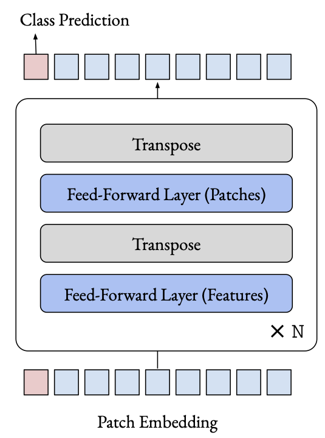

# Do You Even Need Attention? A Stack of Feed-Forward Layers Does
Surprisingly Well on ImageNet, [arxiv](https://arxiv.org/abs/2105.02723) 

PaddlePaddle training/validation code and pretrained models for **FF_Only**.

The official pytorch implementation is [here](https://github.com/lukemelas/do-you-even-need-attention).


This implementation is developed by [PaddleViT](https://github.com/BR-IDL/PaddleViT.git).

<p align="center">

    <h4 align="center">FF_Only Model Overview</h4>
</p>


### Update 
Update (2021-09-14): Code is released and ported weights are uploaded.

## Models Zoo

| Model                          | Acc@1 | Acc@5 | Image Size | Crop_pct | Interpolation | Link |
|--------------------------------|-------|-------|------------|----------|--------------|---------------|
| ff_tiny            | 61.28 | 84.06 | 224        | 0.875    | bicubic       | [google](https://drive.google.com/file/d/14bPRCwuY_nT852fBZxb9wzXzbPWNfbCG/view?usp=sharing)/[baidu](https://pan.baidu.com/s/1nNE4Hh1Nrzl7FEiyaZutDA)(mjgd) |
| ff_base       | 74.82 | 91.71 | 224        | 0.875      | bicubic      | [google](https://drive.google.com/file/d/1DHUg4oCi41ELazPCvYxCFeShPXE4wU3p/view?usp=sharing)/[baidu](https://pan.baidu.com/s/1l-h6Cq4B8kZRvHKDTzhhUg)(m1jc) |

> *The results are evaluated on ImageNet2012 validation set.
>
> Note: FF_Only weights are ported from [here](https://github.com/lukemelas/do-you-even-need-attention).


## Notebooks
We provide a few notebooks in aistudio to help you get started:

**\*(coming soon)\***


## Requirements
- Python>=3.6
- yaml>=0.2.5
- [PaddlePaddle](https://www.paddlepaddle.org.cn/documentation/docs/en/install/index_en.html)>=2.1.0
- [yacs](https://github.com/rbgirshick/yacs)>=0.1.8

## Data 
ImageNet2012 dataset is used in the following folder structure:
```
│imagenet/
├──train/
│  ├── n01440764
│  │   ├── n01440764_10026.JPEG
│  │   ├── n01440764_10027.JPEG
│  │   ├── ......
│  ├── ......
├──val/
│  ├── n01440764
│  │   ├── ILSVRC2012_val_00000293.JPEG
│  │   ├── ILSVRC2012_val_00002138.JPEG
│  │   ├── ......
│  ├── ......
```

## Usage
To use the model with pretrained weights, download the `.pdparam` weight file and change related file paths in the following python scripts. The model config files are located in `./configs/`.

For example, assume the downloaded weight file is stored in `./linear_base.pdparams`, to use the `linear_base` model in python:
```python
from config import get_config
from resmlp import build_res_mlp as build_model
# config files in ./configs/
config = get_config('./configs/ff_base.yaml')
# build model
model = build_model(config)
# load pretrained weights
model_state_dict = paddle.load('./linear_base.pdparams')
model.set_dict(model_state_dict)
```

## Evaluation
To evaluate FF_Only model performance on ImageNet2012 with a single GPU, run the following script using command line:
```shell
sh run_eval.sh
```
or
```shell
CUDA_VISIBLE_DEVICES=0 \
python main_single_gpu.py \
    -cfg=./configs/ff_base.yaml \
    -dataset=imagenet2012 \
    -batch_size=8 \
    -data_path=/path/to/dataset/imagenet/val \
    -eval \
    -pretrained=/path/to/pretrained/model/linear_base  # .pdparams is NOT needed
```

<details>

<summary>
Run evaluation using multi-GPUs:
</summary>


```shell
sh run_eval_multi.sh
```
or
```shell
CUDA_VISIBLE_DEVICES=4,5,6,7 \
python main_multi_gpu.py \
    -cfg=./configs/ff_base.yaml \
    -dataset='imagenet2012' \
    -batch_size=16 \
    -data_path=/path/to/dataset/imagenet/val \
    -eval \
    -pretrained=/path/to/pretrained/model/linear_base  # .pdparams is NOT needed
```

</details>

## Training
To train the FF_Only model on ImageNet2012 with single GPUs, run the following script using command line:
```shell
sh run_train.sh
```
or
```shell
CUDA_VISIBLE_DEVICES=0 \
python main_single_gpu.py \
    -cfg=./configs/ff_base.yaml \
    -dataset=imagenet2012 \
    -batch_size=32 \
    -data_path=/path/to/dataset/imagenet/train
```

<details>
<summary>
Run training using multi-GPUs:
</summary>


```shell
sh run_train_multi.sh
```
or
```shell
CUDA_VISIBLE_DEVICES=0,1,2,3 \
python main_multi_gpu.py \
    -cfg=./configs/ff_base.yaml \
    -dataset=imagenet2012 \
    -batch_size=16 \
    -data_path=/path/to/dataset/imagenet/train
```

</details>


## Visualization Attention Map
**(coming soon)**

## Reference
```
@article{melaskyriazi2021doyoueven,
  title={Do You Even Need Attention? A Stack of Feed-Forward Layers Does Surprisingly Well on ImageNet},
  author={Luke Melas-Kyriazi},
  journal=arxiv,
  year=2021
}
```
