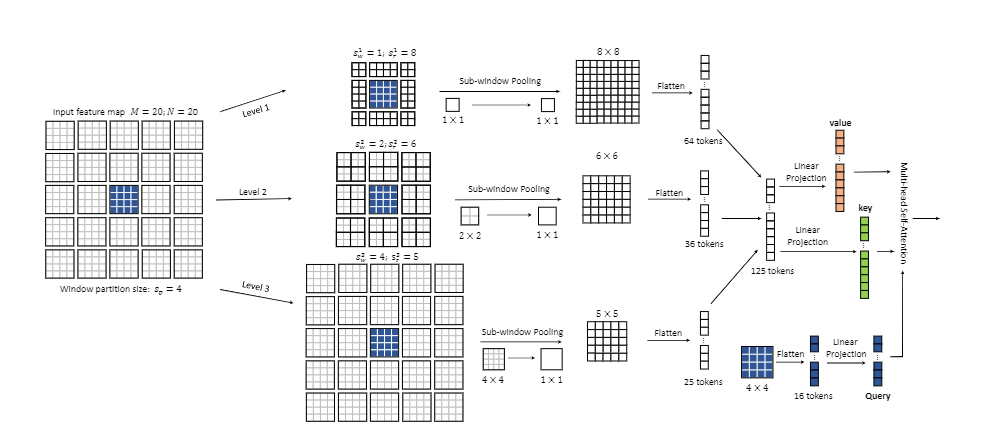

# Focal Self-attention for Local-Global Interactions in Vision Transformers, [arxiv](https://arxiv.org/pdf/2107.00641)


PaddlePaddle training/validation code and pretrained models for Focal Transformer.

The official pytorch implementation is [here](https://github.com/microsoft/Focal-Transformer).

This implementation is developed by [PaddleViT](https://github.com/BR-IDL/PaddleViT.git).

<div align=center>
  
  <center> <h3>Focal Transformer Model Overview</h3>  </center>
  </div>

### Update

- Update(2021-10-21): Code is released and ported weights are uploaded.

## Models Zoo

| Model                         | Acc@1 | Acc@5 | #Params | FLOPs  | Image Size | Crop_pct | Interpolation | Link         |
|-------------------------------|-------|-------|---------|--------|------------|----------|---------------|--------------|
| Focal-T    					| 82.03 | 95.86 | 28.9M   | 4.9G    | 224        | 0.875    | bicubic       | [google](https://drive.google.com/file/d/1HzZJbYH_eIo94h0wLUhqTyJ6AYthNKRh/view?usp=sharing)/[baidu](https://pan.baidu.com/s/1JCr2qIA-SZvTqbTO-m2OwA)(i8c2) |
| Focal-T (use conv)   			| 82.70 | 96.14 | 30.8M   | 4.9G    | 224        | 0.875    | bicubic       | [google](https://drive.google.com/file/d/1PS0-gdXHGl95LqH5k5DG62AH6D3i7v0D/view?usp=sharing)/[baidu](https://pan.baidu.com/s/1tVztox4bVJuJEjkD1fLaHQ)(smrk) |
| Focal-S    					| 83.55 | 96.29 | 51.1M   | 9.4G    | 224        | 0.875    | bicubic       | [google](https://drive.google.com/file/d/1HnVAYsI_hmiomyS4Ax3ccPE7gk4mlTU8/view?usp=sharing)/[baidu](https://pan.baidu.com/s/1b7uugAY9RhrgTkUwYcvvow)(dwd8) |
| Focal-S (use conv)   			| 83.85 | 96.47 | 53.1M   | 9.4G    | 224        | 0.875    | bicubic       | [google](https://drive.google.com/file/d/1vcHjYiGNMayoSTPoM8z39XRH6h89TB9V/view?usp=sharing)/[baidu](https://pan.baidu.com/s/174a2aZzCEt3teLuAnIzMtA)(nr7n) |
| Focal-B    					| 83.98 | 96.48 | 89.8M   | 16.4G   | 224        | 0.875    | bicubic       | [google](https://drive.google.com/file/d/1bNMegxetWpwZNcmDEC3MHCal6SNXSgWR/view?usp=sharing)/[baidu](https://pan.baidu.com/s/1piBslNhxWR78aQJIdoZjEw)(8akn) |
| Focal-B (use conv)   			| 84.18 | 96.61 | 93.3M   | 16.4G   | 224        | 0.875    | bicubic       | [google](https://drive.google.com/file/d/1-J2gDnKrvZGtasvsAYozrbMXR2LtIJ43/view?usp=sharing)/[baidu](https://pan.baidu.com/s/1GTLfnTlt6I6drPdfSWB1Iw)(5nfi) |

> *The results are evaluated on ImageNet2012 validation set.

### Models trained from scratch using PaddleViT
(coming soon)

## Notebooks
We provide a few notebooks in aistudio to help you get started:

**(coming soon)**

## Requirements
- Python>=3.6
- yaml>=0.2.5
- PaddlePaddle>=2.1.0
- yacs>=0.1.8

## Data
`ImageNet2012 dataset` is used in the following folder structure:
```
│imagenet/
├──train/
│  ├── n01440764
│  │   ├── n01440764_10026.JPEG
│  │   ├── n01440764_10027.JPEG
│  │   ├── ......
│  ├── ......
├──val/
│  ├── n01440764
│  │   ├── ILSVRC2012_val_00000293.JPEG
│  │   ├── ILSVRC2012_val_00002138.JPEG
│  │   ├── ......
│  ├── ......
```

## Usage
To use the model with pretrained weights, download the .pdparam weight file and change related file paths in the following python scripts. The model config files are located in `./configs/`.

For example, assume the downloaded weight file is stored in `./focal_tiny_patch4_window7_224.pdparams`, to use the `focal_tiny_patch4_window7_224` model in python:

```python
from config import get_config
from focal_transformer import build_focal as build_model
# config files in ./configs/
config = get_config('./configs/focal_tiny_patch4_window7_224.yaml')
# build model
model = build_model(config)
# load pretrained weights, .pdparams is NOT needed
model_state_dict = paddle.load('./focal_tiny_patch4_window7_224')
model.set_dict(model_state_dict)
```

## Evaluation
To evaluate `Focal Transformer` model performance on ImageNet2012 with a `single GPU`, run the following script using command line:

```shell
sh run_eval.sh
```

or

```shell
CUDA_VISIBLE_DEVICES=0 \
python main_single_gpu.py \
    -cfg='./configs/focal_tiny_patch4_window7_224.yaml' \
    -dataset='imagenet2012' \
    -num_classes=1000 \
    -batch_size=64 \
    -image_size=224 \
    -data_path='/dataset/imagenet' \
    -eval \
    -pretrained='./focal_tiny_patch4_window7_224'
```

<details>

<summary>
Run evaluation using multi-GPUs:
</summary>


```shell
sh run_eval_multi.sh
```
or
```shell
CUDA_VISIBLE_DEVICES=0,1,2,3 \
python main_multi_gpu.py \
    -cfg='./configs/focal_tiny_patch4_window7_224.yaml' \
    -dataset='imagenet2012' \
    -num_classes=1000 \
    -batch_size=32 \
    -image_size=224 \
    -data_path='/dataset/imagenet' \
    -eval \
    -pretrained='./focal_tiny_patch4_window7_224'
```

</details>

## Training
To train the `Focal Transformer` model on ImageNet2012 with `single GPU`, run the following script using command line:
```shell
sh run_train.sh
```
or
```shell
CUDA_VISIBLE_DEVICES=0 \
python main_single_gpu.py \
    -cfg='./configs/focal_tiny_patch4_window7_224.yaml' \
    -dataset='imagenet2012' \
    -num_classes=1000 \
    -batch_size=32 \
    -image_size=224 \
    -data_path='/dataset/imagenet' \
    -output='./output'
```

<details>

<summary>
Run training using multi-GPUs:
</summary>


```shell
sh run_train_multi.sh
```
or
```shell
CUDA_VISIBLE_DEVICES=0,1,2,3 \
python main_single_gpu.py \
    -cfg='./configs/focal_tiny_patch4_window7_224.yaml' \
    -dataset='imagenet2012' \
    -num_classes=1000 \
    -batch_size=4 \
    -image_size=224 \
    -data_path='/dataset/imagenet' \
    -output='./output'
```

</details>

## Arguments
- *`-cfg`*: path of model config file (.yaml), stored in `./configs`.
- *`-dataset`*: dataset name, e.g., `imagenet2012`, `cifar10`, `cifar100`.
- *`-data_path`*: dataset folder path
- `-batch_size`: batch size，default: `32`.
- `-image_size`: input image size，default`224`.
- `-num_classes`: number of classes, default: `1000`.
- `-output`: output folder for storing weights and logs，default: `./output`.
- `-pretrained`: pretrain model weights file path, (`.pdparams` file ext is NOT needed) default: `None`.
- `-resume`: resume model weight and opt file path, (`.paparams` and `.pdopts` file ext are NOT needed, default: `None`.
- `-last_epoch`: start epoch，default: `None`.
- `-save_freq`: number of epochs to save checkpoint，default: `1`.
- `-log_freq`: number of iters to print logging，default: `100`.
- `-validate_freq`: number of epochs to do validation during training，default: `10`.
- `-accum_iter`: number of iteration for iter accumulation, default: 1.
- `-num_workers`: number of workers for data loading，default: `1`.
- `-ngpus`: number of GPUs to use，you can control GPUs by CUDA_VISIBLE_DEVICES, just set this to -1 default: `-1`.
- `-eval`: start eval mode.
- `-amp`: start amp training.

> `-cfg`,`-dataset` and `-data_path` in `main_single_gpu.py` and `main_multi_gpu.py` are MUST-HAVE settings.

## Visualization Attention Map
**(coming soon)**

## Reference
```
@misc{yang2021focal,
    title={Focal Self-attention for Local-Global Interactions in Vision Transformers}, 
    author={Jianwei Yang and Chunyuan Li and Pengchuan Zhang and Xiyang Dai and Bin Xiao and Lu Yuan and Jianfeng Gao},
    year={2021},
    eprint={2107.00641},
    archivePrefix={arXiv},
    primaryClass={cs.CV}
}
```
