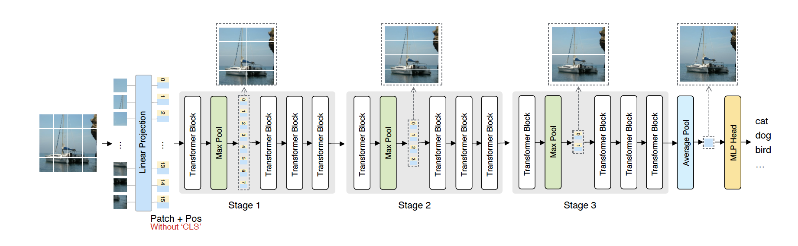
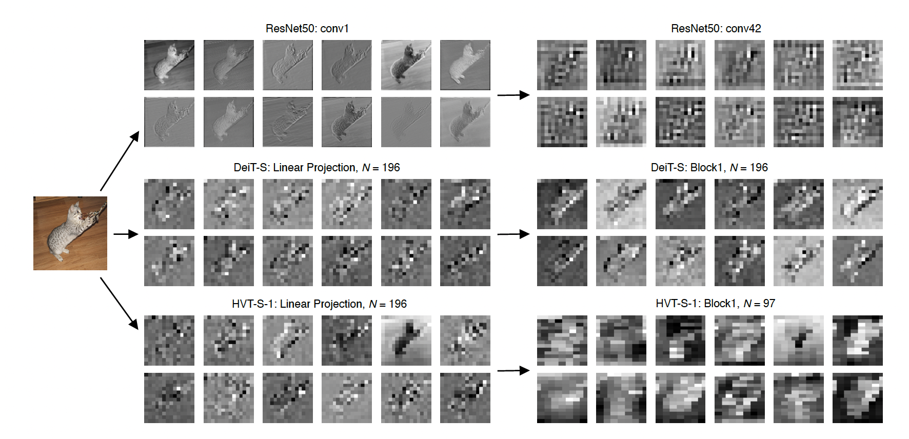

# Scalable Vision Transformers with Hierarchical Pooling [arxiv](https://arxiv.org/abs/2103.10619) 

PaddlePaddle training/validation code and pretrained models for **HVT**.

The official pytorch implementation is [here](https://github.com/zhuang-group/HVT).

This implementation is developed by [PaddleViT](https://github.com/BR-IDL/PaddleViT.git).


<p align="center">

<h4 align="center">HVT Model Overview</h4>
</p>

### Update 
- Update (2021-12-28): Code is released and ported weights are uploaded.

## Models Zoo
| Model          | Acc@1 | Acc@5 | #Params | FLOPs  | Image Size | Crop_pct | Interpolation | Link         |
|----------------|-------|-------|---------|--------|------------|----------|---------------|--------------|
| HVT-Ti-1       | 69.45 | 89.28 | 5.7M    | 0.6G   | 224        |  0.875   |  bicubic      |  [google](https://drive.google.com/file/d/11BW-qLBMu_1TDAavlrAbfVlXB53dgm42/view?usp=sharing)/[baidu](https://pan.baidu.com/s/16rZvJqL-UVuWFsCDuxFDqg?pwd=egds)(egds) |
| HVT-S-0        | 80.30 | 95.15 | 22.0M   | 4.6G   | 224        |  0.875   |  bicubic      |  [google](https://drive.google.com/file/d/1GlJ2j2QVFye1tAQoUJlgKTR_KELq3mSa/view?usp=sharing)/[baidu](https://pan.baidu.com/s/1L-tjDxkQx00jg7BsDClabA?pwd=hj7a)(hj7a) |
| HVT-S-2        | 77.41 | 93.48 | 22.1M   | 1.9G   | 224        |  0.875   |  bicubic      |  [google](https://drive.google.com/file/d/1U14LA7SXJtFep_SdUCjAV-cDOQ9A_OFk/view?usp=sharing)/[baidu](https://pan.baidu.com/s/1nooWTBzaXyBtEgadn9VDmw?pwd=bajp)(bajp) |
| HVT-S-3        | 76.30 | 92.88 | 22.1M   | 1.6G   | 224        |  0.875   |  bicubic      |  [google](https://drive.google.com/file/d/1m1CjOcZfPMLDRyX4QBgMhHV1m6rtu44v/view?usp=sharing)/[baidu](https://pan.baidu.com/s/15sAOmQN6Hx0GLelYDuMQXw?pwd=rjch)(rjch) |
| HVT-S-4        | 75.21 | 92.34 | 22.1M   | 1.6G   | 224        |  0.875   |  bicubic      |  [google](https://drive.google.com/file/d/14comGo9lO12dUeGGL52MuIJWZPSit7I0/view?usp=sharing)/[baidu](https://pan.baidu.com/s/1o31hMRWR7FTCjUk7_fAOgA?pwd=ki4j)(ki4j) |

> *The results are evaluated on ImageNet2012 validation set.


## Notebooks
We provide a few notebooks in aistudio to help you get started:

**\*(coming soon)\***


## Requirements
- Python>=3.6
- yaml>=0.2.5
- [PaddlePaddle](https://www.paddlepaddle.org.cn/documentation/docs/en/install/index_en.html)>=2.1.0
- [yacs](https://github.com/rbgirshick/yacs)>=0.1.8

## Data 
ImageNet2012 dataset is used in the following folder structure:
```
│imagenet/
├──train/
│  ├── n01440764
│  │   ├── n01440764_10026.JPEG
│  │   ├── n01440764_10027.JPEG
│  │   ├── ......
│  ├── ......
├──val/
│  ├── n01440764
│  │   ├── ILSVRC2012_val_00000293.JPEG
│  │   ├── ILSVRC2012_val_00002138.JPEG
│  │   ├── ......
│  ├── ......
```

## Usage
To use the model with pretrained weights, download the `.pdparam` weight file and change related file paths in the following python scripts. The model config files are located in `./configs/`.

For example, assume the downloaded weight file is stored in `./hvt_s2_patch16_224.pdparams`, to use the `hvt_s2_patch16_224` model in python:
```python
from config import get_config
from hvt import build_hvt as build_model
# config files in ./configs/
config = get_config('./configs/hvt_s2_patch16_224.yaml')
# build model
model = build_model(config)
# load pretrained weights, .pdparams is NOT needed
model_state_dict = paddle.load('./hvt_s2_patch16_224')
model.set_dict(model_state_dict)
```

## Evaluation
To evaluate HVT model performance on ImageNet2012 with a single GPU, run the following script using command line:
```shell
sh run_eval.sh
```
or
```shell
CUDA_VISIBLE_DEVICES=0 \
python main_single_gpu.py \
    -cfg='./configs/hvt_s2_patch16_224.yaml' \
    -dataset='imagenet2012' \
    -batch_size=16 \
    -data_path='/dataset/imagenet' \
    -eval \
    -pretrained='./hvt_s2_patch16_224'
```

<details>

<summary>
Run evaluation using multi-GPUs:
</summary>


```shell
sh run_eval_multi.sh
```
or
```shell
CUDA_VISIBLE_DEVICES=0,1,2,3 \
python main_multi_gpu.py \
    -cfg='./configs/hvt_s2_patch16_224.yaml' \
    -dataset='imagenet2012' \
    -batch_size=16 \
    -data_path='/dataset/imagenet' \
    -eval \
    -pretrained='./hvt_s2_patch16_224'
```

</details>


## Training
To train the HVT Transformer model on ImageNet2012 with single GPU, run the following script using command line:

```shell
sh run_train.sh
```
or
```shell
CUDA_VISIBLE_DEVICES=0 \
python main_single_gpu.py \
  -cfg='./configs/hvt_s2_patch16_224.yaml' \
  -dataset='imagenet2012' \
  -batch_size=16 \
  -data_path='/dataset/imagenet' 
```

<details>

<summary>
Run training using multi-GPUs:
</summary>


```shell
sh run_train_multi.sh
```
or
```shell
CUDA_VISIBLE_DEVICES=0,1,2,3 \
python main_multi_gpu.py \
    -cfg='./configs/hvt_s2_patch16_224.yaml' \
    -dataset='imagenet2012' \
    -batch_size=16 \
    -data_path='/dataset/imagenet' 
```

</details>

## Visualization Attention Map

<p align="center">

<h4 align="center">Feature visualization of ResNet50, DeiT-S and HVT-S-1 trained on ImageNet</h4>
</p>

## Reference
```
@inproceedings{pan2021scalable,
  title={Scalable vision transformers with hierarchical pooling},
  author={Pan, Zizheng and Zhuang, Bohan and Liu, Jing and He, Haoyu and Cai, Jianfei},
  booktitle={Proceedings of the IEEE/CVF International Conference on Computer Vision},
  pages={377--386},
  year={2021}
}
```
