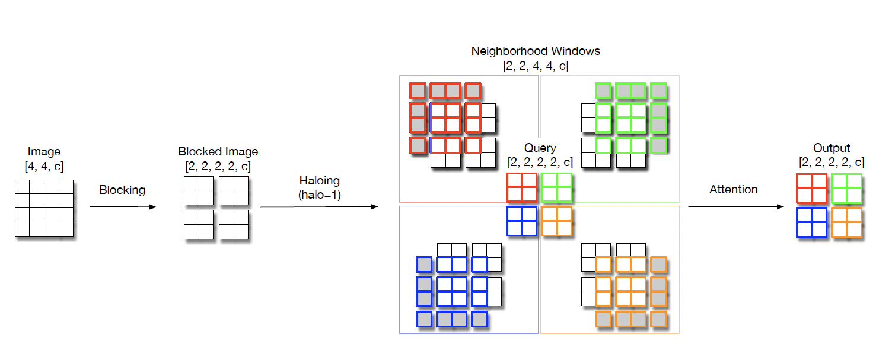

# Scaling Local Self-Attention for Parameter Efficient Visual Backbones, [arxiv](https://https://arxiv.org/abs/2103.12731) 

PaddlePaddle training/validation code and pretrained models for **HaloNet**.

The official pytorch implementation is N/A.

This implementation is developed by [PaddleViT](https://github.com/BR-IDL/PaddleViT.git).


<p align="center">

    <h4 align="center">HaloNet local self-attention architecture</h4>
</p>

### Update 
* Update (2022-04-11): Code is updated.
* Update (2021-12-09): Initial code and ported weights are released.

## Models Zoo
| Model          | Acc@1 	| Acc@5 | #Params | FLOPs  | Image Size | Crop_pct | Interpolation | Link         |
|----------------|----------|-------|---------|--------|------------|----------|---------------|--------------|
| halonet26t 	 | 79.10	| 94.31	| 12.5M    | 3.2G   | 256        | 0.95     | bicubic       |[google](https://drive.google.com/file/d/1F_a1brftXXnPM39c30NYe32La9YZQ0mW/view?usp=sharing)/[baidu](https://pan.baidu.com/s/1FSlSTuYMpwPJpi4Yz2nCTA?pwd=ednv)  |
| halonet50ts 	 | 81.65	| 95.61	| 22.8M    | 5.1G   | 256        | 0.94     | bicubic       |[google](https://drive.google.com/file/d/12t85kJcPA377XePw6smch--ELMBo6p0Y/view?usp=sharing)/[baidu](https://pan.baidu.com/s/1X4LM-sqoTKG7CrM5BNjcdA?pwd=3j9e)  |

> *The results are evaluated on ImageNet2012 validation set.


## Data Preparation
ImageNet2012 dataset is used in the following file structure:
```
│imagenet/
├──train_list.txt
├──val_list.txt
├──train/
│  ├── n01440764
│  │   ├── n01440764_10026.JPEG
│  │   ├── n01440764_10027.JPEG
│  │   ├── ......
│  ├── ......
├──val/
│  ├── n01440764
│  │   ├── ILSVRC2012_val_00000293.JPEG
│  │   ├── ILSVRC2012_val_00002138.JPEG
│  │   ├── ......
│  ├── ......
```
- `train_list.txt`: list of relative paths and labels of training images. You can download it from: [google](https://drive.google.com/file/d/10YGzx_aO3IYjBOhInKT_gY6p0mC3beaC/view?usp=sharing)/[baidu](https://pan.baidu.com/s/1G5xYPczfs9koDb7rM4c0lA?pwd=a4vm?pwd=a4vm)
- `val_list.txt`: list of relative paths and labels of validation images. You can download it from: [google](https://drive.google.com/file/d/1aXHu0svock6MJSur4-FKjW0nyjiJaWHE/view?usp=sharing)/[baidu](https://pan.baidu.com/s/1TFGda7uBZjR7g-A6YjQo-g?pwd=kdga?pwd=kdga) 


## Usage
To use the model with pretrained weights, download the `.pdparam` weight file and change related file paths in the following python scripts. The model config files are located in `./configs/`.

For example, assume weight file is downloaded in `./halonet_26t_256.pdparams`, to use the `halonet_26t_256` model in python:
```python
from config import get_config
from halonet import build_halonet as build_model
# config files in ./configs/
config = get_config('./configs/halonet_26t_256.yaml')
# build model
model = build_model(config)
# load pretrained weights
model_state_dict = paddle.load('./halonet_26t_256.pdparams')
model.set_state_dict(model_state_dict)
```

## Evaluation
To evaluate model performance on ImageNet2012, run the following script using command line:
```shell
sh run_eval_multi.sh
```
or
```shell
CUDA_VISIBLE_DEVICES=0,1,2,3,4,5,6,7 \
python main_multi_gpu.py \
-cfg='./configs/halonet_26t_256.yaml' \
-dataset='imagenet2012' \
-batch_size=256 \
-data_path='/dataset/imagenet' \
-eval \
-pretrained='./halonet_26t_256.pdparams' \
-amp
```
> Note: if you have only 1 GPU, change device number to `CUDA_VISIBLE_DEVICES=0` would run the evaluation on single GPU.


## Training
To train the model on ImageNet2012, run the following script using command line:
```shell
sh run_train_multi.sh
```
or
```shell
CUDA_VISIBLE_DEVICES=0,1,2,3,4,5,6,7 \
python main_multi_gpu.py \
-cfg='./configs/halonet_26t_256.yaml' \
-dataset='imagenet2012' \
-batch_size=256 \
-data_path='/dataset/imagenet' \
-amp
```
> Note: it is highly recommanded to run the training using multiple GPUs / multi-node GPUs.


## Reference
```
@inproceedings{vaswani2021scaling,
  title={Scaling local self-attention for parameter efficient visual backbones},
  author={Vaswani, Ashish and Ramachandran, Prajit and Srinivas, Aravind and Parmar, Niki and Hechtman, Blake and Shlens, Jonathon},
  booktitle={Proceedings of the IEEE/CVF Conference on Computer Vision and Pattern Recognition},
  pages={12894--12904},
  year={2021}
}
```
