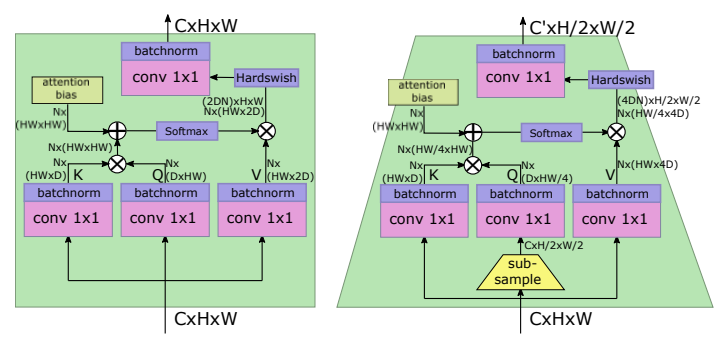

# LeViT: a Vision Transformer in ConvNet's Clothing for Faster Inference, [arxiv](https://arxiv.org/abs/2104.01136)
PaddlePaddle training/validation code and pretrained models for the model released in CVPR2022: **TopFormer (classification backbone)**.

The official PyTorch implementation is [here](https://github.com/facebookresearch/LeViT).

This implementation is developed by [PaddleViT](https://github.com/BR-IDL/PaddleViT.git).

<p align="center">

<h4 align="center">LeViT Model Overview</h4>
</p>


### Update 
- Update (2022-04-30): Code is released and ported weights are uploaded.

## Models Zoo
| Model          | Acc@1 | Acc@5 | #Params | FLOPs  | Image Size | Crop_pct | Interpolation | Link         |
|----------------|-------|-------|---------|--------|------------|----------|---------------|--------------|
| levit_128s | 76.52 | 92.92 | 7.8M    | 0.3G   | 224        | 0.9      | bicubic       | [google](https://drive.google.com/file/d/1Joa4Yr3QAR6glnuDX7_mmGquWAKNgmmI/view?usp=sharing)/[baidu](https://pan.baidu.com/s/1v-3MMRjwkvOwqOm-KKQv1w?pwd=bpdp)             |
| levit_128  | 78.58 | 93.94 | 9.3M    | 0.4G   | 224        | 0.9      | bicubic       | [google](https://drive.google.com/file/d/1Px-jP-2DEeNYDjDpn_G8j0-O9JdRgecJ/view?usp=sharing)/[baidu](https://pan.baidu.com/s/1a6MkpD-E6c2hzJVfW7zNxQ?pwd=wsad)             |
| levit_192  | 79.87 | 94.74 | 11.0M   | 0.6G   | 224        | 0.9      | bicubic       | [google](https://drive.google.com/file/d/1eY8Hmoy0fHdI8KSd3XUI3cx-Pj1GrQNR/view?usp=sharing)/[baidu](https://pan.baidu.com/s/1M271FOHlBEZN3V893OqhBw?pwd=h9c9)             |
| levit_256  | 81.60 | 95.45 | 19.0M   | 1.1G   | 224        | 0.9      | bicubic       | [google](https://drive.google.com/file/d/1aLz57B_ZzxyZqro_DBWX9UBfuGFSmDZR/view?usp=sharing)/[baidu](https://pan.baidu.com/s/14aQAYPzK97qE_ZgPaxcJTw?pwd=pi4y)             |
| levit_384  | 82.60 | 95.96 | 39.2M   | 2.2G   | 224        | 0.9      | bicubic       | [google](https://drive.google.com/file/d/1ZC0nxNkxZMbILko7QpBayYN2v-JN4m_J/view?usp=sharing)/[baidu](https://pan.baidu.com/s/12qZWfmF_50Msc8AwFBkakA?pwd=tti1)             |


| Teacher Model | Link |
| -- | -- |
| RegNet_Y_160  | [google](https://drive.google.com/file/d/1_nEYFnQqlGGqboLq_VmdRvV9mLGSrbyG/view?usp=sharing)/[baidu](https://pan.baidu.com/s/1NZNhiO4xDfqHiRiIbk9BCA?pwd=gjsm)   |
> *The results are evaluated on ImageNet2012 validation set.

## Data Preparation
ImageNet2012 dataset is used in the following file structure:
```
│imagenet/
├──train_list.txt
├──val_list.txt
├──train/
│  ├── n01440764
│  │   ├── n01440764_10026.JPEG
│  │   ├── n01440764_10027.JPEG
│  │   ├── ......
│  ├── ......
├──val/
│  ├── n01440764
│  │   ├── ILSVRC2012_val_00000293.JPEG
│  │   ├── ILSVRC2012_val_00002138.JPEG
│  │   ├── ......
│  ├── ......
```
- `train_list.txt`: list of relative paths and labels of training images. You can download it from: [google](https://drive.google.com/file/d/10YGzx_aO3IYjBOhInKT_gY6p0mC3beaC/view?usp=sharing)/[baidu](https://pan.baidu.com/s/1G5xYPczfs9koDb7rM4c0lA?pwd=a4vm?pwd=a4vm)
- `val_list.txt`: list of relative paths and labels of validation images. You can download it from: [google](https://drive.google.com/file/d/1aXHu0svock6MJSur4-FKjW0nyjiJaWHE/view?usp=sharing)/[baidu](https://pan.baidu.com/s/1TFGda7uBZjR7g-A6YjQo-g?pwd=kdga?pwd=kdga) 


## Usage
To use the model with pretrained weights, download the `.pdparam` weight file and change related file paths in the following python scripts. The model config files are located in `./configs/`.

For example, assume weight file is downloaded in `./levit_128s.pdparams`, to use the `levit_128s` model in python:
```python
from config import get_config
from levit import build_levit as build_model
# config files in ./configs/
config = get_config('./configs/levit_128s.yaml')
# build model
model = build_model(config)
# load pretrained weights
model_state_dict = paddle.load('./levit_128s.pdparams')
model.set_state_dict(model_state_dict)
```

## Evaluation
To evaluate model performance on ImageNet2012, run the following script using command line:
```shell
sh run_eval_multi_distill.sh
```
or
```shell
CUDA_VISIBLE_DEVICES=0,1,2,3,4,5,6,7 \
python main_multi_gpu_distill.py \
-cfg='./configs/levit_128s.yaml' \
-dataset='imagenet2012' \
-batch_size=256 \
-data_path='/dataset/imagenet' \
-eval \
-pretrained='./levit_128s.pdparams' \
-amp
```
> Note: if you have only 1 GPU, change device number to `CUDA_VISIBLE_DEVICES=0` would run the evaluation on single GPU.


## Training
To train the model on ImageNet2012, run the following script using command line:
```shell
sh run_train_multi.sh
```
or
```shell
CUDA_VISIBLE_DEVICES=0,1,2,3,4,5,6,7 \
python main_multi_gpu_distill.py \
-cfg='./configs/levit_128s.yaml' \
-dataset='imagenet2012' \
-batch_size=256 \
-data_path='/dataset/imagenet' \
-teacher_model_path='./regnety_160.pdparams' \
-amp
```
> Note: it is highly recommanded to run the training using multiple GPUs / multi-node GPUs.


## Reference
```
@inproceedings{graham2021levit,
  title={LeViT: a Vision Transformer in ConvNet's Clothing for Faster Inference},
  author={Graham, Benjamin and El-Nouby, Alaaeldin and Touvron, Hugo and Stock, Pierre and Joulin, Armand and J{\'e}gou, Herv{\'e} and Douze, Matthijs},
  booktitle={Proceedings of the IEEE/CVF International Conference on Computer Vision},
  pages={12259--12269},
  year={2021}
}
```

