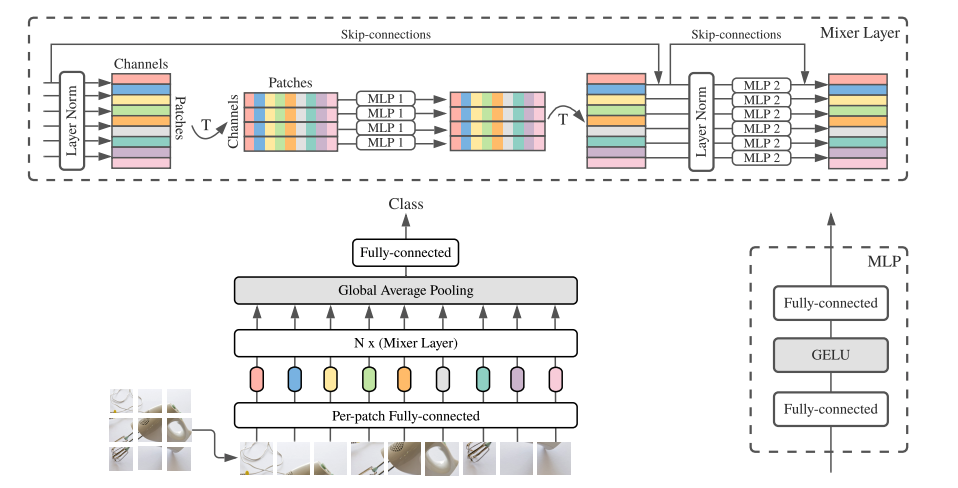

# MLP-Mixer: An all-MLP Architecture for Vision, [arxiv](https://arxiv.org/abs/2105.01601) 

PaddlePaddle training/validation code and pretrained models for **MLP-Mixer**.

The official TF implementation is [here](https://github.com/google-research/vision_transformer).

This implementation is developed by [PaddleViT](https://github.com/BR-IDL/PaddleViT.git).


<p align="center">

    <h4 align="center">MLP-Mixer Model Overview</h4>
</p>

### Update 
- Update (2021-08-11): Model FLOPs and # params are uploaded.
- Update (2021-08-11): Code is released and ported weights are uploaded.

## Models Zoo
| Model                         | Acc@1 | Acc@5 | #Params | FLOPs  | Image Size | Crop_pct | Interpolation | Link         |
|-------------------------------|-------|-------|---------|--------|------------|----------|---------------|--------------|
| mlp_mixer_b16_224            	| 76.60 | 92.23 | 60.0M   | 12.7G  | 224        | 0.875    | bicubic       | [google](https://drive.google.com/file/d/1ZcQEH92sEPvYuDc6eYZgssK5UjYomzUD/view?usp=sharing)/[baidu](https://pan.baidu.com/s/12nZaWGMOXwrCMOIBfUuUMA)(xh8x) |
| mlp_mixer_l16_224           	| 72.06 | 87.67 | 208.2M  | 44.9G  | 224        | 0.875    | bicubic       | [google](https://drive.google.com/file/d/1mkmvqo5K7JuvqGm92a-AdycXIcsv1rdg/view?usp=sharing)/[baidu](https://pan.baidu.com/s/1AmSVpwCaGR9Vjsj_boL7GA)(8q7r) |

> *The results are evaluated on ImageNet2012 validation set.

> Note: MLP-Mixer weights are ported from [timm](https://github.com/rwightman/pytorch-image-models/blob/master/timm/models/mlp_mixer.py)
)


## Notebooks
We provide a few notebooks in aistudio to help you get started:

**\*(coming soon)\***


## Requirements
- Python>=3.6
- yaml>=0.2.5
- [PaddlePaddle](https://www.paddlepaddle.org.cn/documentation/docs/en/install/index_en.html)>=2.1.0
- [yacs](https://github.com/rbgirshick/yacs)>=0.1.8

## Data 
ImageNet2012 dataset is used in the following folder structure:
```
│imagenet/
├──train/
│  ├── n01440764
│  │   ├── n01440764_10026.JPEG
│  │   ├── n01440764_10027.JPEG
│  │   ├── ......
│  ├── ......
├──val/
│  ├── n01440764
│  │   ├── ILSVRC2012_val_00000293.JPEG
│  │   ├── ILSVRC2012_val_00002138.JPEG
│  │   ├── ......
│  ├── ......
```

## Usage
To use the model with pretrained weights, download the `.pdparam` weight file and change related file paths in the following python scripts. The model config files are located in `./configs/`..

For example, assume the downloaded weight file is stored in `./mixer_b16_224.pdparams`, to use the `mixer_b16_224` model in python:
```python
from config import get_config
from mlp_mixer import build_mlp_mixer as build_model
# config files in ./configs/
config = get_config('./configs/mixer_b16_224.yaml')
# build model
model = build_model(config)
# load pretrained weights
model_state_dict = paddle.load('./mixer_b16_224.pdparams')
model.set_dict(model_state_dict)
```

## Evaluation
To evaluate MLP-Mixer model performance on ImageNet2012 with a single GPU, run the following script using command line:
```shell
sh run_eval.sh
```
or
```shell
CUDA_VISIBLE_DEVICES=0 \
python main_single_gpu.py \
    -cfg=./configs/mixer_b16_224.yaml \
    -dataset=imagenet2012 \
    -batch_size=16 \
    -data_path=/path/to/dataset/imagenet/val \
    -eval \
    -pretrained=/path/to/pretrained/model/mixer_b16_224  # .pdparams is NOT needed
```

<details>

<summary>
Run evaluation using multi-GPUs:
</summary>


```shell
sh run_eval_multi.sh
```
or
```shell
CUDA_VISIBLE_DEVICES=0,1,2,3 \
python main_multi_gpu.py \
    -cfg=./configs/mixer_b16_224.yaml \
    -dataset=imagenet2012 \
    -batch_size=16 \
    -data_path=/path/to/dataset/imagenet/val \
    -eval \
    -pretrained=/path/to/pretrained/model/mixer_b16_224  # .pdparams is NOT needed
```

</details>

## Training
To train the MLP-Mixer Transformer model on ImageNet2012 with single GPU, run the following script using command line:
```shell
sh run_train.sh
```
or
```shell
CUDA_VISIBLE_DEVICES=0 \
python main_single_gpu.py \
  -cfg=./configs/mixer_b16_224.yaml \
  -dataset=imagenet2012 \
  -batch_size=32 \
  -data_path=/path/to/dataset/imagenet/train
```

<details>

<summary>
Run training using multi-GPUs:
</summary>


```shell
sh run_train_multi.sh
```
or
```shell
CUDA_VISIBLE_DEVICES=0,1,2,3 \
python main_multi_gpu.py \
    -cfg=./configs/mixer_b16_224.yaml \
    -dataset=imagenet2012 \
    -batch_size=16 \
    -data_path=/path/to/dataset/imagenet/train
```

</details>


## Visualization Attention Map
**(coming soon)**

## Reference
```
@article{tolstikhin2021mlp,
  title={Mlp-mixer: An all-mlp architecture for vision},
  author={Tolstikhin, Ilya and Houlsby, Neil and Kolesnikov, Alexander and Beyer, Lucas and Zhai, Xiaohua and Unterthiner, Thomas and Yung, Jessica and Keysers, Daniel and Uszkoreit, Jakob and Lucic, Mario and others},
  journal={arXiv preprint arXiv:2105.01601},
  year={2021}
}
```
