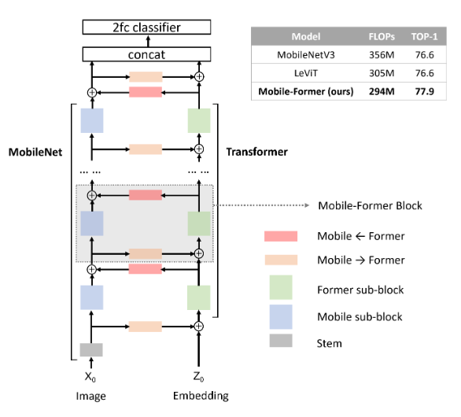
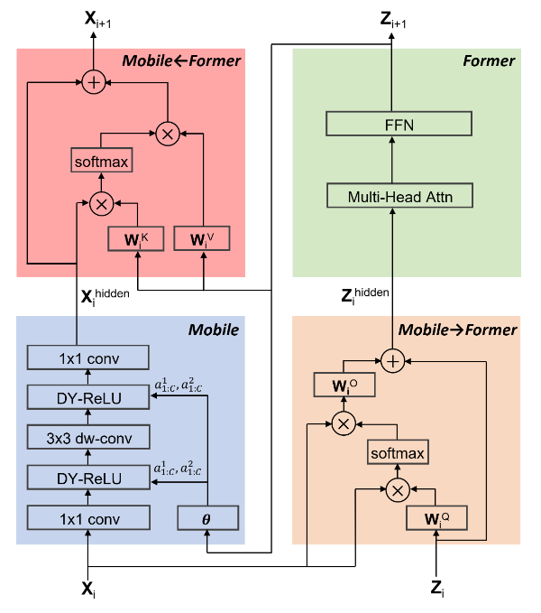

# Mobile-Former: Bridging MobileNet and Transformer, [arxiv](https://arxiv.org/abs/2108.05895)

PaddlePaddle training/validation code for MobileFormer.

This implementation is developed by [PaddleViT](https://github.com/BR-IDL/PaddleViT.git).

<table>
    <tr>
        <td style="text-align:center">
            
            <br>
            <h3>MobileFormer Model Overview</h3>
        </td>
        <td style="text-align:center">
            
            <br>
            <h3>MobileFormer Sub-Block Overview</h3>
        </td>
    </tr>
</table>

### Update

- Update(2022-04-11): Code is updated.
- Update(2021-11-26): Code is released.

## Models Zoo

| Model                         | Acc@1 | Acc@5 | #Params | FLOPs  | Image Size | Crop_pct | Interpolation | Link         |
|-------------------------------|-------|-------|---------|--------|------------|----------|---------------|--------------|
| mobileformer_26m			| * | * |  3.227M   | 26M    | 224        | 0.875    | bicubic       | * |
| mobileformer_52m   		| * | * |  3.513M   | 52M    | 224        | 0.875    | bicubic       | * |
| mobileformer_96m			| * | * |  4.595M   | 96M    | 224        | 0.875    | bicubic       | * |
| mobileformer_151m  		| * | * |  7.616M   | 151M   | 224        | 0.875    | bicubic       | * |
| mobileformer_214m			| * | * |  9.416M   | 214M  | 224        | 0.875    | bicubic       | * |
| mobileformer_294m   		| * | * | 11.392M   | 294M  | 224        | 0.875    | bicubic       | * |
| mobileformer_508m   		| * | * | 14.013M   | 508M   | 224        | 0.875    | bicubic       | * |

> *The results are evaluated on ImageNet2012 validation set.


## Data Preparation
ImageNet2012 dataset is used in the following file structure:
```
│imagenet/
├──train_list.txt
├──val_list.txt
├──train/
│  ├── n01440764
│  │   ├── n01440764_10026.JPEG
│  │   ├── n01440764_10027.JPEG
│  │   ├── ......
│  ├── ......
├──val/
│  ├── n01440764
│  │   ├── ILSVRC2012_val_00000293.JPEG
│  │   ├── ILSVRC2012_val_00002138.JPEG
│  │   ├── ......
│  ├── ......
```
- `train_list.txt`: list of relative paths and labels of training images. You can download it from: [google](https://drive.google.com/file/d/10YGzx_aO3IYjBOhInKT_gY6p0mC3beaC/view?usp=sharing)/[baidu](https://pan.baidu.com/s/1G5xYPczfs9koDb7rM4c0lA?pwd=a4vm?pwd=a4vm)
- `val_list.txt`: list of relative paths and labels of validation images. You can download it from: [google](https://drive.google.com/file/d/1aXHu0svock6MJSur4-FKjW0nyjiJaWHE/view?usp=sharing)/[baidu](https://pan.baidu.com/s/1TFGda7uBZjR7g-A6YjQo-g?pwd=kdga?pwd=kdga) 


## Usage
To use the model with pretrained weights, download the `.pdparam` weight file and change related file paths in the following python scripts. The model config files are located in `./configs/`.

For example, assume weight file is downloaded in `./mobileformer_26m.pdparams`, to use the `mobileformer_26m` model in python:
```python
from config import get_config
from mobileformer import build_mobileformer as build_model
# config files in ./configs/
config = get_config('./configs/mobileformer_26m.yaml')
# build model
model = build_model(config)
# load pretrained weights
model_state_dict = paddle.load('./mobileformer_26m.pdparams')
model.set_state_dict(model_state_dict)
```

## Evaluation
To evaluate model performance on ImageNet2012, run the following script using command line:
```shell
sh run_eval_multi.sh
```
or
```shell
CUDA_VISIBLE_DEVICES=0,1,2,3,4,5,6,7 \
python main_multi_gpu.py \
-cfg='./configs/mobileformer_26m.yaml' \
-dataset='imagenet2012' \
-batch_size=256 \
-data_path='/dataset/imagenet' \
-eval \
-pretrained='./mobileformer_26m.pdparams' \
-amp
```
> Note: if you have only 1 GPU, change device number to `CUDA_VISIBLE_DEVICES=0` would run the evaluation on single GPU.


## Training
To train the model on ImageNet2012, run the following script using command line:
```shell
sh run_train_multi.sh
```
or
```shell
CUDA_VISIBLE_DEVICES=0,1,2,3,4,5,6,7 \
python main_multi_gpu.py \
-cfg='./configs/mobileformer_26m.yaml' \
-dataset='imagenet2012' \
-batch_size=256 \
-data_path='/dataset/imagenet' \
-amp
```
> Note: it is highly recommanded to run the training using multiple GPUs / multi-node GPUs.


## Arguments
- *`-cfg`*: path of model config file (.yaml), stored in `./configs`.
- *`-dataset`*: dataset name, e.g., `imagenet2012`, `cifar10`, `cifar100`.
- *`-data_path`*: dataset folder path
- `-batch_size`: batch size，default: `32`.
- `-image_size`: input image size，default`224`.
- `-num_classes`: number of classes, default: `1000`.
- `-output`: output folder for storing weights and logs，default: `./output`.
- `-pretrained`: pretrain model weights file path, (`.pdparams` file ext is NOT needed) default: `None`.
- `-resume`: resume model weight and opt file path, (`.paparams` and `.pdopts` file ext are NOT needed, default: `None`.
- `-last_epoch`: start epoch，default: `None`.
- `-save_freq`: number of epochs to save checkpoint，default: `1`.
- `-log_freq`: number of iters to print logging，default: `100`.
- `-validate_freq`: number of epochs to do validation during training，default: `10`.
- `-accum_iter`: number of iteration for iter accumulation, default: 1.
- `-num_workers`: number of workers for data loading，default: `1`.
- `-ngpus`: number of GPUs to use，you can control GPUs by CUDA_VISIBLE_DEVICES, just set this to -1 default: `-1`.
- `-eval`: start eval mode.
- `-amp`: start amp training.

> `-cfg`,`-dataset` and `-data_path` in `main_single_gpu.py` and `main_multi_gpu.py` are MUST-HAVE settings.


## Reference
```
@misc{chen2021mobileformer,
      title={Mobile-Former: Bridging MobileNet and Transformer}, 
      author={Yinpeng Chen and Xiyang Dai and Dongdong Chen and Mengchen Liu and Xiaoyi Dong and Lu Yuan and Zicheng Liu},
      year={2021},
      eprint={2108.05895},
      archivePrefix={arXiv},
      primaryClass={cs.CV}
}
```
