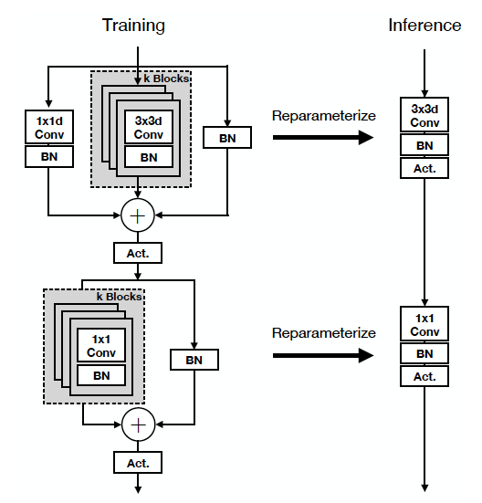

# An Improved One millisecond Mobile Backbone [arxiv](https://arxiv.org/abs/2206.04040) 

PaddlePaddle training/validation code and pretrained models for the model released in: **MobileOne**.

The official PyTorch implementation is [here](https://github.com/apple/ml-mobileone).

This implementation is developed by [PaddleViT](https://github.com/BR-IDL/PaddleViT.git).

<p align="center">

<h4 align="center">RepLKNet Model Overview</h4>
</p>


### Update 
- Update (2022-08-29): Code is released and ported weights are uploaded.

## Models Zoo
| Model          | Acc@1 | Acc@5 | #Params | FLOPs  | Image Size | Crop_pct | Interpolation | Link         | Link(fused)  |
|----------------|-------|-------|---------|--------|------------|----------|---------------|--------------|--------------|
| mobileone_s0    | 71.14 | 89.65 | 5.4M   | 1.1G  | 224        | 0.875      | bicubic       | [google](https://drive.google.com/file/d/1kEt0ogmpflN6TnInBgMODy66nEoY_UAR/view?usp=sharing)/[baidu](https://pan.baidu.com/s/1Oc03Rpx5azxCCJMXgWkMBA?pwd=fh6c) |  [google](https://drive.google.com/file/d/174JQlw7ho3hrx72BQyhXPfapI6Un9Gsv/view?usp=sharing)/[baidu](https://pan.baidu.com/s/1RevAR8lKv8SFx5tVeK4SyA?pwd=2uar)           |
| mobileone_s1    | 75.65 | 92.66 | 4.9M   | 0.9G  | 224        | 0.875      | bicubic       | [google](https://drive.google.com/file/d/19RWywclnYSvd4qDTkQ2rc1z9e309MjJ0/view?usp=sharing)/[baidu](https://pan.baidu.com/s/1N01c8owv0ouN1GqTk44t2Q?pwd=j233) |  [google](https://drive.google.com/file/d/1dZRXQ28-2IM2kDoy5_lfpwVp1ZWo2r4k/view?usp=sharing)/[baidu](https://pan.baidu.com/s/1UjOyzJ3nbBerhDc6V9lyjQ?pwd=u83z)           |
| mobileone_s2    | 77.22 | 93.49 | 8.0M   | 1.3G  | 224        | 0.875      | bicubic       | [google](https://drive.google.com/file/d/1mfgAzJ_vGn1DGgvf-B_4qjIj_zlYIo9g/view?usp=sharing)/[baidu](https://pan.baidu.com/s/14LghMDmpjgRAzwxA1rbaEg?pwd=he5x) |  [google](https://drive.google.com/file/d/17jNvGlmlKRI5FcYUlfmKmM_Kh87xL9DT/view?usp=sharing)/[baidu](https://pan.baidu.com/s/1gdbh83HAPRHFGDQWGCR4Sw?pwd=agfv)           |
| mobileone_s3    | 77.74 | 93.76 | 10.3M  | 1.9G  | 224        | 0.875      | bicubic       | [google](https://drive.google.com/file/d/1yXKtYrxLInBvKzR1_swXzPkJ1Plu1dg7/view?usp=sharing)/[baidu](https://pan.baidu.com/s/1itR_VuUIWBWmcPpdcyyoow?pwd=k7wd) |  [google](https://drive.google.com/file/d/1uyqrBhahJ1LEVNPI0jBDRSHddlGjnqBA/view?usp=sharing)/[baidu](https://pan.baidu.com/s/1XbuIPzZXoP10bq3MTMqleA?pwd=q78t)           |
| mobileone_s4    | 79.07 | 94.23 | 15.1M  | 3.0G  | 224        | 0.875      | bicubic       | [google](https://drive.google.com/file/d/1mPAUXMjI4x0kES1U6DEjtM4l5sl23x1k/view?usp=sharing)/[baidu](https://pan.baidu.com/s/1qgUkMW5S1odOYroliqBiBQ?pwd=j6ew) |  [google](https://drive.google.com/file/d/1H9oKqRpOBti3ncf9JjqxaEM6mqLXYOGg/view?usp=sharing)/[baidu](https://pan.baidu.com/s/1DJy233wdo6fTeNtKI2-U9g?pwd=4wkk)           |


> *The results are above are ported from official implemetation and evaluated on ImageNet2012 validation set.


## Data Preparation
ImageNet2012 dataset is used in the following file structure:
```
│imagenet/
├──train_list.txt
├──val_list.txt
├──train/
│  ├── n01440764
│  │   ├── n01440764_10026.JPEG
│  │   ├── n01440764_10027.JPEG
│  │   ├── ......
│  ├── ......
├──val/
│  ├── n01440764
│  │   ├── ILSVRC2012_val_00000293.JPEG
│  │   ├── ILSVRC2012_val_00002138.JPEG
│  │   ├── ......
│  ├── ......
```
- `train_list.txt`: list of relative paths and labels of training images. You can download it from: [google](https://drive.google.com/file/d/10YGzx_aO3IYjBOhInKT_gY6p0mC3beaC/view?usp=sharing)/[baidu](https://pan.baidu.com/s/1G5xYPczfs9koDb7rM4c0lA?pwd=a4vm)
- `val_list.txt`: list of relative paths and labels of validation images. You can download it from: [google](https://drive.google.com/file/d/1aXHu0svock6MJSur4-FKjW0nyjiJaWHE/view?usp=sharing)/[baidu](https://pan.baidu.com/s/1TFGda7uBZjR7g-A6YjQo-g?pwd=kdga) 


## Usage
To use the model with pretrained weights, download the `.pdparam` weight file and change related file paths in the following python scripts. The model config files are located in `./configs/`.

For example, assume weight file is downloaded in `./mobileone_s0.pdparams`, to use the `mobileone_s0` model in python:
```python
from config import get_config
from mobileone import build_mobileone as build_model
# config files in ./configs/
config = get_config('./configs/mobileone_s0.yaml')
# build model
model = build_model(config)
# load pretrained weights
model_state_dict = paddle.load('./mobileone_s0.pdparams')
model.set_state_dict(model_state_dict)
```

## Evaluation
To evaluate model performance on ImageNet2012, run the following script using command line:
```shell
sh run_eval_multi.sh
```
or
```shell
CUDA_VISIBLE_DEVICES=0,1,2,3,4,5,6,7 \
python main_multi_gpu.py \
-cfg='./configs/mobileone_s0.yaml' \
-dataset='imagenet2012' \
-batch_size=256 \
-data_path='/dataset/imagenet' \
-eval \
-pretrained='./mobileone_s0.pdparams' \
-amp
```
> Note: if you have only 1 GPU, change device number to `CUDA_VISIBLE_DEVICES=0` would run the evaluation on single GPU.


## Training
To train the model on ImageNet2012, run the following script using command line:
```shell
sh run_train_multi.sh
```
or
```shell
CUDA_VISIBLE_DEVICES=0,1,2,3,4,5,6,7 \
python main_multi_gpu.py \
-cfg='./configs/mobileone_s0.yaml' \
-dataset='imagenet2012' \
-batch_size=256 \
-data_path='/dataset/imagenet' \
-amp
```
> Note: it is highly recommanded to run the training using multiple GPUs / multi-node GPUs.


## Reference
```
@article{vasu2022improved,
  title={An Improved One millisecond Mobile Backbone},
  author={Vasu, Pavan Kumar Anasosalu and Gabriel, James and Zhu, Jeff and Tuzel, Oncel and Ranjan, Anurag},
  journal={arXiv preprint arXiv:2206.04040},
  year={2022}
}
```

