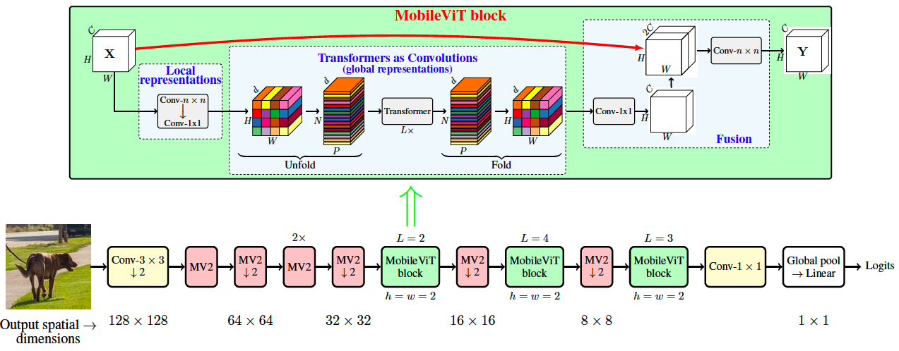

# MobileViT: Light-weight, General-purpose, and Mobile-friendly Vision Transformer, [arxiv](https://arxiv.org/abs/2110.02178) 

PaddlePaddle training/validation code and pretrained models for **MobileViT**.

The official pytorch implementation is N/A.

This implementation is developed by [PaddleViT](https://github.com/BR-IDL/PaddleViT.git).


<p align="center">

    <h4 align="center">MobileViT Transformer Model Overview</h4>
</p>

### Update 
* Update (2021-11-02): Pretrained model weights (mobilevit_s) is released.
* Update (2021-11-02): Pretrained model weights (mobilevit_xs) is released.
* Update (2021-10-29): Pretrained model weights (mobilevit_xxs) is released.
* Update (2021-10-20): Initial code is released.

## Models Zoo
| Model                         | Acc@1 | Acc@5 | #Params | FLOPs  | Image Size | Crop_pct | Interpolation | Link         |
|-------------------------------|-------|-------|---------|--------|------------|----------|---------------|--------------|
| mobilevit_xxs   				| 70.31| 89.68 | 1.32M   | 0.44G   | 256        | 1.0      | bicubic       | [google](https://drive.google.com/file/d/1l3L-_TxS3QisRUIb8ohcv318vrnrHnWA/view?usp=sharing)/[baidu](https://pan.baidu.com/s/1KFZ5G834_-XXN33W67k8eg)(axpc) |
| mobilevit_xs   				| 74.47| 92.02 | 2.33M   | 0.95G   | 256        | 1.0      | bicubic       | [google](https://drive.google.com/file/d/1oRMA4pNs2Ba0LYDbPufC842tO4OFcgwq/view?usp=sharing)/[baidu](https://pan.baidu.com/s/1IP8S-S6ZAkiL0OEsiBWNkw)(hfhm) |
| mobilevit_s   				| 76.74| 93.08 | 5.59M   | 1.88G   | 256        | 1.0      | bicubic       | [google](https://drive.google.com/file/d/1ibkhsswGYWvZwIRjwfgNA4-Oo2stKi0m/view?usp=sharing)/[baidu](https://pan.baidu.com/s/1-rI6hiCHZaI7os2siFASNg)(34bg) |


> *The results are evaluated on ImageNet2012 validation set.
> 
> *This model is trained from scratch using PaddleViT without multi scale batch sampler.


## Notebooks
We provide a few notebooks in aistudio to help you get started:

**\*(coming soon)\***


## Requirements
- Python>=3.6
- yaml>=0.2.5
- [PaddlePaddle](https://www.paddlepaddle.org.cn/documentation/docs/en/install/index_en.html)>=2.1.0
- [yacs](https://github.com/rbgirshick/yacs)>=0.1.8

## Data 
ImageNet2012 dataset is used in the following folder structure:
```
│imagenet/
├──train/
│  ├── n01440764
│  │   ├── n01440764_10026.JPEG
│  │   ├── n01440764_10027.JPEG
│  │   ├── ......
│  ├── ......
├──val/
│  ├── n01440764
│  │   ├── ILSVRC2012_val_00000293.JPEG
│  │   ├── ILSVRC2012_val_00002138.JPEG
│  │   ├── ......
│  ├── ......
```

## Usage
To use the model with pretrained weights, download the `.pdparam` weight file and change related file paths in the following python scripts. The model config files are located in `./configs/`.

For example, assume the downloaded weight file is stored in `./mobilevit_xxs.pdparams`, to use the `mobilevit_xxs` model in python:
```python
from config import get_config
from mobile_vit import build_mobile_vit as build_model
import paddle
# config files in ./configs/
config = get_config('./configs/mobilevit_xxs.yaml')
# build model
model = build_model(config)
# load pretrained weights, .pdparams is NOT needed
model_state_dict = paddle.load('./mobilevit_xxs')
model.set_dict(model_state_dict)
```

## Evaluation
To evaluate MobileViT model performance on ImageNet2012 with a single GPU, run the following script using command line:
```shell
sh run_eval.sh
```
or
```shell
CUDA_VISIBLE_DEVICES=0 \
python main_single_gpu.py \
    -cfg='./configs/mobilevit_xxs.yaml' \
    -dataset='imagenet2012' \
    -batch_size=16 \
    -data_path='/dataset/imagenet' \
    -eval \
    -pretrained='./mobilevit_xxs'
```

<details>

<summary>
Run evaluation using multi-GPUs:
</summary>


```shell
sh run_eval_multi.sh
```
or
```shell
CUDA_VISIBLE_DEVICES=0,1,2,3 \
python main_multi_gpu.py \
    -cfg='./configs/mobilevit_xxs.yaml' \
    -dataset='imagenet2012' \
    -batch_size=16 \
    -data_path='/dataset/imagenet' \
    -eval \
    -pretrained='./mobilevit_xxs'
```

</details>


## Training
To train the MobileVit XXS model on ImageNet2012 with single GPU, run the following script using command line:
```shell
sh run_train.sh
```
or
```shell
CUDA_VISIBLE_DEVICES=0 \
python main_singel_gpu.py \
  -cfg='./configs/mobilevit_xxs.yaml' \
  -dataset='imagenet2012' \
  -batch_size=32 \
  -data_path='/dataset/imagenet' \
```

<details>

<summary>
Run training using multi-GPUs:
</summary>


```shell
sh run_train_multi.sh
```
or
```shell
CUDA_VISIBLE_DEVICES=0,1,2,3 \
python main_multi_gpu.py \
    -cfg='./configs/mobilevit_xxs.yaml' \
    -dataset='imagenet2012' \
    -batch_size=16 \
    -data_path='/dataset/imagenet' \
```

</details>


## Visualization Attention Map
**(coming soon)**

## Reference
```
@article{mehta2021mobilevit,
  title={MobileViT: Light-weight, General-purpose, and Mobile-friendly Vision Transformer},
  author={Mehta, Sachin and Rastegari, Mohammad},
  journal={arXiv preprint arXiv:2110.02178},
  year={2021}
}
```
