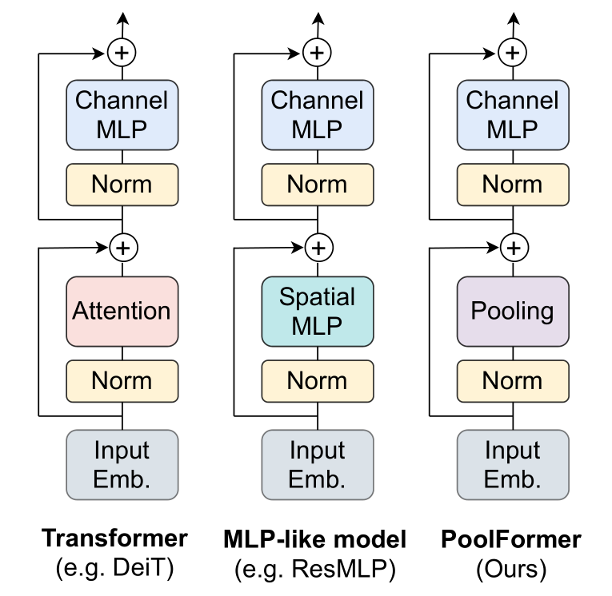

# PoolFormer: MetaFormer is Actually What You Need for Vision, [arxiv](https://arxiv.org/abs/2111.11418) 

PaddlePaddle training/validation code and pretrained models for **PoolFormer**.

The official PyTorch implementation is [here](https://github.com/sail-sg/poolformer).

This implementation is developed by [PaddleViT](https://github.com/BR-IDL/PaddleViT.git).

<p align="center">

<h4 align="center">PoolFormer Model Overview</h4>
</p>


### Update 
- Update (2021-12-15): Code and weights are updated.
- Update (2021-12-10): Code is released and ported weights are uploaded.

## Models Zoo
| Model          | Acc@1 | Acc@5 | #Params | FLOPs  | Image Size | Crop_pct | Interpolation | Link         |
|----------------|-------|-------|---------|--------|------------|----------|---------------|--------------|
| poolformer_s12 | 77.24 | 93.51 | 11.9M   | 1.8G   | 224        | 0.9      | bicubic       | [google](https://drive.google.com/file/d/15EBfTTU6coLCsDNiLgAWYiWeMpp3uYH4/view?usp=sharing)/[baidu](https://pan.baidu.com/s/1n6TUxQGlssTu4lyLrBOXEw?pwd=zcv4)             |
| poolformer_s24 | 80.33 | 95.05 | 21.3M   | 3.4G   | 224        | 0.9      | bicubic       | [google](https://drive.google.com/file/d/1JxqJluDpp1wwe7XtpTi1aWaVvlq0Q3xF/view?usp=sharing)/[baidu](https://pan.baidu.com/s/1d2uyHB5R6ZWPzXWhdtm6fw?pwd=nedr)             |
| poolformer_s36 | 81.43 | 95.45 | 30.8M   | 5.0G   | 224        | 0.9      | bicubic       | [google](https://drive.google.com/file/d/1ka3VeupDRFBSzzrcw4wHXKGqoKv6sB_Y/view?usp=sharing)/[baidu](https://pan.baidu.com/s/1de6ZJkmYEmVI7zKUCMB_xw?pwd=fvpm)             |
| poolformer_m36 | 82.11 | 95.69 | 56.1M   | 8.9G   | 224        | 0.95     | bicubic       | [google](https://drive.google.com/file/d/1LTZ8wNRb_GSrJ9H3qt5-iGiGlwa4dGAK/view?usp=sharing)/[baidu](https://pan.baidu.com/s/1qNTYLw4vyuoH1EKDXEcSvw?pwd=whfp)             |
| poolformer_m48 | 82.46 | 95.96 | 73.4M   | 11.8G  | 224        | 0.95     | bicubic       | [google](https://drive.google.com/file/d/1YhXEVjWtI4bZB_Qwama8G4RBanq2K15L/view?usp=sharing)/[baidu](https://pan.baidu.com/s/1VJXANTseTUEA0E6HYf-XyA?pwd=374f)		 |  

> *The results are evaluated on ImageNet2012 validation set.

## Data Preparation
ImageNet2012 dataset is used in the following file structure:
```
│imagenet/
├──train_list.txt
├──val_list.txt
├──train/
│  ├── n01440764
│  │   ├── n01440764_10026.JPEG
│  │   ├── n01440764_10027.JPEG
│  │   ├── ......
│  ├── ......
├──val/
│  ├── n01440764
│  │   ├── ILSVRC2012_val_00000293.JPEG
│  │   ├── ILSVRC2012_val_00002138.JPEG
│  │   ├── ......
│  ├── ......
```
- `train_list.txt`: list of relative paths and labels of training images. You can download it from: [google](https://drive.google.com/file/d/10YGzx_aO3IYjBOhInKT_gY6p0mC3beaC/view?usp=sharing)/[baidu](https://pan.baidu.com/s/1G5xYPczfs9koDb7rM4c0lA?pwd=a4vm?pwd=a4vm)
- `val_list.txt`: list of relative paths and labels of validation images. You can download it from: [google](https://drive.google.com/file/d/1aXHu0svock6MJSur4-FKjW0nyjiJaWHE/view?usp=sharing)/[baidu](https://pan.baidu.com/s/1TFGda7uBZjR7g-A6YjQo-g?pwd=kdga?pwd=kdga) 


## Usage
To use the model with pretrained weights, download the `.pdparam` weight file and change related file paths in the following python scripts. The model config files are located in `./configs/`.

For example, assume weight file is downloaded in `./poolformer_s12.pdparams`, to use the `poolformer_s12` model in python:
```python
from config import get_config
from poolformer import build_poolformer as build_model
# config files in ./configs/
config = get_config('./configs/poolformer_s12_finetune.yaml')
# build model
model = build_model(config)
# load pretrained weights
model_state_dict = paddle.load('./poolformer_s12.pdparams')
model.set_state_dict(model_state_dict)
```

## Evaluation
To evaluate model performance on ImageNet2012, run the following script using command line:
```shell
sh run_eval_multi.sh
```
or
```shell
CUDA_VISIBLE_DEVICES=0,1,2,3,4,5,6,7 \
python main_multi_gpu.py \
-cfg='./configs/poolformer_s12.yaml' \
-dataset='imagenet2012' \
-batch_size=256 \
-data_path='/dataset/imagenet' \
-eval \
-pretrained='./poolformer_s12.pdparams' \
-amp
```
> Note: if you have only 1 GPU, change device number to `CUDA_VISIBLE_DEVICES=0` would run the evaluation on single GPU.


## Training
To train the model on ImageNet2012, run the following script using command line:
```shell
sh run_train_multi.sh
```
or
```shell
CUDA_VISIBLE_DEVICES=0,1,2,3,4,5,6,7 \
python main_multi_gpu.py \
-cfg='./configs/poolformer_s12.yaml' \
-dataset='imagenet2012' \
-batch_size=256 \
-data_path='/dataset/imagenet' \
-amp
```
> Note: it is highly recommanded to run the training using multiple GPUs / multi-node GPUs.


## Reference
```
@article{yu2021metaformer,
  title={MetaFormer is Actually What You Need for Vision},
  author={Yu, Weihao and Luo, Mi and Zhou, Pan and Si, Chenyang and Zhou, Yichen and Wang, Xinchao and Feng, Jiashi and Yan, Shuicheng},
  journal={arXiv preprint arXiv:2111.11418},
  year={2021}
}
```

