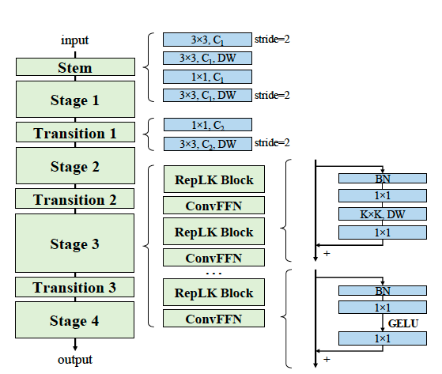

# RepLKNet: Scaling Up Your Kernels to 31x31: Revisiting Large Kernel Design in CNNs [arxiv](https://arxiv.org/abs/2203.06717) 

PaddlePaddle training/validation code and pretrained models for the model released in CVPR2022: **RepLKNet (classification backbone)**.

The official PyTorch implementation is [here](https://github.com/DingXiaoH/RepLKNet-pytorch).

This implementation is developed by [PaddleViT](https://github.com/BR-IDL/PaddleViT.git).

<p align="center">

<h4 align="center">RepLKNet Model Overview</h4>
</p>


### Update 
- Update (2022-07-15): Code is released and ported weights are uploaded.

## Models Zoo
| Model          | Acc@1 | Acc@5 | #Params | FLOPs  | Image Size | Crop_pct | Interpolation | Link         |
|----------------|-------|-------|---------|--------|------------|----------|---------------|--------------|
| replknet-31b-1k-224    | 83.48 | 96.57 | 79M   | 15.3G   | 224        | 0.875      | bicubic       | [google](https://drive.google.com/file/d/1w1-CUZekxJSeNdsdY_TkjUS4WobpXpU5/view?usp=sharing)/[baidu](https://pan.baidu.com/s/1zPU2J3bI49OiMGl7kzLRCQ?pwd=yi5k)             |
| replknet-31b-1k-384    | 84.58 | 97.23 | 79M   | 45.1G   | 384        | 1.0        | bicubic       | [google](https://drive.google.com/file/d/1BZBeIq0SuQdj4w4REynS8UgDNGopMJVh/view?usp=sharing)/[baidu](https://pan.baidu.com/s/1o5wt4l01my7zNzXZvpvpEA?pwd=8x5q)             |
| replknet-31b-22k1k-224 | 85.20 | 97.56 | 79M   | 15.3G   | 224        | 0.875      | bicubic       | [google](https://drive.google.com/file/d/1HamtzvO_QbC4qQrLaEc7yz-OMOCmrCuG/view?usp=sharing)/[baidu](https://pan.baidu.com/s/1jHw0dF4jfD_UcFk5IHA-aw?pwd=bve2)             |
| replknet-31b-22k1k-384 | 85.77 | 97.68 | 79M   | 45.1G   | 384        | 1.0        | bicubic       | [google](https://drive.google.com/file/d/1wyaL3Bxd_JILwVtsQRJQEpVMAom7lx77/view?usp=sharing)/[baidu](https://pan.baidu.com/s/18bnQeqaZHx8wU2DkNNFWrA?pwd=ytfc)             |
| replknet-31l-22k1k-384 | 86.38 | 97.88 | 172M  | 96.0G   | 384        | 1.0        | bicubic       | [google](https://drive.google.com/file/d/1WuYif9niWr8qyOaPfFzChoGw869AmHI1/view?usp=sharing)/[baidu](https://pan.baidu.com/s/1CzacWWjzy1XZqTpeU6lGBg?pwd=nrtq)             |
| replknet-xl-73m1k-320  | -     | -     | 335M  | 128.7G  | 320        | 1.0        | bicubic       | [google](https://drive.google.com/file/d/1dpSE2lujUbnVMANhSwZ6HbW7mEEIuilK/view?usp=sharing)/[baidu](https://pan.baidu.com/s/1EIVGq3Fc4my0DCPqXyjSZw?pwd=rf9t)             |
| replknet-31b-22k | - | - | 79M    | 15.3G   | 224        | 0.875        | bicubic        | [google](https://drive.google.com/file/d/1uoQ9chuwOgKAnYxXzK0Tn0Euka7NoR5q/view?usp=sharing)/[baidu](https://pan.baidu.com/s/1biQu9uAPc460utWC91cUpw?pwd=tbpe)             |
| replknet-31l-22k | - | - | 172M   | 96.0G   | 384        | 1.0          | bicubic        | [google](https://drive.google.com/file/d/1ALUmkYpt4JhFFKgWvMYwRcpceiHRlyct/view?usp=sharing)/[baidu](https://pan.baidu.com/s/1aya0SUpKz8WazeP1M9d0eg?pwd=dypx)             |


> *The results are above are ported from official implemetation and evaluated on ImageNet2012 validation set.


## Data Preparation
ImageNet2012 dataset is used in the following file structure:
```
│imagenet/
├──train_list.txt
├──val_list.txt
├──train/
│  ├── n01440764
│  │   ├── n01440764_10026.JPEG
│  │   ├── n01440764_10027.JPEG
│  │   ├── ......
│  ├── ......
├──val/
│  ├── n01440764
│  │   ├── ILSVRC2012_val_00000293.JPEG
│  │   ├── ILSVRC2012_val_00002138.JPEG
│  │   ├── ......
│  ├── ......
```
- `train_list.txt`: list of relative paths and labels of training images. You can download it from: [google](https://drive.google.com/file/d/10YGzx_aO3IYjBOhInKT_gY6p0mC3beaC/view?usp=sharing)/[baidu](https://pan.baidu.com/s/1G5xYPczfs9koDb7rM4c0lA?pwd=a4vm?pwd=a4vm)
- `val_list.txt`: list of relative paths and labels of validation images. You can download it from: [google](https://drive.google.com/file/d/1aXHu0svock6MJSur4-FKjW0nyjiJaWHE/view?usp=sharing)/[baidu](https://pan.baidu.com/s/1TFGda7uBZjR7g-A6YjQo-g?pwd=kdga?pwd=kdga) 


## Usage
To use the model with pretrained weights, download the `.pdparam` weight file and change related file paths in the following python scripts. The model config files are located in `./configs/`.

For example, assume weight file is downloaded in `./replknet_31b.pdparams`, to use the `replknet_31b` model in python:
```python
from config import get_config
from replknet import build_replknet as build_model
# config files in ./configs/
config = get_config('./configs/replknet_31b.yaml')
# build model
model = build_model(config)
# load pretrained weights
model_state_dict = paddle.load('./replknet_31b.pdparams')
model.set_state_dict(model_state_dict)
```

## Evaluation
To evaluate model performance on ImageNet2012, run the following script using command line:
```shell
sh run_eval_multi.sh
```
or
```shell
CUDA_VISIBLE_DEVICES=0,1,2,3,4,5,6,7 \
python main_multi_gpu.py \
-cfg='./configs/replknet_31b.yaml' \
-dataset='imagenet2012' \
-batch_size=256 \
-data_path='/dataset/imagenet' \
-eval \
-pretrained='./replknet_31b.pdparams' \
-amp
```
> Note: if you have only 1 GPU, change device number to `CUDA_VISIBLE_DEVICES=0` would run the evaluation on single GPU.


## Training
To train the model on ImageNet2012, run the following script using command line:
```shell
sh run_train_multi.sh
```
or
```shell
CUDA_VISIBLE_DEVICES=0,1,2,3,4,5,6,7 \
python main_multi_gpu.py \
-cfg='./configs/replknet_31b.yaml' \
-dataset='imagenet2012' \
-batch_size=256 \
-data_path='/dataset/imagenet' \
-amp
```
> Note: it is highly recommanded to run the training using multiple GPUs / multi-node GPUs.


## Reference
```
@article{replknet,
title={Scaling Up Your Kernels to 31x31: Revisiting Large Kernel Design in CNNs},
author={Ding, Xiaohan and Zhang, Xiangyu and Zhou, Yizhuang and Han, Jungong and Ding, Guiguang and Sun, Jian},
journal={arXiv preprint arXiv:2203.06717},
year={2022}
}
```

