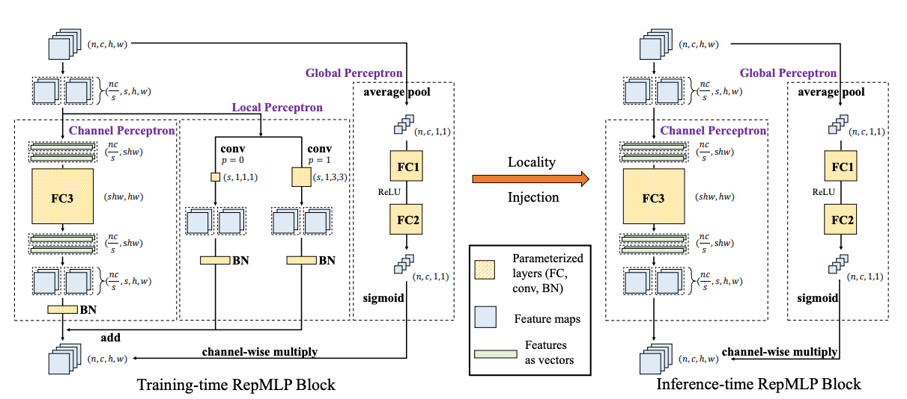

# RepMLP: Re-parameterizing Convolutions into Fully-connected Layers for Image Recognition, [arxiv](https://arxiv.org/abs/2105.01883) 

PaddlePaddle training/validation code and pretrained models for **RepMLP**.

The official pytorch implementation is [here](https://github.com/DingXiaoH/RepMLP).


This implementation is developed by [PaddleViT](https://github.com/BR-IDL/PaddleViT.git).

<p align="center">

    <h4 align="center">RepMLP Model Overview</h4>
</p>


### Update 
- Update (2022-04-01): New code is refactored and weights are uploaded.
- Update (2021-09-27): Model FLOPs and # params are uploaded.
- Update (2021-09-14): Code is released and ported weights are uploaded.

## Models Zoo

| Model                         | Acc@1 | Acc@5 | #Params | FLOPs  | Image Size | Crop_pct | Interpolation | Link         |
|-------------------------------|-------|-------|---------|--------|------------|----------|---------------|--------------|
| repmlp_b_224 		| 80.25 | 95.16 | 6.8M   | 68.3G   | 224   	    | 0.875    | bilinear       | [google](https://drive.google.com/file/d/19xtAbpUqEFbE6IyB2b4dhRIXZFpRhpk7/view?usp=sharing)/[baidu](https://pan.baidu.com/s/1QaYfb1amYLk7-bru8M7rsw?pwd=7pdj) |
| repmlp_b_256 		| 81.10 | 95.50 | 9.8M   | 96.5G   | 256   	    | 0.875    | bilinear       | [google](https://drive.google.com/file/d/1lprWOesyzxr5k2BS0e-UFYjzVkhdlIyx/view?usp=sharing)/[baidu](https://pan.baidu.com/s/1DEXaATJ-yrpx4BjKqod7SQ?pwd=gpe5) |


> *The results are evaluated on ImageNet2012 validation set.
>
> Note: RepMLP weights are ported from [here](https://github.com/DingXiaoH/RepMLP/tree/99eddc909aedce108763ee13bdf4745529581d68).


## Data Preparation
ImageNet2012 dataset is used in the following file structure:
```
│imagenet/
├──train_list.txt
├──val_list.txt
├──train/
│  ├── n01440764
│  │   ├── n01440764_10026.JPEG
│  │   ├── n01440764_10027.JPEG
│  │   ├── ......
│  ├── ......
├──val/
│  ├── n01440764
│  │   ├── ILSVRC2012_val_00000293.JPEG
│  │   ├── ILSVRC2012_val_00002138.JPEG
│  │   ├── ......
│  ├── ......
```
- `train_list.txt`: list of relative paths and labels of training images. You can download it from: [google](https://drive.google.com/file/d/10YGzx_aO3IYjBOhInKT_gY6p0mC3beaC/view?usp=sharing)/[baidu](https://pan.baidu.com/s/1G5xYPczfs9koDb7rM4c0lA?pwd=a4vm?pwd=a4vm)
- `val_list.txt`: list of relative paths and labels of validation images. You can download it from: [google](https://drive.google.com/file/d/1aXHu0svock6MJSur4-FKjW0nyjiJaWHE/view?usp=sharing)/[baidu](https://pan.baidu.com/s/1TFGda7uBZjR7g-A6YjQo-g?pwd=kdga?pwd=kdga) 


## Usage
To use the model with pretrained weights, download the `.pdparam` weight file and change related file paths in the following python scripts. The model config files are located in `./configs/`.

For example, assume weight file is downloaded in `./repmlp_b_224.pdparams`, to use the `repmlp_b_224` model in python:
```python
from config import get_config
from repmlp import build_repmlp as build_model
# config files in ./configs/
config = get_config('./configs/repmlp_b_224.yaml')
# build model
model = build_model(config)
# load pretrained weights
model_state_dict = paddle.load('./repmlp_b_224.pdparams')
model.set_state_dict(model_state_dict)
```

## Evaluation
To evaluate model performance on ImageNet2012, run the following script using command line:
```shell
sh run_eval_multi.sh
```
or
```shell
CUDA_VISIBLE_DEVICES=0,1,2,3,4,5,6,7 \
python main_multi_gpu.py \
-cfg='./configs/repmlp_b_224.yaml' \
-dataset='imagenet2012' \
-batch_size=256 \
-data_path='/dataset/imagenet' \
-eval \
-pretrained='./repmlp_b_224.pdparams' \
-amp
```
> Note: if you have only 1 GPU, change device number to `CUDA_VISIBLE_DEVICES=0` would run the evaluation on single GPU.


## Training
To train the model on ImageNet2012, run the following script using command line:
```shell
sh run_train_multi.sh
```
or
```shell
CUDA_VISIBLE_DEVICES=0,1,2,3,4,5,6,7 \
python main_multi_gpu.py \
-cfg='./configs/repmlp_b_224.yaml' \
-dataset='imagenet2012' \
-batch_size=256 \
-data_path='/dataset/imagenet' \
-amp
```
> Note: it is highly recommanded to run the training using multiple GPUs / multi-node GPUs.


```
## Reference
```
@article{ding2021repmlp,
title={RepMLP: Re-parameterizing Convolutions into Fully-connected Layers for Image Recognition},
author={Ding, Xiaohan and Xia, Chunlong and Zhang, Xiangyu and Chu, Xiaojie and Han, Jungong and Ding, Guiguang},
journal={arXiv preprint arXiv:2105.01883},
year={2021}
}@article{melaskyriazi2021doyoueven,
  title={Do You Even Need Attention? A Stack of Feed-Forward Layers Does Surprisingly Well on ImageNet},
  author={Luke Melas-Kyriazi},
  journal=arxiv,
  year=2021
}
```
