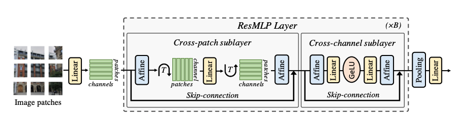

# ResMLP: Feedforward networks for image classification with data-efficient training, [arxiv](https://arxiv.org/abs/2105.03404) 

PaddlePaddle training/validation code and pretrained models for **ResMLP**.

The official and 3rd party pytorch implementation are [here](https://github.com/facebookresearch/deit) and [here](https://github.com/rwightman/pytorch-image-models/blob/master/timm/models/mlp_mixer.py).


This implementation is developed by [PPViT](https://github.com/xperzy/PPViT/tree/master).


<p align="center">

    <h4 align="center">ResMLP Model Overview</h4>
</p>


### Update 
Update (2021-08-11): Code is released and ported weights are uploaded.

## Models Zoo
| Model                          | Acc@1 | Acc@5 | Image Size | Crop_pct | Interpolation | Link        |
|--------------------------------|-------|-------|------------|----------|---------------|--------------|
| resmlp_24_224                  | 79.38 | 94.55 | 224        | 0.875    | bicubic       | [google](https://drive.google.com/file/d/15A5q1XSXBz-y1AcXhy_XaDymLLj2s2Tn/view?usp=sharing)/[baidu](https://pan.baidu.com/s/1nLAvyG53REdwYNCLmp4yBA)(jdcx) |
| resmlp_36_224             | 79.77 | 94.89 | 224        | 0.875      | bicubic      | [google](https://drive.google.com/file/d/1WrhVm-7EKnLmPU18Xm0C7uIqrg-RwqZL/view?usp=sharing)/[baidu](https://pan.baidu.com/s/1QD4EWmM9b2u1r8LsnV6rUA)(33w3) |
| resmlp_big_24_224         | 81.04 | 95.02 | 224        | 0.875      | bicubic      | [google](https://drive.google.com/file/d/1KLlFuzYb17tC5Mmue3dfyr2L_q4xHTZi/view?usp=sharing)/[baidu](https://pan.baidu.com/s/1oXU6CR0z7O0XNwu_UdZv_w)(r9kb) |
| resmlp_big_24_distilled_224 | 83.59 | 96.65 | 224        | 0.875      | bicubic      | [google](https://drive.google.com/file/d/199q0MN_BlQh9-HbB28RdxHj1ApMTHow-/view?usp=sharing)/[baidu](https://pan.baidu.com/s/1yUrfbqW8vLODDiRV5WWkhQ)(4jk5) |

> *The results are evaluated on ImageNet2012 validation set.
> 
> Note: ResMLP weights are ported from [timm](https://github.com/rwightman/pytorch-image-models/blob/master/timm/models/mlp_mixer.py)


## Notebooks
We provide a few notebooks in aistudio to help you get started:

**\*(coming soon)\***


## Requirements
- Python>=3.6
- yaml>=0.2.5
- [PaddlePaddle](https://www.paddlepaddle.org.cn/documentation/docs/en/install/index_en.html)>=2.1.0
- [yacs](https://github.com/rbgirshick/yacs)>=0.1.8

## Data 
ImageNet2012 dataset is used in the following folder structure:
```
│imagenet/
├──train/
│  ├── n01440764
│  │   ├── n01440764_10026.JPEG
│  │   ├── n01440764_10027.JPEG
│  │   ├── ......
│  ├── ......
├──val/
│  ├── n01440764
│  │   ├── ILSVRC2012_val_00000293.JPEG
│  │   ├── ILSVRC2012_val_00002138.JPEG
│  │   ├── ......
│  ├── ......
```

## Usage
To use the model with pretrained weights, download the `.pdparam` weight file and change related file paths in the following python scripts. The model config files are located in `./configs/`.

For example, assume the downloaded weight file is stored in `./resmlp_24_224.pdparams`, to use the `resmlp_24_224` model in python:
```python
from config import get_config
from resmlp import build_res_mlp as build_model
# config files in ./configs/
config = get_config('./configs/resmlp_24_224.yaml')
# build model
model = build_model(config)
# load pretrained weights, .pdparams is NOT needed
model_state_dict = paddle.load('./resmlp_24_224')
model.set_dict(model_state_dict)
```

## Evaluation
To evaluate ResMLP model performance on ImageNet2012 with a single GPU, run the following script using command line:
```shell
sh run_eval.sh
```
or
```shell
CUDA_VISIBLE_DEVICES=0 \
python main_single_gpu.py \
    -cfg='./configs/resmlp_24_224.yaml' \
    -dataset='imagenet2012' \
    -batch_size=16 \
    -data_path='/dataset/imagenet' \
    -eval \
    -pretrained='./resmlp_24_224'
```

<details>

<summary>
Run evaluation using multi-GPUs:
</summary>


```shell
sh run_eval_multi.sh
```
or
```shell
CUDA_VISIBLE_DEVICES=0,1,2,3 \
python main_multi_gpu.py \
    -cfg='./configs/resmlp_24_224.yaml' \
    -dataset='imagenet2012' \
    -batch_size=16 \
    -data_path='/dataset/imagenet' \
    -eval \
    -pretrained='./resmlp_24_224'
```

</details>

## Training
To train the ResMLP Transformer model on ImageNet2012 with single GPUs, run the following script using command line:
```shell
sh run_train.sh
```
or
```shell
CUDA_VISIBLE_DEVICES=0 \
python main_single_gpu.py \
  -cfg='./configs/resmlp_24_224.yaml' \
  -dataset='imagenet2012' \
  -batch_size=32 \
  -data_path='/dataset/imagenet' \
```

<details>

<summary>
Run training using multi-GPUs:
</summary>


```shell
sh run_train_multi.sh
```
or
```shell
CUDA_VISIBLE_DEVICES=0,1,2,3 \
python main_multi_gpu.py \
    -cfg='./configs/resmlp_24_224.yaml' \
    -dataset='imagenet2012' \
    -batch_size=16 \
    -data_path='/dataset/imagenet' \ 
```

</details>


## Visualization Attention Map
**(coming soon)**

## Reference
```
@article{touvron2021resmlp,
  title={Resmlp: Feedforward networks for image classification with data-efficient training},
  author={Touvron, Hugo and Bojanowski, Piotr and Caron, Mathilde and Cord, Matthieu and El-Nouby, Alaaeldin and Grave, Edouard and Joulin, Armand and Synnaeve, Gabriel and Verbeek, Jakob and J{\'e}gou, Herv{\'e}},
  journal={arXiv preprint arXiv:2105.03404},
  year={2021}
}
```
