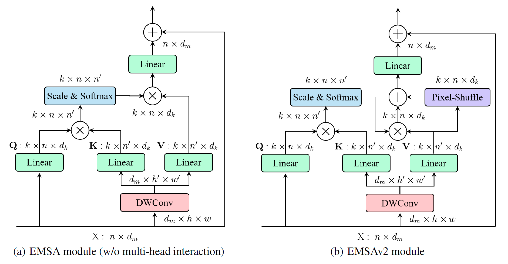

# ResT: An Efficient Transformer for Visual Recognition. NeurIPS 2021 [arxiv](https://arxiv.org/abs/2105.13677)
# ResT V2: Simpler, Faster and Stronger. arXiv 2022. [arxiv](https://arxiv.org/abs/2204.07366)
PaddlePaddle training/validation code and pretrained models for the model released: **ResT** and **ResTV2**.

The official PyTorch implementation is [here](https://github.com/wofmanaf/ResT).

This implementation is developed by [PaddleViT](https://github.com/BR-IDL/PaddleViT.git).

<p align="center">

<h4 align="center">ResTv2 and v2 Model Overview</h4>
</p>


### Update

- Update (2022-05-26): Code is released and ported weights are uploaded.

## Models Zoo


| Model      | Acc@1 | Acc@5 | #Params | FLOPs | Image Size | Crop_pct | Interpolation | Link                                                                                                                                                           |
| ---------- | ----- | ----- | ------- | ----- | ---------- | -------- | ------------- | -------------------------------------------------------------------------------------------------------------------------------------------------------------- |
| ResT_lite     | 77.18 | 93.70 | 10.5M   | 1.5G    | 224        | 0.9      | bicubic       | [google](https://drive.google.com/file/d/1JF3TVYw76kFizAVC3K5wnGqtAjY3R842/view?usp=sharing)/[baidu](https://pan.baidu.com/s/1RHeMe4aED0PRJfL4E336tA?pwd=xi9m) |
| ResT_small    | 79.55 | 94.92 | 13.7M   | 2.0G    | 224        | 0.9      | bicubic       | [google](https://drive.google.com/file/d/1Hq8Bh55ZvM4sufRCaOyIX3-bYi7J66F4/view?usp=sharing)/[baidu](https://pan.baidu.com/s/1Hb7yLFS6E0jJVj4yc3PC-A?pwd=rydb) |
| ResT_base     | 81.60 | 95.65 | 30.3M   | 4.6G    | 224        | 0.9      | bicubic       | [google](https://drive.google.com/file/d/1DqygDScRdwLQM4QltkaC4uJAy_BHfS9y/view?usp=sharing)/[baidu](https://pan.baidu.com/s/1ywvYA9ggMN7f7vo9jROt5A?pwd=y8x1) |
| ResT_large    | 83.57 | 96.26 | 51.7M   | 8.2G    | 224        | 0.9      | bicubic       | [google](https://drive.google.com/file/d/14XBb3HgNYaprMsG1kz1NvSYP6mN3-MEV/view?usp=sharing)/[baidu](https://pan.baidu.com/s/1F2jP9FbpArSWKc63jLlVKg?pwd=7yb7) |
| ResTV2_lite   | 82.32 | 95.48 | 30.4M   | 4.0G    | 224        | 0.9      | bicubic       | [google](https://drive.google.com/file/d/1vSbX1m_4wcE-SdOGpE6tMIj6kuV2_slK/view?usp=sharing)/[baidu](https://pan.baidu.com/s/1J6IdCSYfOAyyCdcaKH9TLg?pwd=rtxz) |
| ResTV2_small  | 83.18 | 96.06 | 41.2M   | 5.9G    | 224        | 0.9      | bicubic       | [google](https://drive.google.com/file/d/1_aFBSog30XkUrC_XOChiitSmBgE6ZxE7/view?usp=sharing)/[baidu](https://pan.baidu.com/s/1xgu3bEZnFpedAFVdwTctNA?pwd=hs3s) |
| ResTV2_base   | 83.70 | 96.25 | 56.0M   | 7.8G    | 224        | 0.9      | bicubic       | [google](https://drive.google.com/file/d/1hDne3_2TuadxxlZiV7qyghuj5jybmcms/view?usp=sharing)/[baidu](https://pan.baidu.com/s/1k33C5HJWdx5zX0QH6X_LSg?pwd=4det) |
| ResTV2_large  | 84.24 | 96.51 | 86.5M   | 13.7G   | 224        | 0.9      | bicubic       | [google](https://drive.google.com/file/d/16XU0i3HV_bn9uhftcScEdVhOLIHbrl91/view?usp=sharing)/[baidu](https://pan.baidu.com/s/1l17DlnRZaIxeBAr0Je8V9w?pwd=cy8y) |


> \*The results are evaluated on ImageNet2012 validation set.

## Data Preparation

ImageNet2012 dataset is used in the following file structure:

```
│imagenet/
├──train_list.txt
├──val_list.txt
├──train/
│  ├── n01440764
│  │   ├── n01440764_10026.JPEG
│  │   ├── n01440764_10027.JPEG
│  │   ├── ......
│  ├── ......
├──val/
│  ├── n01440764
│  │   ├── ILSVRC2012_val_00000293.JPEG
│  │   ├── ILSVRC2012_val_00002138.JPEG
│  │   ├── ......
│  ├── ......
```

- `train_list.txt`: list of relative paths and labels of training images. You can download it from: [google](https://drive.google.com/file/d/10YGzx_aO3IYjBOhInKT_gY6p0mC3beaC/view?usp=sharing)/[baidu](https://pan.baidu.com/s/1G5xYPczfs9koDb7rM4c0lA?pwd=a4vm?pwd=a4vm)
- `val_list.txt`: list of relative paths and labels of validation images. You can download it from: [google](https://drive.google.com/file/d/1aXHu0svock6MJSur4-FKjW0nyjiJaWHE/view?usp=sharing)/[baidu](https://pan.baidu.com/s/1TFGda7uBZjR7g-A6YjQo-g?pwd=kdga?pwd=kdga)

## Usage

To use the model with pretrained weights, download the `.pdparam` weight file and change related file paths in the following python scripts. The model config files are located in `./configs/`.

For example, assume weight file is downloaded in `./restv2_tiny.pdparams`, to use the `restv2_tiny` model in python:

```python
from config import get_config
from rest_v2 import build_restv2 as build_model
# config files in ./configs/
config = get_config('./configs/restv2_tiny.yaml')
# build model
model = build_model(config)
# load pretrained weights
model_state_dict = paddle.load('./restv2_tiny.pdparams')
model.set_state_dict(model_state_dict)
```

## Evaluation

To evaluate model performance on ImageNet2012, run the following script using command line:

```shell
sh run_eval_multi.sh
```

or

```shell
CUDA_VISIBLE_DEVICES=0,1,2,3,4,5,6,7 \
python main_multi_gpu.py \
-cfg='./configs/restv2_tiny.yaml' \
-dataset='imagenet2012' \
-batch_size=256 \
-data_path='/dataset/imagenet' \
-eval \
-pretrained='./restv2_tiny.pdparams' \
-amp
```

> Note: if you have only 1 GPU, change device number to `CUDA_VISIBLE_DEVICES=0` would run the evaluation on single GPU.

## Training

To train the model on ImageNet2012, run the following script using command line:

```shell
sh run_train_multi.sh
```

or

```shell
CUDA_VISIBLE_DEVICES=0,1,2,3,4,5,6,7 \
python main_multi_gpu.py \
-cfg='./configs/restv2_tiny.yaml' \
-dataset='imagenet2012' \
-batch_size=256 \
-data_path='/dataset/imagenet' \
-amp
```

> Note: it is highly recommanded to run the training using multiple GPUs / multi-node GPUs.

## Reference

```
@inproceedings{zhang2021rest,
  title={ResT: An Efficient Transformer for Visual Recognition},
  author={Qinglong Zhang and Yu-bin Yang},
  booktitle={Advances in Neural Information Processing Systems},
  year={2021},
  url={https://openreview.net/forum?id=6Ab68Ip4Mu}
}

@article{zhang2022rest,
  title={ResT V2: Simpler, Faster and Stronger},
  author={Zhang, Qing-Long and Yang, Yu-Bin},
  journal={arXiv preprint arXiv:2204.07366},
  year={2022}
}
```
