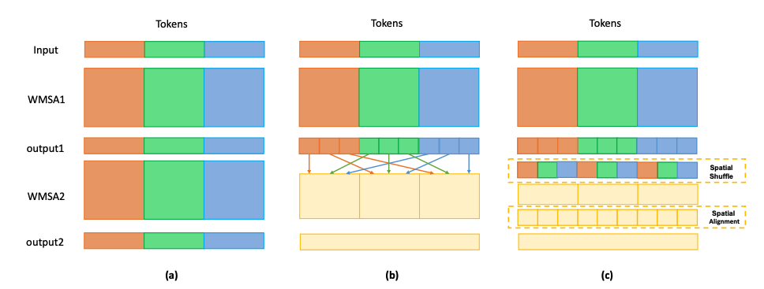
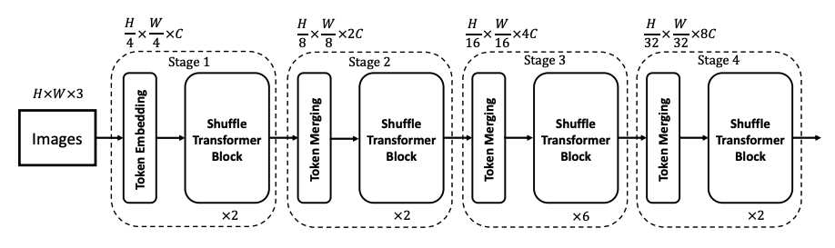

# Shuffle Transformer: Rethinking Spatial Shuffle for Vision Transformer, [arxiv](https://arxiv.org/abs/2106.03650) 

PaddlePaddle training/validation code and pretrained models for **Shuffle Transformer**.

The official pytorch implementation is [here](https://github.com/mulinmeng/Shuffle-Transformer).

This implementation is developed by [PaddleViT](https://github.com/BR-IDL/PaddleViT.git).


<p align="center">


<h4 align="center"> Shuffle Transformer Model Overview</h4>
</p>

### Update 
- Update (2022-03-24): Code is refactored and bugs are fixed.
- Update (2021-08-11): Model FLOPs and # params are uploaded.
- Update (2021-08-11): Code is released and ported weights are uploaded.

## Models Zoo
| Model                         | Acc@1 | Acc@5 | #Params | FLOPs  | Image Size | Crop_pct | Interpolation | Link         |
|-------------------------------|-------|-------|---------|--------|------------|----------|---------------|--------------|
| shuffle_vit_tiny  			| 82.39 | 96.05 | 28.5M   | 4.6G   | 224        | 0.875    | bicubic       | [google](https://drive.google.com/file/d/1ffJ-tG_CGVXztPEPQMaT_lUoc4hxFy__/view?usp=sharing)/[baidu](https://pan.baidu.com/s/19DhlLIFyPGOWtyq_c83ZGQ?pwd=8a1i) |
| shuffle_vit_small 			| 83.53 | 96.57 | 50.1M   | 8.8G   | 224        | 0.875    | bicubic       | [google](https://drive.google.com/file/d/1du9H0SKr0QH9GQjhWDOXOnhpSVpfbb8X/view?usp=sharing)/[baidu](https://pan.baidu.com/s/1rM2J8BVwxQ3kRZoHngwNZA?pwd=xwh3) |
| shuffle_vit_base  			| 83.95 | 96.91 | 88.4M   | 15.5G  | 224        | 0.875    | bicubic       | [google](https://drive.google.com/file/d/1sYh808AyTG3-_qv6nfN6gCmyagsNAE6q/view?usp=sharing)/[baidu](https://pan.baidu.com/s/1fks_IYDdnXdAkCFuYHW_Nw?pwd=1gsr) |

> *The results are evaluated on ImageNet2012 validation set.

## Data Preparation
ImageNet2012 dataset is used in the following file structure:
```
│imagenet/
├──train_list.txt
├──val_list.txt
├──train/
│  ├── n01440764
│  │   ├── n01440764_10026.JPEG
│  │   ├── n01440764_10027.JPEG
│  │   ├── ......
│  ├── ......
├──val/
│  ├── n01440764
│  │   ├── ILSVRC2012_val_00000293.JPEG
│  │   ├── ILSVRC2012_val_00002138.JPEG
│  │   ├── ......
│  ├── ......
```
- `train_list.txt`: list of relative paths and labels of training images. You can download it from: [google](https://drive.google.com/file/d/10YGzx_aO3IYjBOhInKT_gY6p0mC3beaC/view?usp=sharing)/[baidu](https://pan.baidu.com/s/1G5xYPczfs9koDb7rM4c0lA?pwd=a4vm?pwd=a4vm)
- `val_list.txt`: list of relative paths and labels of validation images. You can download it from: [google](https://drive.google.com/file/d/1aXHu0svock6MJSur4-FKjW0nyjiJaWHE/view?usp=sharing)/[baidu](https://pan.baidu.com/s/1TFGda7uBZjR7g-A6YjQo-g?pwd=kdga?pwd=kdga) 


## Usage
To use the model with pretrained weights, download the `.pdparam` weight file and change related file paths in the following python scripts. The model config files are located in `./configs/`.

For example, assume weight file is downloaded in `./shuffle_vit_tiny_patch4_window7_224.pdparams`, to use the `shuffle_vit_tiny` model in python:
```python
from config import get_config
from shuffle_transformer import build_shuffle_transformer as build_model
# config files in ./configs/
config = get_config('./configs/shuffle_vit_tiny_patch4_window7_224.yaml')
# build model
model = build_model(config)
# load pretrained weights
model_state_dict = paddle.load('./shuffle_vit_tiny_patch4_window7_224.pdparams')
model.set_state_dict(model_state_dict)
```

## Evaluation
To evaluate model performance on ImageNet2012, run the following script using command line:
```shell
sh run_eval_multi.sh
```
or
```shell
CUDA_VISIBLE_DEVICES=0,1,2,3,4,5,6,7 \
python main_multi_gpu.py \
-cfg='./configs/shuffle_vit_tiny_patch4_window7_224.yaml' \
-dataset='imagenet2012' \
-batch_size=256 \
-data_path='/dataset/imagenet' \
-eval \
-pretrained='./shuffle_vit_tiny_patch4_window7_224.pdparams' \
-amp
```
> Note: if you have only 1 GPU, change device number to `CUDA_VISIBLE_DEVICES=0` would run the evaluation on single GPU.


## Training
To train the model on ImageNet2012, run the following script using command line:
```shell
sh run_train_multi.sh
```
or
```shell
CUDA_VISIBLE_DEVICES=0,1,2,3,4,5,6,7 \
python main_multi_gpu.py \
-cfg='./configs/shuffle_vit_tiny_patch4_window7_224.yaml' \
-dataset='imagenet2012' \
-batch_size=256 \
-data_path='/dataset/imagenet' \
-amp
```
> Note: it is highly recommanded to run the training using multiple GPUs / multi-node GPUs.


## Reference
```
@article{huang2021shuffle,
  title={Shuffle Transformer: Rethinking Spatial Shuffle for Vision Transformer},
  author={Huang, Zilong and Ben, Youcheng and Luo, Guozhong and Cheng, Pei and Yu, Gang and Fu, Bin},
  journal={arXiv preprint arXiv:2106.03650},
  year={2021}
}
```
