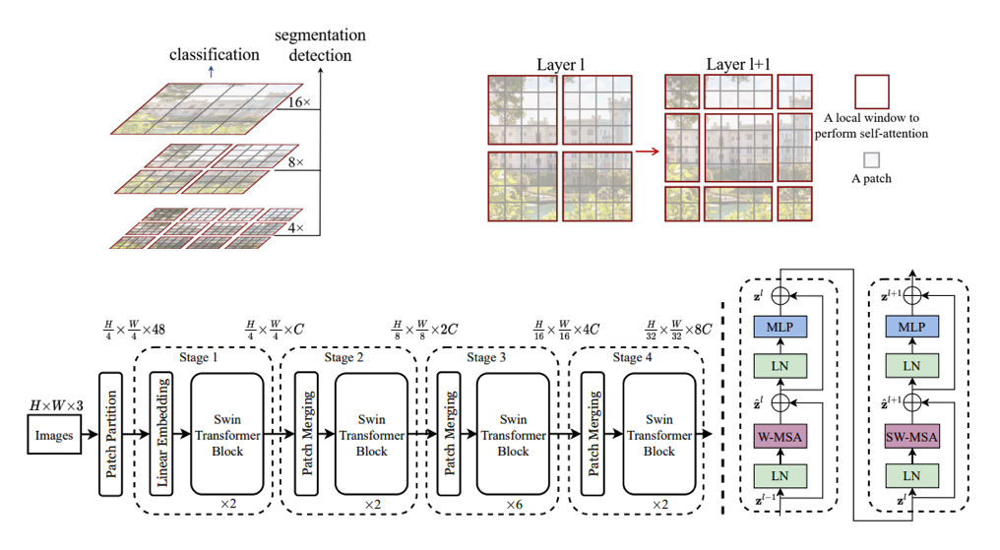

# Swin Transformer: Hierarchical Vision Transformer using Shifted Windows, [arxiv](https://arxiv.org/pdf/2103.14030.pdf) 

PaddlePaddle training/validation code and pretrained models for **Swin Transformer**.

The official pytorch implementation is [here](https://github.com/microsoft/Swin-Transformer).

This implementation is developed by [PaddleViT](https://github.com/BR-IDL/PaddleViT.git).


<p align="center">

    <h4 align="center">Swin Transformer Model Overview</h4>
</p>

### Update 
* Update (2021-09-27): Model FLOPs and num params are uploaded.
* Update (2021-09-10): More ported weights are uploaded.
* Update (2021-08-11): Code is released and ported weights are uploaded.

## Models Zoo
| Model                         | Acc@1 | Acc@5 | #Params | FLOPs  | Image Size | Crop_pct | Interpolation | Link         |
|-------------------------------|-------|-------|---------|--------|------------|----------|---------------|--------------|
| swin_t_224   					| 81.37 | 95.54 | 28.3M   | 4.4G   | 224        | 0.9      | bicubic       | [google](https://drive.google.com/file/d/1v_wzWv3TaQ0RKkKwRQwuDPzwpOb_jGEs/view?usp=sharing)/[baidu](https://pan.baidu.com/s/1tbc751RVh3fIRsrLzrmeOw)(h2ac) |
| swin_s_224   					| 83.21 | 96.32 | 49.6M   | 8.6G   | 224        | 0.9      | bicubic       | [google](https://drive.google.com/file/d/1lrODzr8zIOU9sBrH2x3zolMOS4mv4o7x/view?usp=sharing)/[baidu](https://pan.baidu.com/s/1rlXL0tjLWbWnkIt_2Ne8Jw)(ydyx) |
| swin_b_224   					| 83.60 | 96.46 | 87.7M   | 15.3G  | 224        | 0.9      | bicubic       | [google](https://drive.google.com/file/d/1hjEVODThNEDAlIqkg8C1KzUh3KsVNu6R/view?usp=sharing)/[baidu](https://pan.baidu.com/s/1ucSHBiuiG2sHAmR1N1JENQ)(h4y6) |
| swin_b_384   					| 84.48 | 96.89 | 87.7M   | 45.5G  | 384        | 1.0      | bicubic       | [google](https://drive.google.com/file/d/1szLgwhB6WJu02Me6Uyz94egk8SqKlNsd/view?usp=sharing)/[baidu](https://pan.baidu.com/s/1t0oXbqKNwpUAMJV7VTzcNw)(7nym) |
| swin_b_224_22kto1k    		| 85.27 | 97.56 | 87.7M   | 15.3G  | 224        | 0.9      | bicubic       | [google](https://drive.google.com/file/d/1FhdlheMUlJzrZ7EQobpGRxd3jt3aQniU/view?usp=sharing)/[baidu](https://pan.baidu.com/s/1KBocL_M6YNW1ZsK-GYFiNw)(6ur8) |
| swin_b_384_22kto1k    		| 86.43 | 98.07 | 87.7M   | 45.5G  | 384        | 1.0      | bicubic       | [google](https://drive.google.com/file/d/1zVwIrJmtuBSiSVQhUeblRQzCKx-yWNCA/view?usp=sharing)/[baidu](https://pan.baidu.com/s/1NziwdsEJtmjfGCeUFgtZXA)(9squ) |
| swin_l_224_22kto1k    		| 86.32 | 97.90 | 196.4M  | 34.3G  | 224        | 0.9      | bicubic       | [google](https://drive.google.com/file/d/1yo7rkxKbQ4izy2pY5oQ5QAnkyv7zKcch/view?usp=sharing)/[baidu](https://pan.baidu.com/s/1GsUJbSkGxlGsBYsayyKjVg)(nd2f) |
| swin_l_384_22kto1k    		| 87.14 | 98.23 | 196.4M  | 100.9G | 384        | 1.0      | bicubic       | [google](https://drive.google.com/file/d/1-6DEvkb-FMz72MyKtq9vSPKYBqINxoKK/view?usp=sharing)/[baidu](https://pan.baidu.com/s/1JLdS0aTl3I37oDzGKLFSqA)(5g5e) |
> *The results are evaluated on ImageNet2012 validation set.

## Notebooks
We provide a few notebooks in aistudio to help you get started:

**\*(coming soon)\***


## Requirements
- Python>=3.6
- yaml>=0.2.5
- [PaddlePaddle](https://www.paddlepaddle.org.cn/documentation/docs/en/install/index_en.html)>=2.1.0
- [yacs](https://github.com/rbgirshick/yacs)>=0.1.8

## Data 
ImageNet2012 dataset is used in the following folder structure:
```
│imagenet/
├──train/
│  ├── n01440764
│  │   ├── n01440764_10026.JPEG
│  │   ├── n01440764_10027.JPEG
│  │   ├── ......
│  ├── ......
├──val/
│  ├── n01440764
│  │   ├── ILSVRC2012_val_00000293.JPEG
│  │   ├── ILSVRC2012_val_00002138.JPEG
│  │   ├── ......
│  ├── ......
```

## Usage
To use the model with pretrained weights, download the `.pdparam` weight file and change related file paths in the following python scripts. The model config files are located in `./configs/`.

For example, assume the downloaded weight file is stored in `./swin_base_patch4_window7_224.pdparams`, to use the `swin_base_patch4_window7_224` model in python:
```python
from config import get_config
from swin import build_swin as build_model
# config files in ./configs/
config = get_config('./configs/swin_base_patch4_window7_224.yaml')
# build model
model = build_model(config)
# load pretrained weights, .pdparams is NOT needed
model_state_dict = paddle.load('./swin_base_patch4_window7_224')
model.set_dict(model_state_dict)
```

## Evaluation
To evaluate Swin Transformer model performance on ImageNet2012 with a single GPU, run the following script using command line:
```shell
sh run_eval.sh
```
or
```shell
CUDA_VISIBLE_DEVICES=0 \
python main_single_gpu.py \
    -cfg='./configs/swin_base_patch4_window7_224.yaml' \
    -dataset='imagenet2012' \
    -batch_size=16 \
    -data_path='/dataset/imagenet' \
    -eval \
    -pretrained='./swin_base_patch4_window7_224'
```

<details>

<summary>
Run evaluation using multi-GPUs:
</summary>


```shell
sh run_eval_multi.sh
```
or
```shell
CUDA_VISIBLE_DEVICES=0,1,2,3 \
python main_multi_gpu.py \
    -cfg='./configs/swin_base_patch4_window7_224.yaml' \
    -dataset='imagenet2012' \
    -batch_size=16 \
    -data_path='/dataset/imagenet' \
    -eval \
    -pretrained='./swin_base_patch4_window7_224'
```

</details>


## Training
To train the Swin Transformer model on ImageNet2012 with single GPU, run the following script using command line:
```shell
sh run_train.sh
```
or
```shell
CUDA_VISIBLE_DEVICES=0 \
python main_singel_gpu.py \
  -cfg='./configs/swin_base_patch4_window7_224.yaml' \
  -dataset='imagenet2012' \
  -batch_size=32 \
  -data_path='/dataset/imagenet' \
```

<details>

<summary>
Run training using multi-GPUs:
</summary>


```shell
sh run_train_multi.sh
```
or
```shell
CUDA_VISIBLE_DEVICES=0,1,2,3 \
python main_multi_gpu.py \
    -cfg='./configs/swin_base_patch4_window7_224.yaml' \
    -dataset='imagenet2012' \
    -batch_size=16 \
    -data_path='/dataset/imagenet' \
```

</details>


## Visualization Attention Map
**(coming soon)**

## Reference
```
@article{liu2021swin,
  title={Swin transformer: Hierarchical vision transformer using shifted windows},
  author={Liu, Ze and Lin, Yutong and Cao, Yue and Hu, Han and Wei, Yixuan and Zhang, Zheng and Lin, Stephen and Guo, Baining},
  journal={arXiv preprint arXiv:2103.14030},
  year={2021}
}
```
