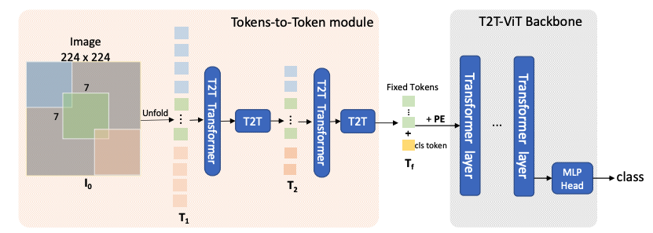

# Tokens-to-Token ViT: Training Vision Transformers from Scratch on ImageNet, [arxiv](https://arxiv.org/abs/2106.13797) 

PaddlePaddle training/validation code and pretrained models for **T2T-ViT**.

The official pytorch implementation is [here](https://github.com/yitu-opensource/T2T-ViT).

This implementation is developed by [PPViT](https://github.com/xperzy/PPViT/tree/master).


<p align="center">

    <h4 align="center">T2T-ViT Model Overview</h4>
</p>


### Update 
Update (2021-08-18): Code is released and ported weights are uploaded.

## Models Zoo
| Model                          | Acc@1 | Acc@5 | Image Size | Crop_pct | Interpolation | Link        |
|--------------------------------|-------|-------|------------|----------|---------------|--------------|
| t2t_vit_7      | 71.68 | 90.89 | 224   | 0.9      | bicubic       | [google](https://drive.google.com/file/d/1YkuPs1ku7B_udydOf_ls1LQvpJDg_c_j/view?usp=sharing)/[baidu](https://pan.baidu.com/s/1jVNsz37gatLCDaOoU3NaMA)(1hpa) |
| t2t_vit_10     | 75.15 | 92.80 | 224   | 0.9      | bicubic       | [google](https://drive.google.com/file/d/1H--55RxliMDlOCekn7FpKrHDGsUkyrJZ/view?usp=sharing)/[baidu](https://pan.baidu.com/s/1nbdb4PFMq4nsIp8HrNxLQg)(ixug) |
| t2t_vit_12     | 76.48 | 93.49 | 224   | 0.9      | bicubic       | [google](https://drive.google.com/file/d/1stnIwOwaescaEcztaF1QjI4NK4jaqN7P/view?usp=sharing)/[baidu](https://pan.baidu.com/s/1DcMzq9WeSwrS3epv6jKJXw)(qpbb) |
| t2t_vit_14     | 81.50 | 95.67 | 224   | 0.9      | bicubic       | [google](https://drive.google.com/file/d/1HSvN3Csgsy7SJbxJYbkzjUx9guftkfZ1/view?usp=sharing)/[baidu](https://pan.baidu.com/s/1wcfh22uopBv7pS7rKcH_iw)(c2u8) |
| t2t_vit_19     | 81.93 | 95.74 | 224   | 0.9      | bicubic       | [google](https://drive.google.com/file/d/1eFnhaL6I33pHCQw2BaEE0Oet9CnjmUf_/view?usp=sharing)/[baidu](https://pan.baidu.com/s/1Hpyc5hBYo1zqoXWpryegnw)(4in3) |
| t2t_vit_24     | 82.28 | 95.89 | 224   | 0.9      | bicubic       | [google](https://drive.google.com/file/d/1Z7nZCHeFp0AhIkGYcMAFkKdkGN0yXtpv/view?usp=sharing)/[baidu](https://pan.baidu.com/s/1Hpyc5hBYo1zqoXWpryegnw)(4in3) |
| t2t_vit_t_14   | 81.69 | 95.85 | 224   | 0.9      | bicubic       | [google](https://drive.google.com/file/d/16li4voStt_B8eWDXqJt7s20OT_Z8L263/view?usp=sharing)/[baidu](https://pan.baidu.com/s/1Hpyc5hBYo1zqoXWpryegnw)(4in3) |
| t2t_vit_t_19   | 82.44 | 96.08 | 224   | 0.9      | bicubic       | [google](https://drive.google.com/file/d/1Ty-42SYOu15Nk8Uo6VRTJ7J0JV_6t7zJ/view?usp=sharing)/[baidu](https://pan.baidu.com/s/1YdQd6l8tj5xMCWvcHWm7sg)(mier) |
| t2t_vit_t_24   | 82.55 | 96.07 | 224   | 0.9      | bicubic       | [google](https://drive.google.com/file/d/1cvvXrGr2buB8Np2WlVL7n_F1_CnI1qow/view?usp=sharing)/[baidu](https://pan.baidu.com/s/1BMU3KX_TRmPxQ1jN5cmWhg)(6vxc) |
| t2t_vit_14_384 | 83.34 | 96.50 | 384   | 1.0      | bicubic       | [google](https://drive.google.com/file/d/1Yuso8WD7Q8Lu_9I8dTvAvkcXXtPSkmnm/view?usp=sharing)/[baidu](https://pan.baidu.com/s/1AOMhyVRF9zPqJe-lTrd7pw)(r685) |

> *The results are evaluated on ImageNet2012 validation set.
## Notebooks
We provide a few notebooks in aistudio to help you get started:

**\*(coming soon)\***


## Requirements
- Python>=3.6
- yaml>=0.2.5
- [PaddlePaddle](https://www.paddlepaddle.org.cn/documentation/docs/en/install/index_en.html)>=2.1.0
- [yacs](https://github.com/rbgirshick/yacs)>=0.1.8

## Data 
ImageNet2012 dataset is used in the following folder structure:
```
│imagenet/
├──train/
│  ├── n01440764
│  │   ├── n01440764_10026.JPEG
│  │   ├── n01440764_10027.JPEG
│  │   ├── ......
│  ├── ......
├──val/
│  ├── n01440764
│  │   ├── ILSVRC2012_val_00000293.JPEG
│  │   ├── ILSVRC2012_val_00002138.JPEG
│  │   ├── ......
│  ├── ......
```

## Usage
To use the model with pretrained weights, download the `.pdparam` weight file and change related file paths in the following python scripts. The model config files are located in `./configs/`.

For example, assume the downloaded weight file is stored in `./t2t_vit_7.pdparams`, to use the `t2t_vit_7` model in python:
```python
from config import get_config
from t2t_vit import build_t2t_vit as build_model
# config files in ./configs/
config = get_config('./configs/t2t_vit_7.yaml')
# build model
model = build_model(config)
# load pretrained weights, .pdparams is NOT needed
model_state_dict = paddle.load('./t2t_vit_7')
model.set_dict(model_state_dict)
```

## Evaluation
To evaluate T2T-ViT model performance on ImageNet2012 with a single GPU, run the following script using command line:
```shell
sh run_eval.sh
```
or
```shell
CUDA_VISIBLE_DEVICES=0 \
python main_single_gpu.py \
    -cfg='./configs/t2t_vit_7.yaml' \
    -dataset='imagenet2012' \
    -batch_size=16 \
    -data_path='/dataset/imagenet' \
    -eval \
    -pretrained='./t2t_vit_7'
```

<details>

<summary>
Run evaluation using multi-GPUs:
</summary>


```shell
sh run_eval_multi.sh
```
or
```shell
CUDA_VISIBLE_DEVICES=0,1,2,3 \
python main_multi_gpu.py \
    -cfg='./configs/t2t_vit_7.yaml' \
    -dataset='imagenet2012' \
    -batch_size=16 \
    -data_path='/dataset/imagenet' \
    -eval \
    -pretrained='./t2t_vit_7'
```

</details>


## Training
To train the T2T-ViT Transformer model on ImageNet2012 with single GPU, run the following script using command line:
```shell
sh run_train.sh
```
or
```shell
CUDA_VISIBLE_DEVICES=0 \
python main_single_gpu.py \
  -cfg='./configs/t2t_vit_7.yaml' \
  -dataset='imagenet2012' \
  -batch_size=16 \
  -data_path='/dataset/imagenet' \
```

<details>

<summary>
Run training using multi-GPUs:
</summary>


```shell
sh run_train_multi.sh
```
or
```shell
CUDA_VISIBLE_DEVICES=0,1,2,3,4,5,6,7 \
python main_multi_gpu.py \
    -cfg='./configs/t2t_vit_7.yaml' \
    -dataset='imagenet2012' \
    -batch_size=32 \
    -data_path='/dataset/imagenet' \
```

</details>


## Visualization Attention Map
**(coming soon)**

## Reference
```
@article{yuan2021tokens,
  title={Tokens-to-token vit: Training vision transformers from scratch on imagenet},
  author={Yuan, Li and Chen, Yunpeng and Wang, Tao and Yu, Weihao and Shi, Yujun and Jiang, Zihang and Tay, Francis EH and Feng, Jiashi and Yan, Shuicheng},
  journal={arXiv preprint arXiv:2101.11986},
  year={2021}
}
```
