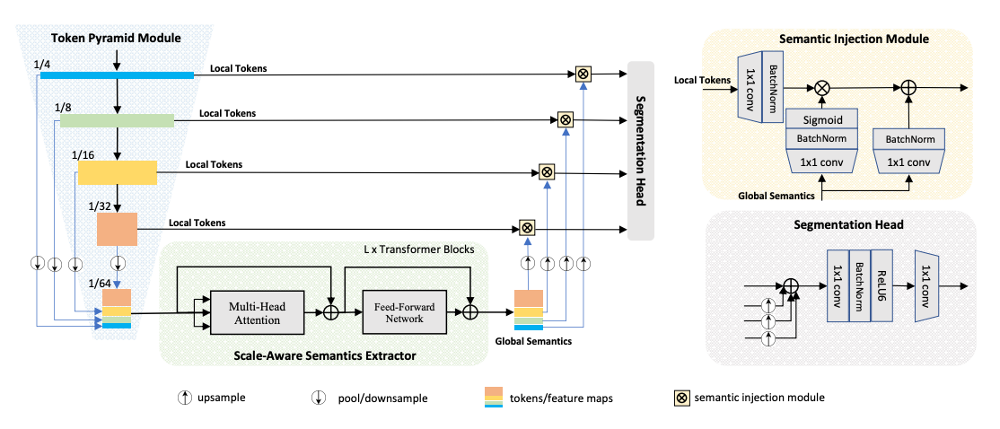

# TopFormer: Token Pyramid Transformer for Mobile Semantic Segmentation, [arxiv](https://arxiv.org/abs/2204.05525) 

PaddlePaddle training/validation code and pretrained models for the model released in CVPR2022: **TopFormer (classification backbone)**.

The official PyTorch implementation is [here](https://github.com/hustvl/TopFormer).

This implementation is developed by [PaddleViT](https://github.com/BR-IDL/PaddleViT.git).

<p align="center">

<h4 align="center">TopFormer Model Overview</h4>
</p>


### Update 
- Update (2022-04-22): Code is released and ported weights are uploaded.

## Models Zoo
| Model          | Acc@1 | Acc@5 | #Params | FLOPs  | Image Size | Crop_pct | Interpolation | Link         |
|----------------|-------|-------|---------|--------|------------|----------|---------------|--------------|
| topformer_tiny | 65.98 | 87.32 | 1.5M   | 0.13G   | 224        | 0.875      | bicubic       | [google](https://drive.google.com/file/d/1CXhp26GYA-yIUvf1PEEVuhKUt2Qq_EoS/view?usp=sharing)/[baidu](https://pan.baidu.com/s/11kLXIEHchXm2PGcOOuxXng?pwd=gvdb)             |
| topformer_small| 72.44 | 91.17 | 3.1M   | 0.24G   | 224        | 0.875      | bicubic       | [google](https://drive.google.com/file/d/1-eJLnHhwpy_6kLKOG-pAvSfKdHePurUz/view?usp=sharing)/[baidu](https://pan.baidu.com/s/1nlw_r55SwfK8ERnHs9kZwg?pwd=b69w)             |
| topformer_base | 75.25 | 92.67 | 5.1M   | 0.37G   | 224        | 0.875      | bicubic       | [google](https://drive.google.com/file/d/1jC_NVpaTRqFJ4ACnv_TTs9kH1yPvHE4H/view?usp=sharing)/[baidu](https://pan.baidu.com/s/1ep2YEQ1ZwgXFb0V6RrQq5Q?pwd=v9xm)             |


> *The results are evaluated on ImageNet2012 validation set.

## Data Preparation
ImageNet2012 dataset is used in the following file structure:
```
│imagenet/
├──train_list.txt
├──val_list.txt
├──train/
│  ├── n01440764
│  │   ├── n01440764_10026.JPEG
│  │   ├── n01440764_10027.JPEG
│  │   ├── ......
│  ├── ......
├──val/
│  ├── n01440764
│  │   ├── ILSVRC2012_val_00000293.JPEG
│  │   ├── ILSVRC2012_val_00002138.JPEG
│  │   ├── ......
│  ├── ......
```
- `train_list.txt`: list of relative paths and labels of training images. You can download it from: [google](https://drive.google.com/file/d/10YGzx_aO3IYjBOhInKT_gY6p0mC3beaC/view?usp=sharing)/[baidu](https://pan.baidu.com/s/1G5xYPczfs9koDb7rM4c0lA?pwd=a4vm?pwd=a4vm)
- `val_list.txt`: list of relative paths and labels of validation images. You can download it from: [google](https://drive.google.com/file/d/1aXHu0svock6MJSur4-FKjW0nyjiJaWHE/view?usp=sharing)/[baidu](https://pan.baidu.com/s/1TFGda7uBZjR7g-A6YjQo-g?pwd=kdga?pwd=kdga) 


## Usage
To use the model with pretrained weights, download the `.pdparam` weight file and change related file paths in the following python scripts. The model config files are located in `./configs/`.

For example, assume weight file is downloaded in `./topformer_tiny.pdparams`, to use the `topformer_tiny` model in python:
```python
from config import get_config
from topformer import build_topformer as build_model
# config files in ./configs/
config = get_config('./configs/topformer_tiny.yaml')
# build model
model = build_model(config)
# load pretrained weights
model_state_dict = paddle.load('./topformer_tiny.pdparams')
model.set_state_dict(model_state_dict)
```

## Evaluation
To evaluate model performance on ImageNet2012, run the following script using command line:
```shell
sh run_eval_multi.sh
```
or
```shell
CUDA_VISIBLE_DEVICES=0,1,2,3,4,5,6,7 \
python main_multi_gpu.py \
-cfg='./configs/topformer_tiny.yaml' \
-dataset='imagenet2012' \
-batch_size=256 \
-data_path='/dataset/imagenet' \
-eval \
-pretrained='./topformer_tiny.pdparams' \
-amp
```
> Note: if you have only 1 GPU, change device number to `CUDA_VISIBLE_DEVICES=0` would run the evaluation on single GPU.


## Training
To train the model on ImageNet2012, run the following script using command line:
```shell
sh run_train_multi.sh
```
or
```shell
CUDA_VISIBLE_DEVICES=0,1,2,3,4,5,6,7 \
python main_multi_gpu.py \
-cfg='./configs/topformer_tiny.yaml' \
-dataset='imagenet2012' \
-batch_size=256 \
-data_path='/dataset/imagenet' \
-amp
```
> Note: it is highly recommanded to run the training using multiple GPUs / multi-node GPUs.


## Reference
```
@article{zhang2022topformer,
  title={TopFormer: Token Pyramid Transformer for Mobile Semantic Segmentation},
  author={Zhang, Wenqiang and Huang, Zilong and Luo, Guozhong and Chen, Tao and Wang, Xinggang and Liu, Wenyu and Yu, Gang and Shen, Chunhua},
  journal={arXiv preprint arXiv:2204.05525},
  year={2022}
}
```

