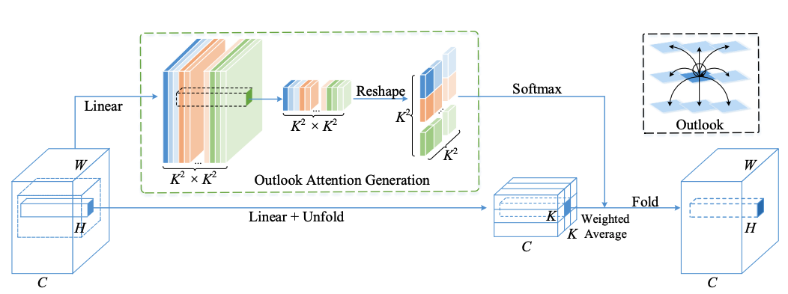

# VOLO: Vision Outlooker for Visual Recognition, [arxiv](https://arxiv.org/abs/2106.13112) 

PaddlePaddle training/validation code and pretrained models for **VOLO**.

The official pytorch implementation is [here](https://github.com/sail-sg/volo).

This implementation is developed by [PaddleViT](https://github.com/BR-IDL/PaddleViT.git).


<p align="center">

    <h4 align="center">VOLO Model Overview</h4>
</p>

### Update 
- Update (2022-04-11): Code is updated.
- Update (2021-09-27): More weights are uploaded.
- Update (2021-08-11): Code is released and ported weights are uploaded.

## Models Zoo
| Model                         | Acc@1 | Acc@5 | #Params | FLOPs  | Image Size | Crop_pct | Interpolation | Link         |
|-------------------------------|-------|-------|---------|--------|------------|----------|---------------|--------------|
| volo_d1_224  					| 84.12 | 96.78 | 26.6M   | 6.6G   | 224        | 1.0      | bicubic       | [google](https://drive.google.com/file/d/1kNNtTh7MUWJpFSDe_7IoYTOpsZk5QSR9/view?usp=sharing)/[baidu](https://pan.baidu.com/s/1EKlKl2oHi_24eaiES67Bgw?pwd=xaim) |
| volo_d1_384  					| 85.24 | 97.21 | 26.6M   | 19.5G  | 384        | 1.0      | bicubic       | [google](https://drive.google.com/file/d/1fku9-11O_gQI7UpZTjagVeND-pcHbV0C/view?usp=sharing)/[baidu](https://pan.baidu.com/s/1qZWoFA7J89i2aujPItEdDQ?pwd=rr7p) |
| volo_d2_224  					| 85.11 | 97.19 | 58.6M   | 13.7G  | 224        | 1.0      | bicubic       | [google](https://drive.google.com/file/d/1KjKzGpyPKq6ekmeEwttHlvOnQXqHK1we/view?usp=sharing)/[baidu](https://pan.baidu.com/s/1JCK0iaYtiOZA6kn7e0wzUQ?pwd=d82f) |
| volo_d2_384  					| 86.04 | 97.57 | 58.6M   | 40.7G  | 384        | 1.0      | bicubic       | [google](https://drive.google.com/file/d/1uLLbvwNK8N0y6Wrq_Bo8vyBGSVhehVmq/view?usp=sharing)/[baidu](https://pan.baidu.com/s/1e7H5aa6miGpCTCgpK0rm0w?pwd=9cf3) |
| volo_d3_224  					| 85.41 | 97.26 | 86.2M   | 19.8G  | 224        | 1.0      | bicubic       | [google](https://drive.google.com/file/d/1OtOX7C29fJ20ESKQnYGevp4euxhmXKAT/view?usp=sharing)/[baidu](https://pan.baidu.com/s/1vhARtV2wfI6EFf0Ap71xwg?pwd=a5a4) |
| volo_d3_448  					| 86.50 | 97.71 | 86.2M   | 80.3G  | 448        | 1.0      | bicubic       | [google](https://drive.google.com/file/d/1lHlYhra1NNp0dp4NWaQ9SMNNmw-AxBNZ/view?usp=sharing)/[baidu](https://pan.baidu.com/s/1Q6KiQw4Vu1GPm5RF9_eycg?pwd=uudu) |
| volo_d4_224  					| 85.89 | 97.54 | 192.8M  | 42.9G  | 224        | 1.0      | bicubic       | [google](https://drive.google.com/file/d/16oXN7xuy-mkpfeD-loIVOK95PfptHhpX/view?usp=sharing)/[baidu](https://pan.baidu.com/s/1PE83ZLd5evkKmHJ1V2KDsg?pwd=vcf2) |
| volo_d4_448  					| 86.70 | 97.85 | 192.8M  | 172.5G | 448        | 1.0      | bicubic       | [google](https://drive.google.com/file/d/1N9-1OhPewA5TBR9CX5oA10obDS8e4Cfa/view?usp=sharing)/[baidu](https://pan.baidu.com/s/1QoJ2Sqe1SK9hxbmV4uZiyg?pwd=nd4n) |
| volo_d5_224  					| 86.08 | 97.58 | 295.3M  | 70.6G  | 224        | 1.0      | bicubic       | [google](https://drive.google.com/file/d/1fcrvOGbAmKUhqJT-pU3MVJZQJIe4Qina/view?usp=sharing)/[baidu](https://pan.baidu.com/s/1nqDcXMW00v9PKr3RQI-g1w?pwd=ymdg) |
| volo_d5_448  					| 86.92 | 97.88 | 295.3M  | 283.8G | 448        | 1.0      | bicubic       | [google](https://drive.google.com/file/d/1aFXEkpfLhmQlDQHUYCuFL8SobhxUzrZX/view?usp=sharing)/[baidu](https://pan.baidu.com/s/1K4FBv6fnyMGcAXhyyybhgw?pwd=qfcc) |
| volo_d5_512  					| 87.05 | 97.97 | 295.3M  | 371.3G | 512        | 1.15     | bicubic       | [google](https://drive.google.com/file/d/1CS4-nv2c9FqOjMz7gdW5i9pguI79S6zk/view?usp=sharing)/[baidu](https://pan.baidu.com/s/16Wseyiqvv0MQJV8wwFDfSA?pwd=353h) |

> *The results are evaluated on ImageNet2012 validation set.

## Data Preparation
ImageNet2012 dataset is used in the following file structure:
```
│imagenet/
├──train_list.txt
├──val_list.txt
├──train/
│  ├── n01440764
│  │   ├── n01440764_10026.JPEG
│  │   ├── n01440764_10027.JPEG
│  │   ├── ......
│  ├── ......
├──val/
│  ├── n01440764
│  │   ├── ILSVRC2012_val_00000293.JPEG
│  │   ├── ILSVRC2012_val_00002138.JPEG
│  │   ├── ......
│  ├── ......
```
- `train_list.txt`: list of relative paths and labels of training images. You can download it from: [google](https://drive.google.com/file/d/10YGzx_aO3IYjBOhInKT_gY6p0mC3beaC/view?usp=sharing)/[baidu](https://pan.baidu.com/s/1G5xYPczfs9koDb7rM4c0lA?pwd=a4vm?pwd=a4vm)
- `val_list.txt`: list of relative paths and labels of validation images. You can download it from: [google](https://drive.google.com/file/d/1aXHu0svock6MJSur4-FKjW0nyjiJaWHE/view?usp=sharing)/[baidu](https://pan.baidu.com/s/1TFGda7uBZjR7g-A6YjQo-g?pwd=kdga?pwd=kdga) 


## Usage
To use the model with pretrained weights, download the `.pdparam` weight file and change related file paths in the following python scripts. The model config files are located in `./configs/`.

For example, assume weight file is downloaded in `./botnet50.pdparams`, to use the `botnet50` model in python:
```python
from config import get_config
from botnet import build_botnet50 as build_model
# config files in ./configs/
config = get_config('./configs/botnet50.yaml')
# build model
model = build_model(config)
# load pretrained weights
model_state_dict = paddle.load('./botnet50.pdparams')
model.set_state_dict(model_state_dict)
```

## Evaluation
To evaluate model performance on ImageNet2012, run the following script using command line:
```shell
sh run_eval_multi.sh
```
or
```shell
CUDA_VISIBLE_DEVICES=0,1,2,3,4,5,6,7 \
python main_multi_gpu.py \
-cfg='./configs/botnet50.yaml' \
-dataset='imagenet2012' \
-batch_size=256 \
-data_path='/dataset/imagenet' \
-eval \
-pretrained='./botnet50.pdparams' \
-amp
```
> Note: if you have only 1 GPU, change device number to `CUDA_VISIBLE_DEVICES=0` would run the evaluation on single GPU.


## Training
>NOTE: Now training is not fully developed, full code is coming soon

To train the model on ImageNet2012, run the following script using command line:
```shell
sh run_train_multi.sh
```
or
```shell
CUDA_VISIBLE_DEVICES=0,1,2,3,4,5,6,7 \
python main_multi_gpu.py \
-cfg='./configs/botnet50.yaml' \
-dataset='imagenet2012' \
-batch_size=256 \
-data_path='/dataset/imagenet' \
-amp
```
> Note: it is highly recommanded to run the training using multiple GPUs / multi-node GPUs.

## Reference
```
@article{yuan2021volo,
  title={Volo: Vision outlooker for visual recognition},
  author={Yuan, Li and Hou, Qibin and Jiang, Zihang and Feng, Jiashi and Yan, Shuicheng},
  journal={arXiv preprint arXiv:2106.13112},
  year={2021}
}
```
