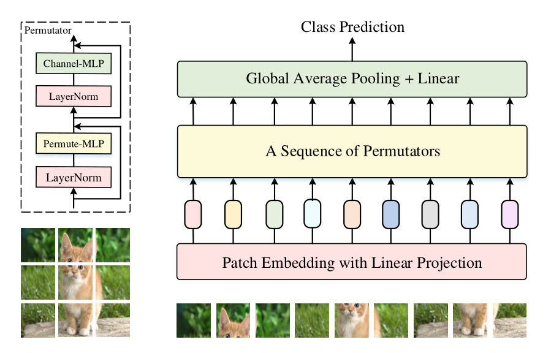
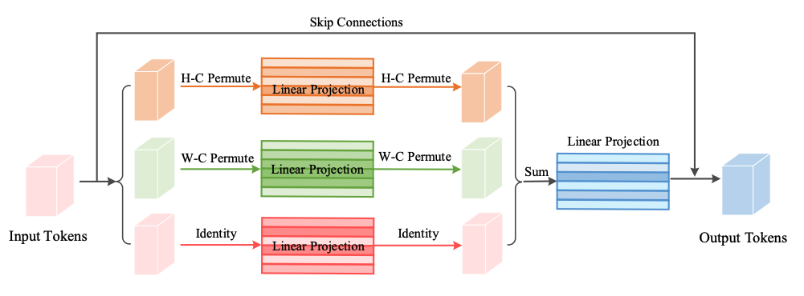

# Vision Permutator: A Permutable MLP-Like Architecture for Visual Recognition, [arxiv](https://arxiv.org/abs/2106.12368) 

PaddlePaddle training/validation code and pretrained models for **ViP**.

The official and 3rd party pytorch implementation are [here](https://github.com/Andrew-Qibin/VisionPermutator).


This implementation is developed by [PPViT](https://github.com/BR-IDL/PaddleViT/).

<p align="center">


<h4 align="center">ViP Model Overview</h4>
</p>


### Update 
- Update (2021-11-03): Code and weights are updated.
- Update (2021-09-23): Code is released and ported weights are uploaded.

## Models Zoo
| Model                         | Acc@1 | Acc@5 | #Params | FLOPs  | Image Size | Crop_pct | Interpolation | Link         |
|-------------------------------|-------|-------|---------|--------|------------|----------|---------------|--------------|
| vip_s7  						| 81.50 | 95.76 | 25.1M   | 7.0G   |    224     | 0.875    | bicubic       | [google](https://drive.google.com/file/d/16bZkqzbnN08_o15k3MzbegK8SBwfQAHF/view?usp=sharing)/[baidu](https://pan.baidu.com/s/1uY0FsNPYaM8cr3ZCdAoVkQ)(mh9b) |
| vip_m7  						| 82.75 | 96.05 | 55.3M   | 16.4G  |    224     | 0.875    | bicubic       | [google](https://drive.google.com/file/d/11lvT2OXW0CVGPZdF9dNjY_uaEIMYrmNu/view?usp=sharing)/[baidu](https://pan.baidu.com/s/1j3V0Q40iSqOY15bTKlFFRw)(hvm8) |
| vip_l7  						| 83.18 | 96.37 | 87.8M   | 24.5G  |    224     | 0.875    | bicubic       | [google](https://drive.google.com/file/d/1bK08JorLPMjYUep_TnFPKGs0e1j0UBKJ/view?usp=sharing)/[baidu](https://pan.baidu.com/s/1I5hnv3wHWEaG3vpDqaNL-w)(tjvh) |
> *The results are evaluated on ImageNet2012 validation set.
> 
> Note: ViP weights are ported from [here](https://github.com/Andrew-Qibin/VisionPermutator)


## Notebooks
We provide a few notebooks in aistudio to help you get started:

**\*(coming soon)\***


## Requirements
- Python>=3.6
- yaml>=0.2.5
- [PaddlePaddle](https://www.paddlepaddle.org.cn/documentation/docs/en/install/index_en.html)>=2.1.0
- [yacs](https://github.com/rbgirshick/yacs)>=0.1.8

## Data 
ImageNet2012 dataset is used in the following folder structure:
```
│imagenet/
├──train/
│  ├── n01440764
│  │   ├── n01440764_10026.JPEG
│  │   ├── n01440764_10027.JPEG
│  │   ├── ......
│  ├── ......
├──val/
│  ├── n01440764
│  │   ├── ILSVRC2012_val_00000293.JPEG
│  │   ├── ILSVRC2012_val_00002138.JPEG
│  │   ├── ......
│  ├── ......
```

## Usage
To use the model with pretrained weights, download the `.pdparam` weight file and change related file paths in the following python scripts. The model config files are located in `./configs/`.

For example, assume the downloaded weight file is stored in `./vip_s7.pdparams`, to use the `vip_s7` model in python:
```python
from config import get_config
from vip import build_vip as build_model
# config files in ./configs/
config = get_config('./configs/vip_s7.yaml')
# build model
model = build_model(config)
# load pretrained weights, .pdparams is NOT needed
model_state_dict = paddle.load('./vip_s7')
model.set_dict(model_state_dict)
```

## Evaluation
To evaluate ViP model performance on ImageNet2012 with a single GPU, run the following script using command line:
```shell
sh run_eval.sh
```
or
```shell
CUDA_VISIBLE_DEVICES=0 \
python main_single_gpu.py \
    -cfg='./configs/vip_s7.yaml' \
    -dataset='imagenet2012' \
    -batch_size=16 \
    -data_path='/dataset/imagenet' \
    -eval \
    -pretrained='./vip_s7'
```

<details>

<summary>
Run evaluation using multi-GPUs:
</summary>


```shell
sh run_eval_multi.sh
```
or
```shell
CUDA_VISIBLE_DEVICES=0,1,2,3 \
python main_multi_gpu.py \
    -cfg='./configs/vip_s7.yaml' \
    -dataset='imagenet2012' \
    -batch_size=16 \
    -data_path='/dataset/imagenet' \
    -eval \
    -pretrained='./vip_s7'
```

</details>

## Training
To train the ViP Transformer model on ImageNet2012 with single GPUs, run the following script using command line:
```shell
sh run_train.sh
```
or
```shell
CUDA_VISIBLE_DEVICES=0 \
python main_single_gpu.py \
  -cfg='./configs/vip_s7.yaml' \
  -dataset='imagenet2012' \
  -batch_size=32 \
  -data_path='/dataset/imagenet' \
```

<details>

<summary>
Run training using multi-GPUs:
</summary>


```shell
sh run_train_multi.sh
```
or
```shell
CUDA_VISIBLE_DEVICES=0,1,2,3 \
python main_multi_gpu.py \
    -cfg='./configs/vip_s7.yaml' \
    -dataset='imagenet2012' \
    -batch_size=16 \
    -data_path='/dataset/imagenet' \ 
```

</details>


## Visualization Attention Map
**(coming soon)**

## Reference
```
@misc{hou2021vision,
    title={Vision Permutator: A Permutable MLP-Like Architecture for Visual Recognition},
    author={Qibin Hou and Zihang Jiang and Li Yuan and Ming-Ming Cheng and Shuicheng Yan and Jiashi Feng},
    year={2021},
    eprint={2106.12368},
    archivePrefix={arXiv},
    primaryClass={cs.CV}
}
```
