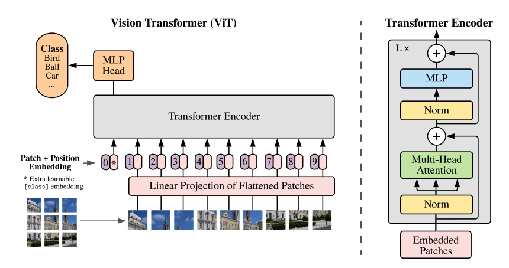

# An Image is Worth 16x16 Words: Transformers for Image Recognition at Scale, [arxiv](https://arxiv.org/abs/2010.11929) 

PaddlePaddle training/validation code and pretrained models for **ViT**.

The official TF implementation is [here](https://github.com/google-research/vision_transformer).

This implementation is developed by [PaddleViT](https://github.com/BR-IDL/PaddleViT.git).


<p align="center">

<h4 align="center">ViT Model Overview</h4>
</p>


### Update 
- Update (2021-09-27): More weights are uploaded.
- Update (2021-08-11): Code is released and ported weights are uploaded.

## Models Zoo
| Model                         | Acc@1 | Acc@5 | #Params | FLOPs  | Image Size | Crop_pct | Interpolation | Link         |
|-------------------------------|-------|-------|---------|--------|------------|----------|---------------|--------------|
| vit_base_patch32_224          | 80.68 | 95.61 | 88.2M   | 4.4G   | 224        | 0.875    | bicubic       | [google](https://drive.google.com/file/d/1DPEhEuu9sDdcmOPukQbR7ZcHq2bxx9cr/view?usp=sharing)/[baidu](https://pan.baidu.com/s/1ppOLj5SWlJmA-NjoLCoYIw)(ubyr) |
| vit_base_patch32_384          | 83.35 | 96.84 | 88.2M   | 12.7G  | 384        | 1.0      | bicubic       | [google](https://drive.google.com/file/d/1nCOSwrDiFBFmTkLEThYwjL9SfyzkKoaf/view?usp=sharing)/[baidu](https://pan.baidu.com/s/1jxnL00ocpmdiPM4fOu4lpg)(3c2f) |
| vit_base_patch16_224          | 84.58 | 97.30 | 86.4M   | 17.0G  | 224        | 0.875    | bicubic       | [google](https://drive.google.com/file/d/13D9FqU4ISsGxWXURgKW9eLOBV-pYPr-L/view?usp=sharing)/[baidu](https://pan.baidu.com/s/1ms3o2fHMQpIoVqnEHitRtA)(qv4n) |
| vit_base_patch16_384          | 85.99 | 98.00 | 86.4M   | 49.8G  | 384        | 1.0      | bicubic       | [google](https://drive.google.com/file/d/1kWKaAgneDx0QsECxtf7EnUdUZej6vSFT/view?usp=sharing)/[baidu](https://pan.baidu.com/s/15ggLdiL98RPcz__SXorrXA)(wsum) |
| vit_large_patch16_224         | 85.81 | 97.82 | 304.1M  | 59.9G  | 224        | 0.875    | bicubic       | [google](https://drive.google.com/file/d/1jgwtmtp_cDWEhZE-FuWhs7lCdpqhAMft/view?usp=sharing)/[baidu](https://pan.baidu.com/s/1HRxUJAwEiKgrWnJSjHyU0A)(1bgk) |
| vit_large_patch16_384         | 87.08 | 98.30 | 304.1M  | 175.9G | 384        | 1.0      | bicubic       | [google](https://drive.google.com/file/d/1zfw5mdiIm-mPxxQddBFxt0xX-IR-PF2U/view?usp=sharing)/[baidu](https://pan.baidu.com/s/1KvxfIpMeitgXAUZGr5HV8A)(5t91) |
| vit_large_patch32_384         | 81.51 | 96.09 | 306.5M  | 44.4G  | 384        | 1.0      | bicubic       | [google](https://drive.google.com/file/d/1Py1EX3E35jL7DComW-29Usg9788BB26j/view?usp=sharing)/[baidu](https://pan.baidu.com/s/1W8sUs0pObOGpohP4vsT05w)(ieg3) |
| | | | | | | | | |

> *The results are evaluated on ImageNet2012 validation set.

## Notebooks
We provide a few notebooks in aistudio to help you get started:

**\*(coming soon)\***


## Requirements
- Python>=3.6
- yaml>=0.2.5
- [PaddlePaddle](https://www.paddlepaddle.org.cn/documentation/docs/en/install/index_en.html)>=2.1.0
- [yacs](https://github.com/rbgirshick/yacs)>=0.1.8

## Data 
ImageNet2012 dataset is used in the following folder structure:
```
│imagenet/
├──train/
│  ├── n01440764
│  │   ├── n01440764_10026.JPEG
│  │   ├── n01440764_10027.JPEG
│  │   ├── ......
│  ├── ......
├──val/
│  ├── n01440764
│  │   ├── ILSVRC2012_val_00000293.JPEG
│  │   ├── ILSVRC2012_val_00002138.JPEG
│  │   ├── ......
│  ├── ......
```

## Usage
To use the model with pretrained weights, download the `.pdparam` weight file and change related file paths in the following python scripts. The model config files are located in `./configs/`.

For example, assume the downloaded weight file is stored in `./vit_base_patch16_224.pdparams`, to use the `vit_base_patch16_224` model in python:
```python
from config import get_config
from transformer import build_vit as build_model
# config files in ./configs/
config = get_config('./configs/vit_base_patch16_224.yaml')
# build model
model = build_model(config)
# load pretrained weights
model_state_dict = paddle.load('./vit_base_patch16_224.pdparams')
model.set_dict(model_state_dict)
```

## Evaluation
To evaluate ViT model performance on ImageNet2012 with a single GPU, run the following script using command line:
```shell
sh run_eval.sh
```
or
```shell
CUDA_VISIBLE_DEVICES=0 \
python main_single_gpu.py \
    -cfg=./configs/vit_base_patch16_224.yaml \
    -dataset=imagenet2012 \
    -batch_size=16 \
    -data_path=/path/to/dataset/imagenet/val \
    -eval \
    -pretrained=/path/to/pretrained/model/vit_base_patch16_224  # .pdparams is NOT needed
```

<details>

<summary>
Run evaluation using multi-GPUs:
</summary>


```shell
sh run_eval_multi.sh
```
or
```shell
CUDA_VISIBLE_DEVICES=0,1,2,3 \
python main_multi_gpu.py \
    -cfg=./configs/vit_base_patch16_224.yaml \
    -dataset=imagenet2012 \
    -batch_size=16 \
    -data_path=/path/to/dataset/imagenet/val \
    -eval \
    -pretrained=/path/to/pretrained/model/vit_base_patch16_224  # .pdparams is NOT needed
```

</details>


## Training
To train the ViT model on ImageNet2012 with single GPU, run the following script using command line:
```shell
sh run_train.sh
```
or
```shell
CUDA_VISIBLE_DEVICES=0 \
python main_single_gpu.py \
  -cfg=./configs/vit_base_patch16_224.yaml \
  -dataset=imagenet2012 \
  -batch_size=32 \
  -data_path=/path/to/dataset/imagenet/train
```


<details>

<summary>
Run training using multi-GPUs:
</summary>


```shell
sh run_train_multi.sh
```
or
```shell
CUDA_VISIBLE_DEVICES=0,1,2,3 \
python main_multi_gpu.py \
    -cfg=./configs/vit_base_patch16_224.yaml \
    -dataset=imagenet2012 \
    -batch_size=16 \
    -data_path=/path/to/dataset/imagenet/train
```

</details>


## Visualization Attention Map
**(coming soon)**

## Reference
```
@article{dosovitskiy2020image,
  title={An image is worth 16x16 words: Transformers for image recognition at scale},
  author={Dosovitskiy, Alexey and Beyer, Lucas and Kolesnikov, Alexander and Weissenborn, Dirk and Zhai, Xiaohua and Unterthiner, Thomas and Dehghani, Mostafa and Minderer, Matthias and Heigold, Georg and Gelly, Sylvain and others},
  journal={arXiv preprint arXiv:2010.11929},
  year={2020}
}
```
