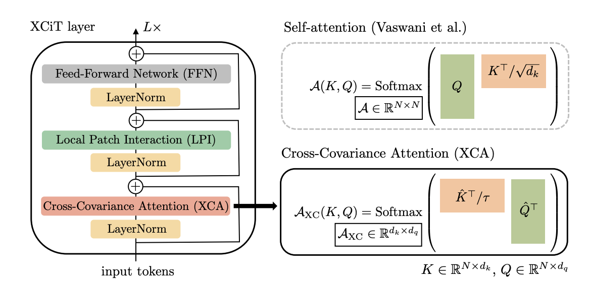

# XCiT: Cross-Covariance Image Transformer, [arxiv](https://arxiv.org/pdf/2106.09681.pdf) 

PaddlePaddle training/validation code and pretrained models for **XCiT**.

The official pytorch implementation is [here](https://github.com/facebookresearch/xcit).

This implementation is developed by [PaddleViT](https://github.com/BR-IDL/PaddleViT.git).

<p align="center">

    <h4 align="center">XCiT Model Overview</h4>
</p>


### Update 

* Update (2022-03-31): Code is refactored and more ported weights are uploaded.
* Update (2021-12-8): Code is updated and ported weights are uploaded.
* Update (2021-11-7): Code is released

## Models Zoo

| Model                       | Acc@1  | Acc@5  | #Params | FLOPs | Image Size | Crop_pct | Interpolation | Link |
| --------------------------- | ------ | ------ | ------- | ----- | ---------- | -------- | ------------- | ---- |
|xcit_nano_12_p16_224				|  69.96	|	89.76	|	3.1M	|	0.6G 	|	224  |	1.0  |	bicubic  |	[google](https://drive.google.com/drive/folders/1QCeKP4jXwMakw-lcdlVQWtmmE0Xuj3D8?usp=sharing)/[baidu](https://pan.baidu.com/s/18I5npwc3U11Orkan-8J-FQ?pwd=ecn3) |
|xcit_nano_12_p16_224_distill		|  72.32	|	90.86	|	3.1M	|	0.6G  	|	224  |	1.0  |	bicubic  |	[google](https://drive.google.com/drive/folders/1QCeKP4jXwMakw-lcdlVQWtmmE0Xuj3D8?usp=sharing)/[baidu](https://pan.baidu.com/s/18I5npwc3U11Orkan-8J-FQ?pwd=ecn3) |
|xcit_nano_12_p16_384_distill		|  75.46 	|	92.70	|	3.1M	|	1.6G  	|	384  |	1.0  |	bicubic  |	[google](https://drive.google.com/drive/folders/1QCeKP4jXwMakw-lcdlVQWtmmE0Xuj3D8?usp=sharing)/[baidu](https://pan.baidu.com/s/18I5npwc3U11Orkan-8J-FQ?pwd=ecn3) |
|xcit_nano_12_p8_224				|  73.91	|	92.17	|	3.0M	|	2.2G  	|	224  |	1.0  |	bicubic  |	[google](https://drive.google.com/drive/folders/1QCeKP4jXwMakw-lcdlVQWtmmE0Xuj3D8?usp=sharing)/[baidu](https://pan.baidu.com/s/18I5npwc3U11Orkan-8J-FQ?pwd=ecn3) |
|xcit_nano_12_p8_224_distill		|  76.32 	|	93.09	|	3.0M	|	2.2G  	|	224  |	1.0  |	bicubic  |	[google](https://drive.google.com/drive/folders/1QCeKP4jXwMakw-lcdlVQWtmmE0Xuj3D8?usp=sharing)/[baidu](https://pan.baidu.com/s/18I5npwc3U11Orkan-8J-FQ?pwd=ecn3) |
|xcit_nano_12_p8_384_distill		|  77.66 	|	93.92	|	3.0M	|	6.3G  	|	384  |	1.0  |	bicubic  |	[google](https://drive.google.com/drive/folders/1QCeKP4jXwMakw-lcdlVQWtmmE0Xuj3D8?usp=sharing)/[baidu](https://pan.baidu.com/s/18I5npwc3U11Orkan-8J-FQ?pwd=ecn3) |
|xcit_tiny_12_p16_224		    	|  77.14 	|	93.71	|	6.7M	|	1.2G  	|	224  |	1.0  |	bicubic  |	[google](https://drive.google.com/drive/folders/1QCeKP4jXwMakw-lcdlVQWtmmE0Xuj3D8?usp=sharing)/[baidu](https://pan.baidu.com/s/18I5npwc3U11Orkan-8J-FQ?pwd=ecn3) |
|xcit_tiny_12_p16_224_distill		|  78.58 	|	94.29	|	6.7M	|	1.2G  	|	224  |	1.0  |	bicubic  |	[google](https://drive.google.com/drive/folders/1QCeKP4jXwMakw-lcdlVQWtmmE0Xuj3D8?usp=sharing)/[baidu](https://pan.baidu.com/s/18I5npwc3U11Orkan-8J-FQ?pwd=ecn3) |	
|xcit_tiny_12_p16_384_distill		|  80.94 	|	95.41	|	6.7M	|	3.6G  	|	384  |	1.0  |	bicubic  |	[google](https://drive.google.com/drive/folders/1QCeKP4jXwMakw-lcdlVQWtmmE0Xuj3D8?usp=sharing)/[baidu](https://pan.baidu.com/s/18I5npwc3U11Orkan-8J-FQ?pwd=ecn3) |	
|xcit_tiny_12_p8_224		  		|  79.69 	|	95.05	|	6.7M	|	4.8G  	|	224  |	1.0  |	bicubic  |	[google](https://drive.google.com/drive/folders/1QCeKP4jXwMakw-lcdlVQWtmmE0Xuj3D8?usp=sharing)/[baidu](https://pan.baidu.com/s/18I5npwc3U11Orkan-8J-FQ?pwd=ecn3) |
|xcit_tiny_12_p8_224_distill		|  81.21 	|	95.61	|	6.7M	|	4.8G  	|	224  |	1.0  |	bicubic  |	[google](https://drive.google.com/drive/folders/1QCeKP4jXwMakw-lcdlVQWtmmE0Xuj3D8?usp=sharing)/[baidu](https://pan.baidu.com/s/18I5npwc3U11Orkan-8J-FQ?pwd=ecn3) |
|xcit_tiny_12_p8_384_distill		|  82.30 	|	96.20	|	6.7M	|	14.0G  	|	384  |	1.0  |	bicubic  |	[google](https://drive.google.com/drive/folders/1QCeKP4jXwMakw-lcdlVQWtmmE0Xuj3D8?usp=sharing)/[baidu](https://pan.baidu.com/s/18I5npwc3U11Orkan-8J-FQ?pwd=ecn3) |
|xcit_tiny_24_p16_224				|  79.45 	|	94.88	|	12.1M	|	2.3G  	|	224  |	1.0  |	bicubic  |	[google](https://drive.google.com/drive/folders/1QCeKP4jXwMakw-lcdlVQWtmmE0Xuj3D8?usp=sharing)/[baidu](https://pan.baidu.com/s/18I5npwc3U11Orkan-8J-FQ?pwd=ecn3) |	
|xcit_tiny_24_p16_224_distill		|  80.46 	|	95.22	|	12.1M	|	2.3G  	|	224  |	1.0  |	bicubic  |	[google](https://drive.google.com/drive/folders/1QCeKP4jXwMakw-lcdlVQWtmmE0Xuj3D8?usp=sharing)/[baidu](https://pan.baidu.com/s/18I5npwc3U11Orkan-8J-FQ?pwd=ecn3) |		
|xcit_tiny_24_p16_384_distill		|  82.56 	|	96.28	|	12.1M	|	6.8G  	|	384  |	1.0  |	bicubic  |	[google](https://drive.google.com/drive/folders/1QCeKP4jXwMakw-lcdlVQWtmmE0Xuj3D8?usp=sharing)/[baidu](https://pan.baidu.com/s/18I5npwc3U11Orkan-8J-FQ?pwd=ecn3) |		
|xcit_tiny_24_p8_224				|  81.89 	|	95.97	|	12.1M	|	9.1G  	|	224  |	1.0  |	bicubic  |	[google](https://drive.google.com/drive/folders/1QCeKP4jXwMakw-lcdlVQWtmmE0Xuj3D8?usp=sharing)/[baidu](https://pan.baidu.com/s/18I5npwc3U11Orkan-8J-FQ?pwd=ecn3) |	
|xcit_tiny_24_p8_224_distill		|  82.57 	|	96.17	|	12.1M	|	9.1G  	|	224  |	1.0  |	bicubic  |	[google](https://drive.google.com/drive/folders/1QCeKP4jXwMakw-lcdlVQWtmmE0Xuj3D8?usp=sharing)/[baidu](https://pan.baidu.com/s/18I5npwc3U11Orkan-8J-FQ?pwd=ecn3) |	
|xcit_tiny_24_p8_384_distill		|  83.62 	|	96.67	|	12.1M	|	26.7G  	|	384  |	1.0  |	bicubic  |	[google](https://drive.google.com/drive/folders/1QCeKP4jXwMakw-lcdlVQWtmmE0Xuj3D8?usp=sharing)/[baidu](https://pan.baidu.com/s/18I5npwc3U11Orkan-8J-FQ?pwd=ecn3) |	
|xcit_small_12_p16_224				|  81.97 	|	95.81	|	26.2M	|	4.8G  	|	224  |	1.0  |	bicubic  |	[google](https://drive.google.com/drive/folders/1QCeKP4jXwMakw-lcdlVQWtmmE0Xuj3D8?usp=sharing)/[baidu](https://pan.baidu.com/s/18I5npwc3U11Orkan-8J-FQ?pwd=ecn3) |	
|xcit_small_12_p16_224_distill		|  83.33 	|	96.41	|	26.2M	|	4.8G  	|	224  |	1.0  |	bicubic  |	[google](https://drive.google.com/drive/folders/1QCeKP4jXwMakw-lcdlVQWtmmE0Xuj3D8?usp=sharing)/[baidu](https://pan.baidu.com/s/18I5npwc3U11Orkan-8J-FQ?pwd=ecn3) |		
|xcit_small_12_p16_384_distill		|  84.71 	|	97.12	|	26.2M	|	14.2G  	|	384  |	1.0  |	bicubic  |	[google](https://drive.google.com/drive/folders/1QCeKP4jXwMakw-lcdlVQWtmmE0Xuj3D8?usp=sharing)/[baidu](https://pan.baidu.com/s/18I5npwc3U11Orkan-8J-FQ?pwd=ecn3) |		
|xcit_small_12_p8_224				|  83.33 	|	96.49	|	26.2M	|	18.7G  	|	224  |	1.0  |	bicubic  |	[google](https://drive.google.com/drive/folders/1QCeKP4jXwMakw-lcdlVQWtmmE0Xuj3D8?usp=sharing)/[baidu](https://pan.baidu.com/s/18I5npwc3U11Orkan-8J-FQ?pwd=ecn3) |	
|xcit_small_12_p8_224_distill		|  84.24 	|	96.87	|	26.2M	|	18.7G  	|	224  |	1.0  |	bicubic  |	[google](https://drive.google.com/drive/folders/1QCeKP4jXwMakw-lcdlVQWtmmE0Xuj3D8?usp=sharing)/[baidu](https://pan.baidu.com/s/18I5npwc3U11Orkan-8J-FQ?pwd=ecn3) |		
|xcit_small_12_p8_384_distill		|  85.05 	|	97.27	|	26.2M	|	55.1G  	|	384  |	1.0  |	bicubic  |	[google](https://drive.google.com/drive/folders/1QCeKP4jXwMakw-lcdlVQWtmmE0Xuj3D8?usp=sharing)/[baidu](https://pan.baidu.com/s/18I5npwc3U11Orkan-8J-FQ?pwd=ecn3) |		
|xcit_small_24_p16_224				|  82.58 	|	96.01	|	47.7M	|	9.1G  	|	224  |	1.0  |	bicubic  |	[google](https://drive.google.com/drive/folders/1QCeKP4jXwMakw-lcdlVQWtmmE0Xuj3D8?usp=sharing)/[baidu](https://pan.baidu.com/s/18I5npwc3U11Orkan-8J-FQ?pwd=ecn3) |	
|xcit_small_24_p16_224_distill		|  83.88 	|	96.73	|	47.7M	|	9.1G  	|	224  |	1.0  |	bicubic  |	[google](https://drive.google.com/drive/folders/1QCeKP4jXwMakw-lcdlVQWtmmE0Xuj3D8?usp=sharing)/[baidu](https://pan.baidu.com/s/18I5npwc3U11Orkan-8J-FQ?pwd=ecn3) |		
|xcit_small_24_p16_384_distill		|  85.10 	|	97.31	|	47.7M	|	26.6G  	|	384  |	1.0  |	bicubic  |	[google](https://drive.google.com/drive/folders/1QCeKP4jXwMakw-lcdlVQWtmmE0Xuj3D8?usp=sharing)/[baidu](https://pan.baidu.com/s/18I5npwc3U11Orkan-8J-FQ?pwd=ecn3) |		
|xcit_small_24_p8_224				|  83.83 	|	96.63	|	47.6M	|	35.7G  	|	224  |	1.0  |	bicubic  |	[google](https://drive.google.com/drive/folders/1QCeKP4jXwMakw-lcdlVQWtmmE0Xuj3D8?usp=sharing)/[baidu](https://pan.baidu.com/s/18I5npwc3U11Orkan-8J-FQ?pwd=ecn3) |	
|xcit_small_24_p8_224_distill		|  84.86 	|	97.19	|	47.6M	|	35.7G  	|	224  |	1.0  |	bicubic  |	[google](https://drive.google.com/drive/folders/1QCeKP4jXwMakw-lcdlVQWtmmE0Xuj3D8?usp=sharing)/[baidu](https://pan.baidu.com/s/18I5npwc3U11Orkan-8J-FQ?pwd=ecn3) |		
|xcit_small_24_p8_384_distill		|  85.52 	|	97.56	|	47.6M	|	104.8G  |	384  |	1.0  |	bicubic  |	[google](https://drive.google.com/drive/folders/1QCeKP4jXwMakw-lcdlVQWtmmE0Xuj3D8?usp=sharing)/[baidu](https://pan.baidu.com/s/18I5npwc3U11Orkan-8J-FQ?pwd=ecn3) |		
|xcit_medium_24_p16_224				|  82.64 	|	95.98	|	84.4M	|	16.0G  	|	224  |	1.0  |	bicubic  |	[google](https://drive.google.com/drive/folders/1QCeKP4jXwMakw-lcdlVQWtmmE0Xuj3D8?usp=sharing)/[baidu](https://pan.baidu.com/s/18I5npwc3U11Orkan-8J-FQ?pwd=ecn3) |	
|xcit_medium_24_p16_224_distill  	|  83.88 	|	96.73	|	84.4M	|	16.0G  	|	224  |	1.0  |	bicubic  |	[google](https://drive.google.com/drive/folders/1QCeKP4jXwMakw-lcdlVQWtmmE0Xuj3D8?usp=sharing)/[baidu](https://pan.baidu.com/s/18I5npwc3U11Orkan-8J-FQ?pwd=ecn3) |		
|xcit_medium_24_p16_384_distill  	|  85.82 	|	97.59	|	84.4M	|	47.1G  	|	384  |	1.0  |	bicubic  |	[google](https://drive.google.com/drive/folders/1QCeKP4jXwMakw-lcdlVQWtmmE0Xuj3D8?usp=sharing)/[baidu](https://pan.baidu.com/s/18I5npwc3U11Orkan-8J-FQ?pwd=ecn3) |		
|xcit_medium_24_p8_224				|  83.74 	|	96.40	|	84.3M	|	63.1G  	|	224  |	1.0  |	bicubic  |	[google](https://drive.google.com/drive/folders/1QCeKP4jXwMakw-lcdlVQWtmmE0Xuj3D8?usp=sharing)/[baidu](https://pan.baidu.com/s/18I5npwc3U11Orkan-8J-FQ?pwd=ecn3) |	
|xcit_medium_24_p8_224_distill		|  85.07 	|	97.27	|	84.3M	|	63.1G  	|	224  |	1.0  |	bicubic  |	[google](https://drive.google.com/drive/folders/1QCeKP4jXwMakw-lcdlVQWtmmE0Xuj3D8?usp=sharing)/[baidu](https://pan.baidu.com/s/18I5npwc3U11Orkan-8J-FQ?pwd=ecn3) |		
|xcit_medium_24_p8_384_distill		|  85.82 	|	97.59	|	84.3M	|	185.5G  |	384  |	1.0  |	bicubic  |	[google](https://drive.google.com/drive/folders/1QCeKP4jXwMakw-lcdlVQWtmmE0Xuj3D8?usp=sharing)/[baidu](https://pan.baidu.com/s/18I5npwc3U11Orkan-8J-FQ?pwd=ecn3) |		
|xcit_large_24_p16_224		 		|  82.90 	|	95.89	|	189.1M	|	35.9G  	|	224  |	1.0  |	bicubic  |	[google](https://drive.google.com/drive/folders/1QCeKP4jXwMakw-lcdlVQWtmmE0Xuj3D8?usp=sharing)/[baidu](https://pan.baidu.com/s/18I5npwc3U11Orkan-8J-FQ?pwd=ecn3) |	
|xcit_large_24_p16_224_distill		|  84.92 	|	97.13	|	189.1M	|	35.9G  	|	224  |	1.0  |	bicubic  |	[google](https://drive.google.com/drive/folders/1QCeKP4jXwMakw-lcdlVQWtmmE0Xuj3D8?usp=sharing)/[baidu](https://pan.baidu.com/s/18I5npwc3U11Orkan-8J-FQ?pwd=ecn3) |		
|xcit_large_24_p16_384_distill		|  85.67 	|	97.54	|	189.1M	|	105.5G  |	384  |	1.0  |	bicubic  |	[google](https://drive.google.com/drive/folders/1QCeKP4jXwMakw-lcdlVQWtmmE0Xuj3D8?usp=sharing)/[baidu](https://pan.baidu.com/s/18I5npwc3U11Orkan-8J-FQ?pwd=ecn3) |		
|xcit_large_24_p8_224				|  84.39 	|	96.66	|	188.9M	|	141.4G  |	224  |	1.0  |	bicubic  |	[google](https://drive.google.com/drive/folders/1QCeKP4jXwMakw-lcdlVQWtmmE0Xuj3D8?usp=sharing)/[baidu](https://pan.baidu.com/s/18I5npwc3U11Orkan-8J-FQ?pwd=ecn3) |	
|xcit_large_24_p8_224_distill		|  85.40 	|	97.40	|	188.9M	|	141.4G  |	224  |	1.0  |	bicubic  |	[google](https://drive.google.com/drive/folders/1QCeKP4jXwMakw-lcdlVQWtmmE0Xuj3D8?usp=sharing)/[baidu](https://pan.baidu.com/s/18I5npwc3U11Orkan-8J-FQ?pwd=ecn3) |		
|xcit_large_24_p8_384_distill		|  85.99 	|	97.69	|	188.9M	|	415.5G  |	384  |	1.0  |	bicubic  |	[google](https://drive.google.com/drive/folders/1QCeKP4jXwMakw-lcdlVQWtmmE0Xuj3D8?usp=sharing)/[baidu](https://pan.baidu.com/s/18I5npwc3U11Orkan-8J-FQ?pwd=ecn3) |	


> *The results are evaluated on ImageNet2012 validation set. 

## Data Preparation
ImageNet2012 dataset is used in the following file structure:
```
│imagenet/
├──train_list.txt
├──val_list.txt
├──train/
│  ├── n01440764
│  │   ├── n01440764_10026.JPEG
│  │   ├── n01440764_10027.JPEG
│  │   ├── ......
│  ├── ......
├──val/
│  ├── n01440764
│  │   ├── ILSVRC2012_val_00000293.JPEG
│  │   ├── ILSVRC2012_val_00002138.JPEG
│  │   ├── ......
│  ├── ......
```
- `train_list.txt`: list of relative paths and labels of training images. You can download it from: [google](https://drive.google.com/file/d/10YGzx_aO3IYjBOhInKT_gY6p0mC3beaC/view?usp=sharing)/[baidu](https://pan.baidu.com/s/1G5xYPczfs9koDb7rM4c0lA?pwd=a4vm?pwd=a4vm)
- `val_list.txt`: list of relative paths and labels of validation images. You can download it from: [google](https://drive.google.com/file/d/1aXHu0svock6MJSur4-FKjW0nyjiJaWHE/view?usp=sharing)/[baidu](https://pan.baidu.com/s/1TFGda7uBZjR7g-A6YjQo-g?pwd=kdga?pwd=kdga) 


## Usage
To use the model with pretrained weights, download the `.pdparam` weight file and change related file paths in the following python scripts. The model config files are located in `./configs/`.

For example, assume weight file is downloaded in `./xcit_nano_12_p16_224.pdparams`, to use the `xcit_nano_12_p16_224` model in python:
```python
from config import get_config
from xcit import build_xcit as build_model
# config files in ./configs/
config = get_config('./configs/xcit_nano_12_p16_224.yaml')
# build model
model = build_model(config)
# load pretrained weights
model_state_dict = paddle.load('./xcit_nano_12_p16_224.pdparams')
model.set_state_dict(model_state_dict)
```

## Evaluation
To evaluate model performance on ImageNet2012, run the following script using command line:
```shell
sh run_eval_multi.sh
```
or
```shell
CUDA_VISIBLE_DEVICES=0,1,2,3,4,5,6,7 \
python main_multi_gpu.py \
-cfg='./configs/xcit_nano_12_p16_224.yaml' \
-dataset='imagenet2012' \
-batch_size=256 \
-data_path='/dataset/imagenet' \
-eval \
-pretrained='./xcit_nano_12_p16_224.pdparams' \
-amp
```
> Note: if you have only 1 GPU, change device number to `CUDA_VISIBLE_DEVICES=0` would run the evaluation on single GPU.


## Training
To train the model on ImageNet2012, run the following script using command line:
```shell
sh run_train_multi.sh
```
or
```shell
CUDA_VISIBLE_DEVICES=0,1,2,3,4,5,6,7 \
python main_multi_gpu.py \
-cfg='./configs/xcit_nano_12_p16_224.yaml' \
-dataset='imagenet2012' \
-batch_size=256 \
-data_path='/dataset/imagenet' \
-amp
```
> Note: it is highly recommanded to run the training using multiple GPUs / multi-node GPUs.


## Reference

```
@article{el2021xcit,
  title={XCiT: Cross-Covariance Image Transformers},
  author={El-Nouby, Alaaeldin and Touvron, Hugo and Caron, Mathilde and Bojanowski, Piotr and Douze, Matthijs and Joulin, Armand and Laptev, Ivan and Neverova, Natalia and Synnaeve, Gabriel and Verbeek, Jakob and others},
  journal={arXiv preprint arXiv:2106.09681},
  year={2021}
}
```
