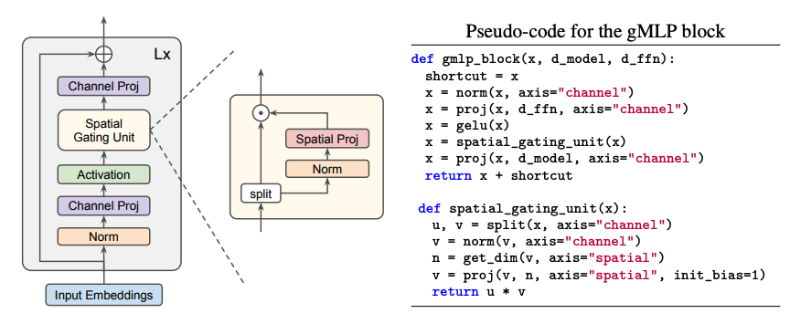

# Pay Attention to MLPs, [arxiv](https://arxiv.org/abs/2105.08050) 

PaddlePaddle training/validation code and pretrained models for **gMLP**.

The 3rd party pytorch implementation is [here](https://github.com/rwightman/pytorch-image-models/blob/master/timm/models/mlp_mixer.py).

This implementation is developed by [PaddleViT](https://github.com/BR-IDL/PaddleViT.git).


<p align="center">

    <h4 align="center">gMLP Model Overview</h4>
</p>


### Update 
- Update (2022-03-30): Code is refactored.
- Update (2021-09-27): Model FLOPs and # params are uploaded.
- Update (2021-08-11): Code is released and ported weights are uploaded.

## Models Zoo
| Model                         | Acc@1 | Acc@5 | #Params | FLOPs  | Image Size | Crop_pct | Interpolation | Link         |
|-------------------------------|-------|-------|---------|--------|------------|----------|---------------|--------------|
| gmlp_s16_224                 	| 79.64 | 94.63 | 19.4M   | 4.5G   | 224        | 0.875    | bicubic       | [google](https://drive.google.com/file/d/1TLypFly7aW0oXzEHfeDSz2Va4RHPRqe5/view?usp=sharing)/[baidu](https://pan.baidu.com/s/13UUz1eGIKyqyhtwedKLUMA?pwd=bcth) |

> *The results are evaluated on ImageNet2012 validation set.
> 
> Note: gMLP weights are ported from [timm](https://github.com/rwightman/pytorch-image-models/blob/master/timm/models/mlp_mixer.py)

## Data Preparation
ImageNet2012 dataset is used in the following file structure:
```
│imagenet/
├──train_list.txt
├──val_list.txt
├──train/
│  ├── n01440764
│  │   ├── n01440764_10026.JPEG
│  │   ├── n01440764_10027.JPEG
│  │   ├── ......
│  ├── ......
├──val/
│  ├── n01440764
│  │   ├── ILSVRC2012_val_00000293.JPEG
│  │   ├── ILSVRC2012_val_00002138.JPEG
│  │   ├── ......
│  ├── ......
```
- `train_list.txt`: list of relative paths and labels of training images. You can download it from: [google](https://drive.google.com/file/d/10YGzx_aO3IYjBOhInKT_gY6p0mC3beaC/view?usp=sharing)/[baidu](https://pan.baidu.com/s/1G5xYPczfs9koDb7rM4c0lA?pwd=a4vm?pwd=a4vm)
- `val_list.txt`: list of relative paths and labels of validation images. You can download it from: [google](https://drive.google.com/file/d/1aXHu0svock6MJSur4-FKjW0nyjiJaWHE/view?usp=sharing)/[baidu](https://pan.baidu.com/s/1TFGda7uBZjR7g-A6YjQo-g?pwd=kdga?pwd=kdga) 


## Usage
To use the model with pretrained weights, download the `.pdparam` weight file and change related file paths in the following python scripts. The model config files are located in `./configs/`.

For example, assume weight file is downloaded in `./gmlp_s16_224.pdparams`, to use the `gmlp_s16_224` model in python:
```python
from config import get_config
from gmlp import build_gmlp as build_model
# config files in ./configs/
config = get_config('./configs/gmlp_s16_224.yaml')
# build model
model = build_model(config)
# load pretrained weights
model_state_dict = paddle.load('./gmlp_s16_224.pdparams')
model.set_state_dict(model_state_dict)
```

## Evaluation
To evaluate model performance on ImageNet2012, run the following script using command line:
```shell
sh run_eval_multi.sh
```
or
```shell
CUDA_VISIBLE_DEVICES=0,1,2,3,4,5,6,7 \
python main_multi_gpu.py \
-cfg='./configs/gmlp_s16_224.yaml' \
-dataset='imagenet2012' \
-batch_size=256 \
-data_path='/dataset/imagenet' \
-eval \
-pretrained='./gmlp_s16_224.pdparams' \
-amp
```
> Note: if you have only 1 GPU, change device number to `CUDA_VISIBLE_DEVICES=0` would run the evaluation on single GPU.


## Training
To train the model on ImageNet2012, run the following script using command line:
```shell
sh run_train_multi.sh
```
or
```shell
CUDA_VISIBLE_DEVICES=0,1,2,3,4,5,6,7 \
python main_multi_gpu.py \
-cfg='./configs/gmlp_s16_224.yaml' \
-dataset='imagenet2012' \
-batch_size=256 \
-data_path='/dataset/imagenet' \
-amp
```
> Note: it is highly recommanded to run the training using multiple GPUs / multi-node GPUs.


## Reference
```
@article{liu2021pay,
  title={Pay attention to MLPs},
  author={Liu, Hanxiao and Dai, Zihang and So, David and Le, Quoc},
  journal={Advances in Neural Information Processing Systems},
  volume={34},
  year={2021}
}
```
