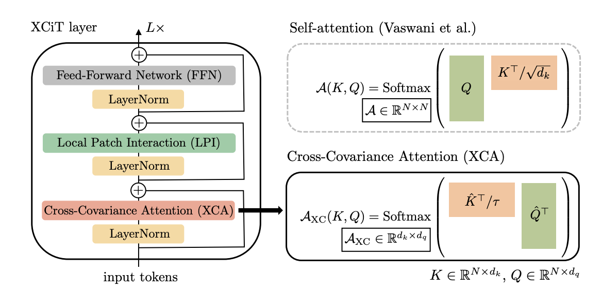

# XCiT: Cross-Covariance Image Transformer, [arxiv](https://arxiv.org/pdf/2106.09681.pdf) 

PaddlePaddle training/validation code and pretrained models for **XCiT**.

The official pytorch implementation is [here](https://github.com/facebookresearch/xcit).

This implementation is developed by [PaddleViT](https://github.com/BR-IDL/PaddleViT.git).

<p align="center">

    <h4 align="center">XCiT Model Overview</h4>
</p>


### Update 
* Update (2021-11-7): Code is released

## Models Zoo
| Model                         | Acc@1 | Acc@5 | #Params | FLOPs  | Image Size | Crop_pct | Interpolation | Link         |
|-------------------------------|-------|-------|---------|--------|------------|----------|---------------|--------------|
| xcit_nano_12_p16_224_dist |  |  |    |    | 224        | 1.0    | bicubic       | [google](https://drive.google.com/file/d/1v_wzWv3TaQ0RKkKwRQwuDPzwpOb_jGEs/view?usp=sharing)/[baidu](https://pan.baidu.com/s/1tbc751RVh3fIRsrLzrmeOw)(h2ac) |
|                           |       |       |         |       |            |          |               |                                                              |
|                           |       |       |         |       |            |          |               |                                                              |
|                           |       |       |         |       |            |          |               |                                                              |
|                           |       |       |         |       |            |          |               |                                                              |
|                           |       |       |         |       |            |          |               |                                                              |
|                           |       |       |         |       |            |          |               |                                                              |
|                           |       |       |         |       |            |          |               |                                                              |
|  |  |  |  |  |  |  |  |  |
|  |  |  |  |  |  |  |  |  |
|  |  |  |  |  |  |  |  |  |
|  |  |  |  |  |  |  |  |  |
|  |  |  |  |  |  |  |  |  |
|  |  |  |  |  |  |  |  |  |
|  |  |  |  |  |  |  |  |  |
|  |  |  |  |  |  |  |  |  |
|  |  |  |  |  |  |  |  |  |
|  |  |  |  |  |  |  |  |  |
|  |  |  |  |  |  |  |  |  |
|  |  |  |  |  |  |  |  |  |
|  |  |  |  |  |  |  |  |  |
|  |  |  |  |  |  |  |  |  |
|  |  |  |  |  |  |  |  |  |
|  |  |  |  |  |  |  |  |  |
|  |  |  |  |  |  |  |  |  |
|  |  |  |  |  |  |  |  |  |
|  |  |  |  |  |  |  |  |  |
> *The results are evaluated on ImageNet2012 validation set.

## Notebooks
We provide a few notebooks in aistudio to help you get started:

**\*(coming soon)\***


## Requirements
- Python>=3.6
- yaml>=0.2.5
- [PaddlePaddle](https://www.paddlepaddle.org.cn/documentation/docs/en/install/index_en.html)>=2.1.0
- [yacs](https://github.com/rbgirshick/yacs)>=0.1.8

## Data 
ImageNet2012 dataset is used in the following folder structure:
```
│imagenet/
├──train/
│  ├── n01440764
│  │   ├── n01440764_10026.JPEG
│  │   ├── n01440764_10027.JPEG
│  │   ├── ......
│  ├── ......
├──val/
│  ├── n01440764
│  │   ├── ILSVRC2012_val_00000293.JPEG
│  │   ├── ILSVRC2012_val_00002138.JPEG
│  │   ├── ......
│  ├── ......
```

## Usage
To use the model with pretrained weights, download the `.pdparam` weight file and change related file paths in the following python scripts. The model config files are located in `./configs/`.

For example, assume the downloaded weight file is stored in `./swin_base_patch4_window7_224.pdparams`, to use the `swin_base_patch4_window7_224` model in python:
```python
from config import get_config
from xcit import build_xcit as build_model
# config files in ./configs/
config = get_config('./configs/xcit_nano_12_p16_224.yaml')
# build model
model = build_model(config)
# load pretrained weights, .pdparams is NOT needed
model_state_dict = paddle.load('./xcit_nano_12_p16_224_dist')
model.set_dict(model_state_dict)
```

## Evaluation
To evaluate XCiT model performance on ImageNet2012 with a single GPU, run the following script using command line:
```shell
sh run_eval.sh
```
or
```shell
CUDA_VISIBLE_DEVICES=0 \
python main_single_gpu.py \
    -cfg='./configs/xcit_nano_12_p16_224.yaml' \
    -dataset='imagenet2012' \
    -batch_size=16 \
    -data_path='/dataset/imagenet' \
    -eval \
    -pretrained='./xcit_nano_12_p16_224_dist'
```

<details>

<summary>
Run evaluation using multi-GPUs:
</summary>


```shell
sh run_eval_multi.sh
```
or
```shell
CUDA_VISIBLE_DEVICES=0,1,2,3 \
python main_multi_gpu.py \
    -cfg='./configs/xcit_nano_12_p16_224.yaml' \
    -dataset='imagenet2012' \
    -batch_size=16 \
    -data_path='/dataset/imagenet' \
    -eval \
    -pretrained='./xcit_nano_12_p16_224_dist'
```

</details>


## Training
To train the XCiT model on ImageNet2012 with single GPU, run the following script using command line:
```shell
sh run_train.sh
```
or
```shell
CUDA_VISIBLE_DEVICES=0 \
python main_singel_gpu.py \
  -cfg='./configs/xcit_nano_12_p16_224.yaml' \
  -dataset='imagenet2012' \
  -batch_size=32 \
  -data_path='/dataset/imagenet' \
```

<details>

<summary>
Run training using multi-GPUs:
</summary>


```shell
sh run_train_multi.sh
```
or
```shell
CUDA_VISIBLE_DEVICES=0,1,2,3 \
python main_multi_gpu.py \
    -cfg='./configs/xcit_nano_12_p16_224.yaml' \
    -dataset='imagenet2012' \
    -batch_size=16 \
    -data_path='/dataset/imagenet' \
```

</details>


## Visualization Attention Map
**(coming soon)**

## Reference
```
@article{el2021xcit,
  title={XCiT: Cross-Covariance Image Transformers},
  author={El-Nouby, Alaaeldin and Touvron, Hugo and Caron, Mathilde and Bojanowski, Piotr and Douze, Matthijs and Joulin, Armand and Laptev, Ivan and Neverova, Natalia and Synnaeve, Gabriel and Verbeek, Jakob and others},
  journal={arXiv preprint arXiv:2106.09681},
  year={2021}
}
```
