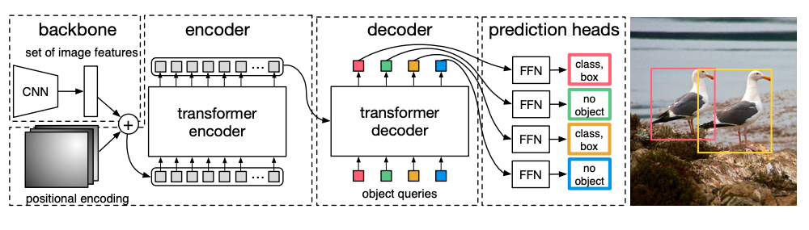

# End-to-End Object Detection with Transformers, [arxiv](https://arxiv.org/abs/2005.12872) 

PaddlePaddle training/validation code and pretrained models for **DETR**.

The official pytorch implementation is [here](https://github.com/facebookresearch/detr).

This implementation is developed by [PaddleViT](https://github.com/BR-IDL/PaddleViT).



<figcaption align = "center">DETR Model Overview</figcaption>

### Update 
Update (2021-09-01): Code is released and ported weights are uploaded.

## Models Zoo
| Model | backbone  | box_mAP | Model                                                                                                                                                       |
|-------|-----------|---------|-------------------------------------------------------------------------------------------------------------------------------------------------------------|
| DETR  | ResNet50  | 42.0    | [google](https://drive.google.com/file/d/1ruIKCqfh_MMqzq_F4L2Bv-femDMjS_ix/view?usp=sharing)/[baidu](https://pan.baidu.com/s/1J6lB1mezd6_eVW3jnmohZA)(n5gk) |
| DETR  | ResNet101 | 43.5    | [google](https://drive.google.com/file/d/11HCyDJKZLX33_fRGp4bCg1I14vrIKYW5/view?usp=sharing)/[baidu](https://pan.baidu.com/s/1_msuuAwFMNbAlMpgUq89Og)(bxz2) |

> *The results are evaluated on COCO validation set.

## Notebooks
We provide a few notebooks in aistudio to help you get started:

**\*(coming soon)\***


## Requirements
- Python>=3.6
- yaml>=0.2.5
- [PaddlePaddle](https://www.paddlepaddle.org.cn/documentation/docs/en/install/index_en.html)>=2.1.0
- [yacs](https://github.com/rbgirshick/yacs)>=0.1.8

## Data 
COCO2017 dataset is used in the following folder structure:
```
COCO dataset folder
├── annotations
│   ├── captions_train2017.json
│   ├── captions_val2017.json
│   ├── instances_train2017.json
│   ├── instances_val2017.json
│   ├── person_keypoints_train2017.json
│   └── person_keypoints_val2017.json
├── train2017
│   ├── 000000000009.jpg
│   ├── 000000000025.jpg
│   ├── 000000000030.jpg
│   ├── 000000000034.jpg
|   ...
└── val2017
    ├── 000000000139.jpg
    ├── 000000000285.jpg
    ├── 000000000632.jpg
    ├── 000000000724.jpg
    ...
```

More details about the COCO dataset can be found [here](../../docs/paddlevit-coco.md) and COCO [official dataset](https://cocodataset.org/#download).

## Usage
To use the model with pretrained weights, download the `.pdparam` weight file and change related file paths in the following python scripts. The model config files are located in `./configs/`.

For example, assume the downloaded weight file is stored in `./detr_resnet50.pdparams`, to use the `detr` model in python:
```python
from config import get_config
from detr import build_detr
# config files in ./configs/
config = get_config('./configs/detr_resnet50.yaml')
# build model
model, critertion, postprocessors = build_detr(config)
# load pretrained weights, .pdparams is NOT needed
model_state_dict = paddle.load('./detr_resnet50')
model.set_dict(model_state_dict)
```

## Evaluation
To evaluate DETR model performance on COCO2017 with a single GPU, run the following script using command line:
```shell
sh run_eval.sh
```
or
```shell
CUDA_VISIBLE_DEVICES=0 \
python main_single_gpu.py \
    -cfg='./configs/detr_resnet50.yaml' \
    -dataset='coco' \
    -batch_size=4 \
    -data_path='/dataset/coco' \
    -eval \
    -pretrained='./detr_resnet50'
```

<details>

<summary>
Run evaluation using multi-GPUs:
</summary>


```shell
sh run_eval_multi.sh
```
or
```shell
CUDA_VISIBLE_DEVICES=0,1,2,3 \
python main_multi_gpu.py \
    -cfg='./configs/detr_resnet50.yaml' \
    -dataset='coco' \
    -batch_size=4 \
    -data_path='/dataset/coco' \
    -eval \
    -pretrained='./detr_resnet50'
```

</details>


## Training
To train the DETR model on COCO2017 with single GPU, run the following script using command line:
```shell
sh run_train.sh
```
or
```shell
CUDA_VISIBLE_DEVICES=1 \
python main_single_gpu.py \
    -cfg='./configs/detr_resnet50.yaml' \
    -dataset='coco' \
    -batch_size=2 \
    -data_path='/dataset/coco' \
```

<details>

<summary>
Run training using multi-GPUs (coming soon):
</summary>


```shell
sh run_train_multi.sh
```
or
```shell
CUDA_VISIBLE_DEVICES=0,1,2,3 \
python main_multi_gpu.py \
    -cfg='./configs/detr_resnet50.yaml' \
    -dataset='coco' \
    -batch_size=2 \
    -data_path='/dataset/coco' \
```

</details>

## Visualization
coming soon

## Reference
```
@inproceedings{carion2020end,
  title={End-to-end object detection with transformers},
  author={Carion, Nicolas and Massa, Francisco and Synnaeve, Gabriel and Usunier, Nicolas and Kirillov, Alexander and Zagoruyko, Sergey},
  booktitle={European Conference on Computer Vision},
  pages={213--229},
  year={2020},
  organization={Springer}
}
```

