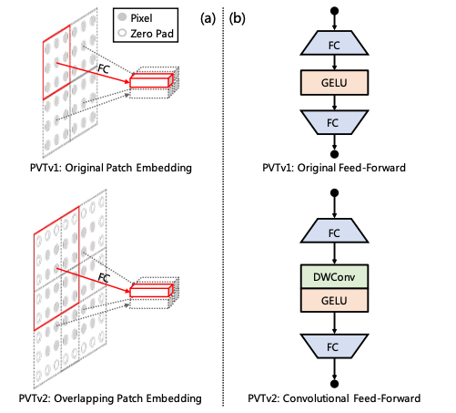

# PVTv2: Improved Baselines with Pyramid Vision Transformer, [arxiv](https://arxiv.org/abs/2106.13797) 

PaddlePaddle training/validation code and pretrained models for **PVTv2 Detection**.

The official pytorch implementation is [here](https://github.com/whai362/PVT/tree/v2/detection).

This implementation is developed by [PaddleViT](https://github.com/BR-IDL/PaddleViT).



<figcaption align = "center">PVTv2 Model Overview</figcaption>

### Update 
Update (2021-09-15): Code is released and Mask R-CNN ported weights are uploaded.

## Models Zoo
| Model | backbone  | box_mAP | Model                                                                                                                                                       |
|-------|-----------|---------|-------------------------------------------------------------------------------------------------------------------------------------------------------------|
| Mask R-CNN | pvtv2_b0 		|  38.3   | [google](https://drive.google.com/file/d/1wA324LkFtGezHJovSZ4luVqSxVt9woFc/view?usp=sharing)/[baidu](https://pan.baidu.com/s/1q67ZIDSHn9Y-HU_WoQr8OQ)(3kqb) |
| Mask R-CNN | pvtv2_b1 		|  41.8   | [google](https://drive.google.com/file/d/1alNaSmR4TSXsPpGoUZr2QQf5phYQjIzN/view?usp=sharing)/[baidu](https://pan.baidu.com/s/1aSkuDiNpxdnFWE1Wn1SWNw)(k5aq) |
| Mask R-CNN | pvtv2_b2 		|  45.2   | [google](https://drive.google.com/file/d/1tg6B5OEV4OWLsDxTCjsWgxgaSgIh4cID/view?usp=sharing)/[baidu](https://pan.baidu.com/s/1DLwxCZVZizb5HKih7RFw2w)(jh8b) |
| Mask R-CNN | pvtv2_b2_linear 	|  44.1   | [google](https://drive.google.com/file/d/1b26vxK3QVGx5ovqKir77NyY6YPgAWAEj/view?usp=sharing)/[baidu](https://pan.baidu.com/s/16T-Nyo_Jm2yDq4aoXpdnbg)(8ipt) |
| Mask R-CNN | pvtv2_b3 		|  46.9   | [google](https://drive.google.com/file/d/1H6ZUCixCaYe1AvlBkuqYoxzz4b-icJ3u/view?usp=sharing)/[baidu](https://pan.baidu.com/s/16QVsjUOXijo5d9cO3FZ39A)(je4y) |
| Mask R-CNN | pvtv2_b4 		|  47.5   | [google](https://drive.google.com/file/d/1pXQNpn0BoKqiuVaGtJL18eWG6XmdlBOL/view?usp=sharing)/[baidu](https://pan.baidu.com/s/1yhX7mpmb2wbRvWZFnUloBQ)(n3ay) |
| Mask R-CNN | pvtv2_b5 		|  47.4   | [google](https://drive.google.com/file/d/12vOyw6pUfK1NdOWBF758aAZuaf-rZLvx/view?usp=sharing)/[baidu](https://pan.baidu.com/s/1-gasQk9PqLMkrWXw4aX41g)(jzq1) |

> *The results are evaluated on COCO validation set.

## Notebooks
We provide a few notebooks in aistudio to help you get started:

**\*(coming soon)\***


## Requirements
- Python>=3.6
- yaml>=0.2.5
- [PaddlePaddle](https://www.paddlepaddle.org.cn/documentation/docs/en/install/index_en.html)>=2.1.0
- [yacs](https://github.com/rbgirshick/yacs)>=0.1.8

## Data 
COCO2017 dataset is used in the following folder structure:
```
COCO dataset folder
├── annotations
│   ├── captions_train2017.json
│   ├── captions_val2017.json
│   ├── instances_train2017.json
│   ├── instances_val2017.json
│   ├── person_keypoints_train2017.json
│   └── person_keypoints_val2017.json
├── train2017
│   ├── 000000000009.jpg
│   ├── 000000000025.jpg
│   ├── 000000000030.jpg
│   ├── 000000000034.jpg
|   ...
└── val2017
    ├── 000000000139.jpg
    ├── 000000000285.jpg
    ├── 000000000632.jpg
    ├── 000000000724.jpg
    ...
```

More details about the COCO dataset can be found [here](../../docs/paddlevit-coco.md) and COCO [official dataset](https://cocodataset.org/#download).

## Usage
To use the model with pretrained weights, download the `.pdparam` weight file and change related file paths in the following python scripts. The model config files are located in `./configs/`.

For example, assume the downloaded weight file is stored in `./ pvtv2_b0_maskrcnn.pdparams`, to use the `pvtv2` model in python:
```python
from config import get_config
from pvtv2_det import build_pvtv2_det
# config files in ./configs/
config = get_config('./configs/pvtv2_b0.yaml')
# build model
model = build_pvtv2_det(config)
# load pretrained weights, .pdparams is NOT needed
model_state_dict = paddle.load('./pvtv2_b0_maskrcnn.pdparams')
model.set_dict(model_state_dict)
```

## Evaluation
To evaluate DETR model performance on COCO2017 with a single GPU, run the following script using command line:
```shell
sh run_eval.sh
```
or
```shell
CUDA_VISIBLE_DEVICES=0 \
python main_single_gpu.py \
    -cfg='./configs/pvtv2_b0.yaml' \
    -dataset='coco' \
    -batch_size=4 \
    -data_path='/dataset/coco' \
    -eval \
    -pretrained='./pvtv2_b0_maskrcnn'
```

<details>

<summary>
Run evaluation using multi-GPUs:
</summary>


```shell
sh run_eval_multi.sh
```
or
```shell
CUDA_VISIBLE_DEVICES=0,1,2,3 \
python main_multi_gpu.py \
    -cfg='./configs/pvtv2_b0.yaml' \
    -dataset='coco' \
    -batch_size=4 \
    -data_path='/dataset/coco' \
    -eval \
    -pretrained='./pvtv2_b0_maskrcnn'
```

</details>


## Training
To train the DETR model on COCO2017 with single GPU, run the following script using command line:
```shell
sh run_train.sh
```
or
```shell
CUDA_VISIBLE_DEVICES=1 \
python main_single_gpu.py \
    -cfg='./configs/pvtv2_b0.yaml' \
    -dataset='coco' \
    -batch_size=2 \
    -data_path='/dataset/coco' \
    -pretrained='./pvtv2_b0'
```
The `pretrined` arguments sets the pretrained backbone weights, which can be found in PVTv2 classification [here](../../image_classification/PVTv2).
<details>

<summary>
Run training using multi-GPUs (coming soon):
</summary>


```shell
sh run_train_multi.sh
```
or
```shell
CUDA_VISIBLE_DEVICES=0,1,2,3 \
python main_multi_gpu.py \
    -cfg='./configs/pvtv2_b0.yaml' \
    -dataset='coco' \
    -batch_size=2 \
    -data_path='/dataset/coco' \
    -pretrained='./pvtv2_b0'
```
The `pretrined` arguments sets the pretrained backbone weights, which can be found in PVTv2 classification [here](../../image_classification/PVTv2).
</details>

## Visualization
coming soon

## Reference
```
@article{wang2021pvtv2,
  title={Pvtv2: Improved baselines with pyramid vision transformer},
  author={Wang, Wenhai and Xie, Enze and Li, Xiang and Fan, Deng-Ping and Song, Kaitao and Liang, Ding and Lu, Tong and Luo, Ping and Shao, Ling},
  journal={arXiv preprint arXiv:2106.13797},
  year={2021}
}
```
