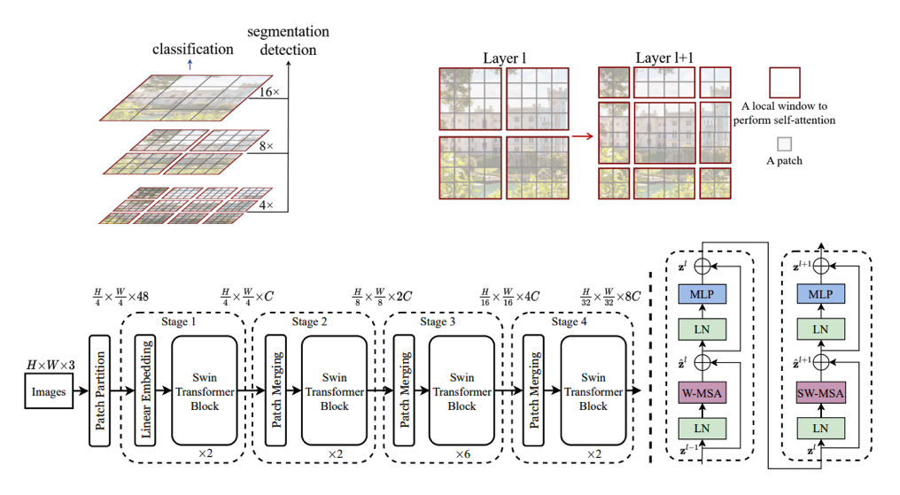

# Swin Transformer: Hierarchical Vision Transformer using Shifted Windows, [arxiv](https://arxiv.org/abs/2103.14030) 

PaddlePaddle training/validation code and pretrained models for **Swin Detection**.

The official pytorch implementation is [here](https://github.com/SwinTransformer/Swin-Transformer-Object-Detection).

This implementation is developed by [PaddleViT](https://github.com/BR-IDL/PaddleViT).



<figcaption align = "center">Swin Model Overview</figcaption>

### Update 
Update (2021-09-15): Code is released and Mask R-CNN ported weights are uploaded.

## Models Zoo
| Model | backbone  | box_mAP | Model                                                                                                                                                       |
|-------|-----------|---------|-------------------------------------------------------------------------------------------------------------------------------------------------------------|
| Mask R-CNN | Swin-T 1x |  43.7   | [google](https://drive.google.com/file/d/1OpbCH5HuIlxwakNz4PzrAlJF3CxkLSYp/view?usp=sharing)/[baidu](https://pan.baidu.com/s/18HALSo2RHMBsX-Gbsi-YOw)(qev7) |
| Mask R-CNN | Swin-T 3x |  46.0   | [google](https://drive.google.com/file/d/1oREwIk1ORhSsJcs4Y-Cfd0XrSEfPFP3-/view?usp=sharing)/[baidu](https://pan.baidu.com/s/1tw607oogDWQ7Iz91ItfuGQ)(m8fg) |
| Mask R-CNN | Swin-S 3x |  48.4   | [google](https://drive.google.com/file/d/1ZPWkz0zMzHJycHd6_s2hWDHIsW8SdZcK/view?usp=sharing)/[baidu](https://pan.baidu.com/s/1ubC5_CKSq0ExQSINohukVg)(hdw5) |

> - The results are evaluated on COCO validation set.
> - 1x/3x is the 'Lr Schd' in the official repo.

* Backbone model weights can be found in Swin Transformer Classification [here](../../image_classification/SwinTransformer)

## Notebooks
We provide a few notebooks in aistudio to help you get started:

**\*(coming soon)\***


## Requirements
- Python>=3.6
- yaml>=0.2.5
- [PaddlePaddle](https://www.paddlepaddle.org.cn/documentation/docs/en/install/index_en.html)>=2.1.0
- [yacs](https://github.com/rbgirshick/yacs)>=0.1.8

## Data 
COCO2017 dataset is used in the following folder structure:
```
COCO dataset folder
├── annotations
│   ├── captions_train2017.json
│   ├── captions_val2017.json
│   ├── instances_train2017.json
│   ├── instances_val2017.json
│   ├── person_keypoints_train2017.json
│   └── person_keypoints_val2017.json
├── train2017
│   ├── 000000000009.jpg
│   ├── 000000000025.jpg
│   ├── 000000000030.jpg
│   ├── 000000000034.jpg
|   ...
└── val2017
    ├── 000000000139.jpg
    ├── 000000000285.jpg
    ├── 000000000632.jpg
    ├── 000000000724.jpg
    ...
```

More details about the COCO dataset can be found [here](../../docs/paddlevit-coco.md) and COCO [official dataset](https://cocodataset.org/#download).

## Usage
To use the model with pretrained weights, download the `.pdparam` weight file and change related file paths in the following python scripts. The model config files are located in `./configs/`.

For example, assume the downloaded weight file is stored in `./mask_rcnn_swin_tiny_patch4_window7.pdparams`, to use the `swin_t_maskrcnn` model in python:
```python
from config import get_config
from swin_det import build_swin_det
# config files in ./configs/
config = get_config('./configs/swin_t_maskrcnn.yaml')
# build model
model = build_swin_det(config)
# load pretrained weights, .pdparams is NOT needed
model_state_dict = paddle.load('./mask_rcnn_swin_tiny_patch4_window7.pdparams')
model.set_dict(model_state_dict)
```

## Evaluation
To evaluate Swin detection model performance on COCO2017 with a single GPU, run the following script using command line:
```shell
sh run_eval.sh
```
or
```shell
CUDA_VISIBLE_DEVICES=0 \
python main_single_gpu.py \
    -cfg='./configs/swin_t_maskrcnn.yaml' \
    -dataset='coco' \
    -batch_size=4 \
    -data_path='/dataset/coco' \
    -eval \
    -pretrained='./mask_rcnn_swin_tiny_patch4_window7'
```

<details>

<summary>
Run evaluation using multi-GPUs:
</summary>


```shell
sh run_eval_multi.sh
```
or
```shell
CUDA_VISIBLE_DEVICES=0,1,2,3 \
python main_multi_gpu.py \
    -cfg='./configs/swin_t_maskrcnn.yaml' \
    -dataset='coco' \
    -batch_size=4 \
    -data_path='/dataset/coco' \
    -eval \
    -pretrained='./mask_rcnn_swin_tiny_patch4_window7'
```

</details>


## Training
To train the Swin detection model on COCO2017 with single GPU, run the following script using command line:
```shell
sh run_train.sh
```
or
```shell
CUDA_VISIBLE_DEVICES=1 \
python main_single_gpu.py \
    -cfg='./configs/swin_t_maskrcnn.yaml' \
    -dataset='coco' \
    -batch_size=2 \
    -data_path='/dataset/coco' \
    -pretrained='./swin_tiny_patch4_window7_224.pdparams'
```
The `pretrained` arguments sets the pretrained backbone weights, which can be found in Swin classification [here](../../image_classification/SwinTransformer).
<details>

<summary>
Run training using multi-GPUs:
</summary>


```shell
sh run_train_multi.sh
```
or
```shell
CUDA_VISIBLE_DEVICES=0,1,2,3 \
python main_multi_gpu.py \
    -cfg='./configs/swin_t_maskrcnn.yaml' \
    -dataset='coco' \
    -batch_size=2 \
    -data_path='/dataset/coco' \
    -pretrained='./swin_tiny_patch4_window7_224.pdparams'
```
The `pretrained` arguments sets the pretrained backbone weights, which can be found in Swin classification [here](../../image_classification/SwinTransformer).
</details>

## Visualization
coming soon

## Reference
```
@article{liu2021swin,
  title={Swin transformer: Hierarchical vision transformer using shifted windows},
  author={Liu, Ze and Lin, Yutong and Cao, Yue and Hu, Han and Wei, Yixuan and Zhang, Zheng and Lin, Stephen and Guo, Baining},
  journal={arXiv preprint arXiv:2103.14030},
  year={2021}
}
```
