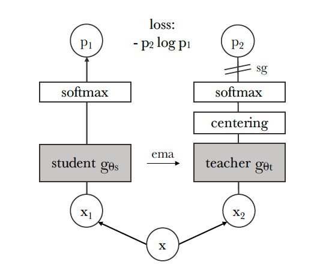

# Emerging Properties in Self-Supervised Vision Transformers, [arxiv](https://arxiv.org/abs/2104.14294) 

PaddlePaddle training/validation code and pretrained models for **DINO**.

The official pytorch implementation is [here](https://github.com/facebookresearch/dino).

This implementation is developed by [PaddleViT](https://github.com/BR-IDL/PaddleViT.git).

<p align="center">

    <h4 align="center">DINO Algorithm Overview</h4>
</p>


### Update 

* Update (2022-01-18): Code is released (Currently weight decay scheduler is not supported!)

## Models Zoo

| Model                       | Acc@1  | Acc@5  | #Params | FLOPs | Image Size | Crop_pct | Interpolation | Link |
| --------------------------- | ------ | ------ | ------- | ----- | ---------- | -------- | ------------- | ---- |
| ViT-S/16   | TBD  | TBD | TBD   | 21.0M      | 224        | 1.0      | bicubic       | [google]()/[baidu]()()     |

> *The results are evaluated on ImageNet2012 validation set.

## Notebooks

We provide a few notebooks in aistudio to help you get started:

**\*(coming soon)\***


## Requirements

- Python>=3.6
- yaml>=0.2.5
- [PaddlePaddle](https://www.paddlepaddle.org.cn/documentation/docs/en/install/index_en.html)>=2.1.0
- [yacs](https://github.com/rbgirshick/yacs)>=0.1.8

## Data 

ImageNet2012 dataset is used in the following folder structure:

```
│imagenet/
├──train/
│  ├── n01440764
│  │   ├── n01440764_10026.JPEG
│  │   ├── n01440764_10027.JPEG
│  │   ├── ......
│  ├── ......
├──val/
│  ├── n01440764
│  │   ├── ILSVRC2012_val_00000293.JPEG
│  │   ├── ILSVRC2012_val_00002138.JPEG
│  │   ├── ......
│  ├── ......
```

## Usage

To use the model with pretrained weights, download the `.pdparam` weight file and change related file paths in the following python scripts. The model config files are located in `./configs/`.

For example, assume the downloaded weight file is stored in `./vit_base_patch16_224.pdparams`, to use the `vit_base_patch16_224` model in python:

```python
from config import get_config
from transformer import build_vit as build_model
# config files in ./configs/
config = get_config('./configs/vit_base_patch16_224.yaml')
# build model
model = build_model(config)
# load pretrained weights, .pdparams is NOT needed
model_state_dict = paddle.load('./vit_base_patch16_224')
model.set_dict(model_state_dict)
```

## Evaluation

To evaluate ViT model performance on ImageNet2012 with a single GPU, run the following script using command line:

```shell
sh run_eval.sh
```

or

```shell
CUDA_VISIBLE_DEVICES=0 \
python main_single_gpu.py \
    -cfg='./configs/vit_base_patch16_224.yaml' \
    -dataset='imagenet2012' \
    -batch_size=16 \
    -data_path='/dataset/imagenet' \
    -eval \
    -pretrained='./vit_base_patch16_224.pdparams'
```

<details>


<summary>
Run evaluation using multi-GPUs:
</summary>


```shell
sh run_eval_multi.sh
```

or

```shell
CUDA_VISIBLE_DEVICES=0,1,2,3 \
python main_multi_gpu.py \
    -cfg='./configs/vit_base_patch16_224.yaml' \
    -dataset='imagenet2012' \
    -batch_size=16 \
    -data_path='/dataset/imagenet' \
    -eval \
    -pretrained='./vit_base_patch16_224.pdparams'
```

</details>


## Training

To train the ViT model on ImageNet2012 with multiple GPUs, run the following script using command line:


```shell
sh run_train_multi.sh
```

or

```shell
CUDA_VISIBLE_DEVICES=0,1,2,3 \
python main_multi_gpu.py \
    -cfg='./configs/vit_base_patch16_224.yaml' \
    -dataset='imagenet2012' \
    -batch_size=16 \
    -data_path='/dataset/imagenet' \
```


## Visualization Attention Map

**(coming soon)**

## Reference

```
@inproceedings{caron2021emerging,
  title={Emerging Properties in Self-Supervised Vision Transformers},
  author={Caron, Mathilde and Touvron, Hugo and Misra, Ishan and J\'egou, Herv\'e  and Mairal, Julien and Bojanowski, Piotr and Joulin, Armand},
  booktitle={Proceedings of the International Conference on Computer Vision (ICCV)},
  year={2021}
}
```
