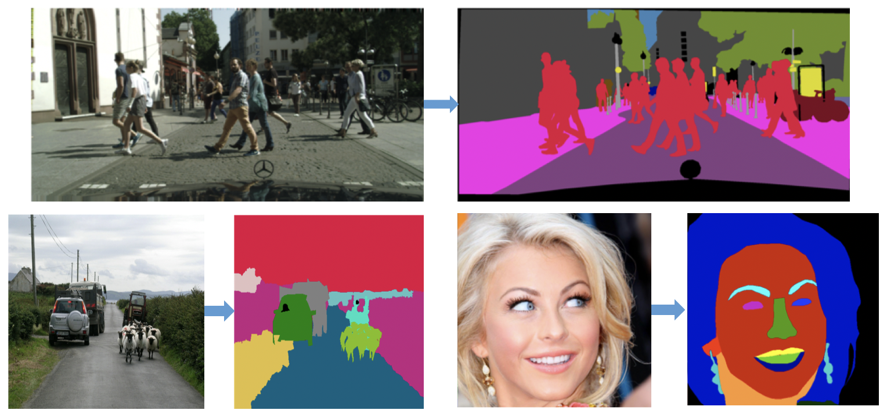

简体中文 | [English](./README.md)

# 基于 Visual Transformers 的语义分割工具

语义分割旨在将图像中的每个像素分类到指定的语义类别，包括objects（例如，自行车、汽车、人）和stuff(例如，道路、长凳、天空).

<div align="center">
  
</div>

## 环境配置
此代码在以下配置下开发：

Hardware: 1/2/4/8 GPU for training and testing
Software: Centos 6.10, CUDA=10.2 Python=3.8, Paddle=2.1.0

## 安装
1. 创建conda虚拟环境并激活环境.

```shell
conda create -n paddlevit python=3.8
conda activate ppvit
```

2. 按照官方说明安装PaddlePaddle：
```shell
conda install paddlepaddle-gpu==2.1.0 cudatoolkit=10.2 --channel https://mirrors.tuna.tsinghua.edu.cn/anaconda/cloud/Paddle/
```

3. 安装 PaddleViT
```shell
git clone https://github.com/BR-IDL/PaddleViT.git
cd PaddleViT/semantic_segmentation
pip3 install -r requirements.txt
```

## Demo
我们提供了一个demo脚本[demo.py](./demo/demo.py)，对单张图像进行推理操作，你可以将输入图像放在 `./demo/img`.
```shell
cd demo
CUDA_VISIBLE_DEVICES=0 python3 demo.py \
    --config ${CONFIG_FILE} \
    --model_path ${MODEL_PATH} \
    --pretrained_backbone ${PRETRAINED_BACKBONE} \
    --img_dir ${IMAGE_DIRECTORY} \
    --results_dir ${RESULT_DIRECTRORY}
```
举例如下：
```shell
cd demo
CUDA_VISIBLE_DEVICES=0 python3 demo.py \
    --config ../configs/setr/SETR_PUP_Large_768x768_80k_cityscapes_bs_8.yaml \
    --model_path ../pretrain_models/setr/SETR_PUP_cityscapes_b8_80k.pdparams \
    --pretrained_backbone ../pretrain_models/backbones/vit_large_patch16_224.pdparams \
    --img_dir ./img/ \
    --results_dir ./results/
```


## Quick start: 训练并验证模型

### 1. 准备数据
#### Pascal-Context 数据集
下载Pascal-Context 数据集. "pascal_context/SegmentationClassContext" 是通过运行脚本 [voc2010_to_pascalcontext.py](tools/voc2010_to_pascalcontext.py)生成的.
具体来说，从http://host.robots.ox.ac.uk/pascal/VOC/voc2010/VOCtrainval_03-May-2010.tar 下载PASCAL VOC2010 ,从https://codalabuser.blob.core.windows.net/public/trainval_merged.json 下载注释文件. 它应该具有以下基本结构:  
```
pascal_context
|-- Annotations
|-- ImageSets
|-- JPEGImages
|-- SegmentationClass
|-- SegmentationClassContext
|-- SegmentationObject
|-- trainval_merged.json
|-- voc2010_to_pascalcontext.py
```
#### ADE20K 数据集
从http://sceneparsing.csail.mit.edu/ 下载ADE20K 数据集.  它应该具有以下基本结构: 
```
ADEChallengeData2016
|-- annotations
|   |-- training
|   `-- validation
|-- images
|   |-- training
|   `-- validation
|-- objectInfo150.txt
`-- sceneCategories.txt
```
### Cityscapes 数据集
从https://www.cityscapes-dataset.com/ 下载Cityscapes数据集. **labelTrainIds.png** 用于cityscapes training, 由[convert_cityscapes.py](tools/convert_cityscapes.py)生成. 它应该具有以下基本结构:
```
cityscapes
|-- gtFine
|   |-- test
|   |-- train
|   `-- val
|-- leftImg8bit
|   |-- test
|   |-- train
|   `-- val
```
### Trans10kV2 数据集
从 [Google Drive](https://drive.google.com/file/d/1YzAAMY8xfL9BMTIDU-nFC3dcGbSIBPu5/view?usp=sharing)或者[Baidu Drive](https://pan.baidu.com/s/1P-2l-Q2brbnwRd2kXi--Dg)（code: oqms）下载 Trans10kV2 数据集。
它应该具有以下基本结构：

```
Trans10K_cls12
|-- test
|   |-- images
|   `-- masks_12
|-- train
|   |-- images
|   `-- masks_12
|-- validation
|   |-- images
|   `-- masks_12
```

### 2. 测试
#### 在单GPU上进行单尺度测试
```shell
CUDA_VISIBLE_DEVICES=0 python3  val.py  \
    --config ./configs/setr/SETR_MLA_Large_480x480_80k_pascal_context_bs_8.yaml \
    --model_path ./pretrain_models/setr/SETR_MLA_pascal_context_b8_80k.pdparams
```

#### 在单GPU上进行多尺度测试
```shell
CUDA_VISIBLE_DEVICES=0,1 python3 val.py \
    --config ./configs/setr/SETR_MLA_Large_480x480_80k_pascal_context_bs_8.yaml \
    --model_path ./pretrain_models/setr/SETR_MLA_pascal_context_b8_80k.pdparams \
    --multi_scales True
```

#### 在多GPU上进行单尺度测试 
```shell
CUDA_VISIBLE_DEVICES=0,1,2,3 python3 -u -m paddle.distributed.launch val.py \
    --config ./configs/setr/SETR_MLA_Large_480x480_80k_pascal_context_bs_8.yaml \
    --model_path ./pretrain_models/setr/SETR_MLA_pascal_context_b8_80k.pdparams
```

#### 在多GPU上进行多尺度测试
```shell                                                                                                                                                                                       
CUDA_VISIBLE_DEVICES=0,1,2,3 python3 -u -m paddle.distributed.launch val.py \
    --config ./configs/setr/SETR_MLA_Large_480x480_80k_pascal_context_bs_8.yaml \
    --model_path ./pretrain_models/setr/SETR_MLA_pascal_context_b8_80k.pdparams \
    --multi_scales True
```

> 注意:
>
> - that the `-model_path` 选项以预训练权重文件的路径作为输入 (分割模型, e.g., setr)


### 3. 训练
#### 单GPU训练

```shell
CUDA_VISIBLE_DEVICES=0 python3  train.py \
    --config ./configs/setr/SETR_MLA_Large_480x480_80k_pascal_context_bs_8.yaml
```
> 注意:
> - 可以在`-cfg`中设置的 `.yaml`文件中更改lr,图像尺寸，模型层等训练选项。所有可用的设置均在`./config.py`可以找到。

#### 多GPU训练

```shell
CUDA_VISIBLE_DEVICES=0,1,2,3 python3 -u -m paddle.distributed.launch train.py \
    --config ./configs/setr/SETR_MLA_Large_480x480_80k_pascal_context_bs_8.yaml

```
> 注意:
> - 可以在`-cfg`中设置的 `.yaml`文件中更改lr,图像尺寸，模型层等训练选项。所有可用的设置均在`./config.py`可以找到。


## Contact
如果您有任何问题, 请在我们的Github上创建一个[issue](https://github.com/BR-IDL/PaddleViT/issues).
