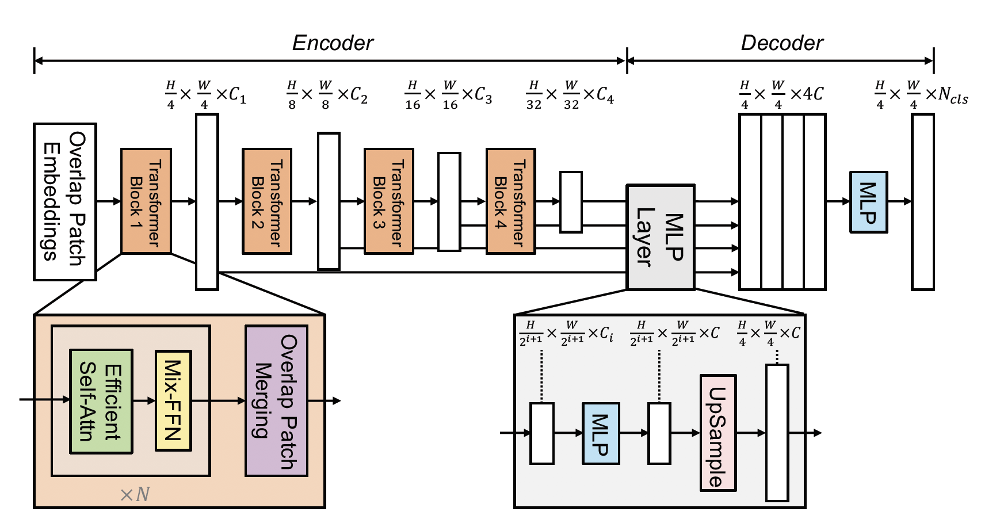

# SegFormer: Simple and Efficient Design for Semantic Segmentation with Transformers, [arxiv](https://arxiv.org/abs/2105.15203)

The official pytorch implementation is [here](https://github.com/NVlabs/SegFormer)

## Framework


## Model Zoo ##
### ADE20K ###
|Model      | Backbone  | Batch_size | Iteration | mIoU (ss) | mIoU (ms+flip) | Backbone_checkpoint | Model_checkpoint     |     ConfigFile  |
|-----------|-----------|------------|-----------|-----------|----------------|-----------------------------------------------|-----------------------------------------------------------------------|------------|
|Segformer  | MIT-B0 |     16     |     160k   |  38.37   |       -        |   TODO      |[baidu](https://pan.baidu.com/s/1WOD9jGjQRLnwKrRYzgBong)(ges9)   |  [config](segformer_mit-b0_512x512_160k_ade20k.yaml) |
|Segformer  | MIT-B1 |     16     |     160k   |  42.20   |       -        |   TODO      |[baidu](https://pan.baidu.com/s/1aiSBXMd8nP82XK7sSZ05gg)(t4n4)   |  [config](segformer_mit-b1_512x512_160k_ade20k.yaml) |
|Segformer  | MIT-B2 |     16     |     160k   |  46.38   |       -        |   TODO      |[baidu](https://pan.baidu.com/s/1wFFh-K5t46YktkfoWUOTAg)(h5ar)   |  [config](segformer_mit-b2_512x512_160k_ade20k.yaml) |
|Segformer  | MIT-B3 |     16     |     160k   |  48.35   |       -        |   TODO      |[baidu](https://pan.baidu.com/s/1IwBnDeLNyKgs-xjhlaB9ug)(g9n4)   |  [config](segformer_mit-b3_512x512_160k_ade20k.yaml) |
|Segformer  | MIT-B4 |     16     |     160k   |  49.01   |       -        |   TODO      |[baidu](https://pan.baidu.com/s/1a25fCVlwJ-1TUh9HQfx7YA)(e4xw)   |  [config](segformer_mit-b4_512x512_160k_ade20k.yaml) |
|Segformer  | MIT-B5 |     16     |     160k   |  49.73   |       -        |   TODO      |[baidu](https://pan.baidu.com/s/15kXXxKEjjtJv-BmrPnSTOw)(uczo)   |  [config](segformer_mit-b5_512x512_160k_ade20k.yaml) |

## Reference
```
@article{xie2021segformer,
  title={SegFormer: Simple and Efficient Design for Semantic Segmentation with Transformers},
  author={Xie, Enze and Wang, Wenhai and Yu, Zhiding and Anandkumar, Anima and Alvarez, Jose M and Luo, Ping},
  journal={arXiv preprint arXiv:2105.15203},
  year={2021}
}
```
