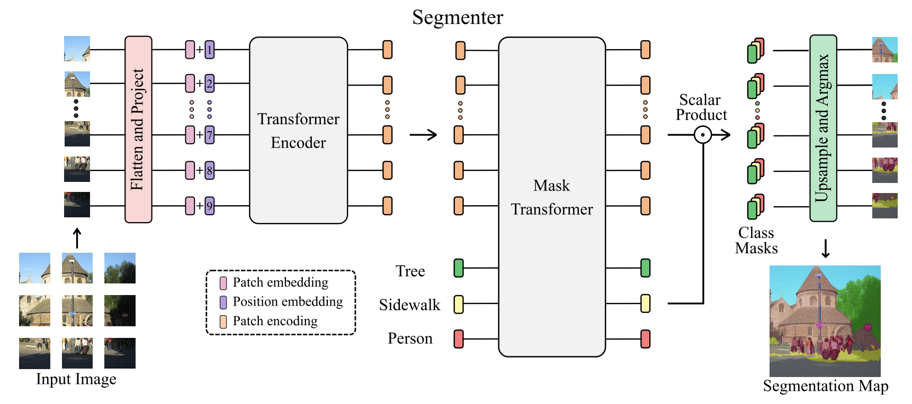

# Segmenter: Transformer for Semantic Segmentation, [arxiv](https://arxiv.org/pdf/2105.05633.pdf)

The official pytorch implementation is [here](https://github.com/rstrudel/segmenter)
## Framework


## Model Zoo ##
### ADE20K ###
|Model      | Backbone  | Batch_size | Iteration | mIoU (ss) | mIoU (ms+flip) | Backbone_checkpoint | Model_checkpoint     |     ConfigFile  |
|-----------|-----------|------------|-----------|-----------|----------------|-----------------------------------------------|-----------------------------------------------------------------------|------------|
|Segmenter  | ViT_Tiny  |     16     |     160k   |  38.45   |       -        |   TODO      |[baidu](https://pan.baidu.com/s/1nZptBc-IY_3PFramXSlovQ)(1k97)   |  [config](semantic_segmentation/configs/segmenter/segmenter_Tiny_512x512_160k_ade20k_bs_16.yaml)
|Segmenter  | ViT_Small |     16     |     160k   |  46.07   |       -        |   TODO      |[baidu](https://pan.baidu.com/s/1gKE-GEu7gX6dJsgtlvrmWg)(i8nv)   |  [config](semantic_segmentation/configs/segmenter/segmenter_small_512x512_160k_ade20k_bs_16.yaml)
|Segmenter  | ViT_Base  |     16     |     160k   |  49.08   |       -        |   TODO      |[baidu](https://pan.baidu.com/s/1qb7HEtKW0kBSP6iv-r_Hjg)(hxrl)   |  [config](semantic_segmentation/configs/segmenter/segmenter_Base_512x512_160k_ade20k_bs_16.yaml) |
|Segmenter_Linear  | DeiT_Base |     16     |     160k   |  47.34   |       -        |   TODO      |[baidu](https://pan.baidu.com/s/1Hk_zcXUIt_h5sKiAjG2Pog)(5dpv)   |  [config](semantic_segmentation/configs/segmenter/segmenter_Base_distilled_512x512_160k_ade20k_bs_16.yaml)
|Segmenter  | DeiT_Base |     16     |     160k   |  49.27   |       -        |   TODO      |[baidu](https://pan.baidu.com/s/1-TBUuvcBKNgetSJr0CsAHA)(3kim)   |  [config](semantic_segmentation/configs/segmenter/segmenter_Base_distilled_512x512_160k_ade20k_bs_16.yaml) |

## Reference
```
@article{strudel2021,
  title={Segmenter: Transformer for Semantic Segmentation},
  author={Strudel, Robin and Garcia, Ricardo and Laptev, Ivan and Schmid, Cordelia},
  journal={arXiv preprint arXiv:2105.05633},
  year={2021}
}
```
