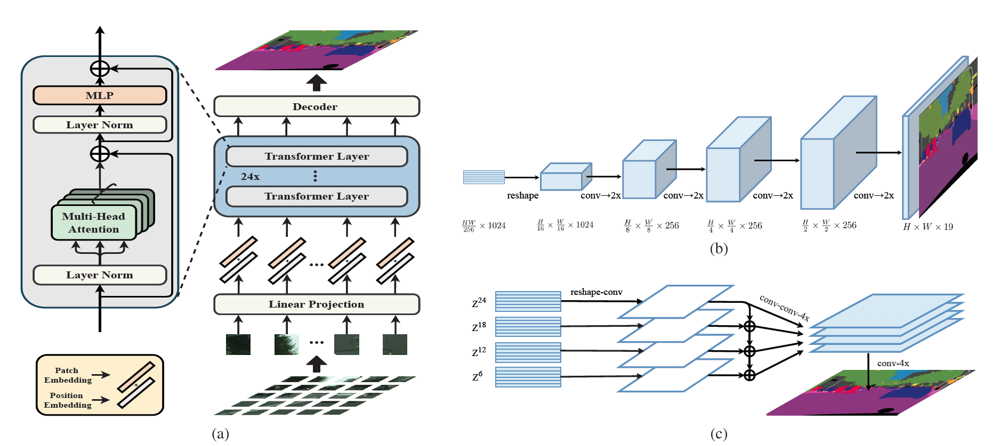

# Rethinking Semantic Segmentation from a Sequence-to-Sequence Perspective with Transformers, [arxiv](https://arxiv.org/pdf/2012.15840.pdf)

The official pytorch implementation is [here](https://github.com/fudan-zvg/SETR).
## Framework


## Model Zoo ##
### Pascal Context ###
|Model      | Backbone  | Batch_size | mIoU (ss) | mIoU (ms+flip) | Backbone_checkpoint | Model_checkpoint      |     ConfigFile  |
|-----------|-----------|------------|-----------|----------------|-----------------------------------------------|-----------------------------------------------------------------------|------------|
|SETR_Naive | ViT_large |     16     |   52.06   |      52.57        | [google](https://drive.google.com/file/d/1TPgh7Po6ayYb1DksJeZp60LGnNyznr-r/view?usp=sharing)/[baidu](https://pan.baidu.com/s/18WSi8Jp3tCZgv_Vr3V1i7A)(owoj)     | [google](https://drive.google.com/file/d/1AUyBLeoAcMH0P_QGer8tdeU44muTUOCA/view?usp=sharing)/[baidu](https://pan.baidu.com/s/11XgmgYG071n_9fSGUcPpDQ)(xdb8)   | [config](./SETR_Naive_Large_480x480_80k_pascal_context_bs_16.yaml) | 
|SETR_PUP   | ViT_large |     16     |   53.90   |       54.53    | [google](https://drive.google.com/file/d/1TPgh7Po6ayYb1DksJeZp60LGnNyznr-r/view?usp=sharing)/[baidu](https://pan.baidu.com/s/18WSi8Jp3tCZgv_Vr3V1i7A)(owoj)     | [google](https://drive.google.com/file/d/1IY-yBIrDPg5CigQ18-X2AX6Oq3rvWeXL/view?usp=sharing)/[baidu](https://pan.baidu.com/s/1v6ll68fDNCuXUIJT2Cxo-A)(6sji) | [config](./SETR_PUP_Large_480x480_80k_pascal_context_bs_16.yaml) |
|SETR_MLA   | ViT_Large |     8      |   54.39   |       55.16       | [google](https://drive.google.com/file/d/1TPgh7Po6ayYb1DksJeZp60LGnNyznr-r/view?usp=sharing)/[baidu](https://pan.baidu.com/s/18WSi8Jp3tCZgv_Vr3V1i7A)(owoj)     | [google](https://drive.google.com/file/d/1utU2h0TrtuGzRX5RMGroudiDcz0z6UmV/view)/[baidu](https://pan.baidu.com/s/1Eg0eyUQXc-Mg5fg0T3RADA)(wora)| [config](./SETR_MLA_Large_480x480_80k_pascal_context_bs_8.yaml) |
|SETR_MLA   | ViT_large |     16     |   55.01   |       55.87        | [google](https://drive.google.com/file/d/1TPgh7Po6ayYb1DksJeZp60LGnNyznr-r/view?usp=sharing)/[baidu](https://pan.baidu.com/s/18WSi8Jp3tCZgv_Vr3V1i7A)(owoj)     | [google](https://drive.google.com/file/d/1SOXB7sAyysNhI8szaBqtF8ZoxSaPNvtl/view?usp=sharing)/[baidu](https://pan.baidu.com/s/1jskpqYbazKY1CKK3iVxAYA)(76h2) | [config](./SETR_MLA_Large_480x480_80k_pascal_context_bs_16.yaml) |

### Cityscapes ###
|Model      | Backbone  | Batch_size | Iteration | mIoU (ss) | mIoU (ms+flip) | Backbone_checkpoint | Model_checkpoint     |     ConfigFile  |
|-----------|-----------|------------|-----------|-----------|----------------|-----------------------------------------------|-----------------------------------------------------------------------|------------|
|SETR_Naive | ViT_Large |     8      |     40k   |   76.71   |       79.03        | [google](https://drive.google.com/file/d/1TPgh7Po6ayYb1DksJeZp60LGnNyznr-r/view?usp=sharing)/[baidu](https://pan.baidu.com/s/18WSi8Jp3tCZgv_Vr3V1i7A)(owoj)      | [google](https://drive.google.com/file/d/1QialLNMmvWW8oi7uAHhJZI3HSOavV4qj/view?usp=sharing)/[baidu](https://pan.baidu.com/s/1F3IB31QVlsohqW8cRNphqw)(g7ro)  |  [config](./SETR_Naive_Large_768x768_40k_cityscapes_bs_8.yaml)| 
|SETR_Naive | ViT_Large |     8      |     80k   |   77.31   |       79.43      | [google](https://drive.google.com/file/d/1TPgh7Po6ayYb1DksJeZp60LGnNyznr-r/view?usp=sharing)/[baidu](https://pan.baidu.com/s/18WSi8Jp3tCZgv_Vr3V1i7A)(owoj)      | [google](https://drive.google.com/file/d/1RJeSGoDaOP-fM4p1_5CJxS5ku_yDXXLV/view?usp=sharing)/[baidu](https://pan.baidu.com/s/1XbHPBfaHS56HlaMJmdJf1A)(wn6q)   |  [config](./SETR_Naive_Large_768x768_80k_cityscapes_bs_8.yaml)| 
|SETR_PUP   | ViT_Large |     8      |     40k   |   77.92   |       79.63        |  [google](https://drive.google.com/file/d/1TPgh7Po6ayYb1DksJeZp60LGnNyznr-r/view?usp=sharing)/[baidu](https://pan.baidu.com/s/18WSi8Jp3tCZgv_Vr3V1i7A)(owoj)     | [google](https://drive.google.com/file/d/12rMFMOaOYSsWd3f1hkrqRc1ThNT8K8NG/view?usp=sharing)/[baidu](https://pan.baidu.com/s/1H8b3valvQ2oLU9ZohZl_6Q)(zmoi)    | [config](./SETR_PUP_Large_768x768_40k_cityscapes_bs_8.yaml)| 
|SETR_PUP   | ViT_Large |     8      |     80k   |   78.81   |       80.43     |   [google](https://drive.google.com/file/d/1TPgh7Po6ayYb1DksJeZp60LGnNyznr-r/view?usp=sharing)/[baidu](https://pan.baidu.com/s/18WSi8Jp3tCZgv_Vr3V1i7A)(owoj)    | [baidu](https://pan.baidu.com/s/1tkMhRzO0XHqKYM0lojE3_g)(f793)    | [config](./SETR_PUP_Large_768x768_80k_cityscapes_bs_8.yaml)| 
|SETR_MLA   | ViT_Large |     8      |     40k   |   76.70    |       78.96      |   [google](https://drive.google.com/file/d/1TPgh7Po6ayYb1DksJeZp60LGnNyznr-r/view?usp=sharing)/[baidu](https://pan.baidu.com/s/18WSi8Jp3tCZgv_Vr3V1i7A)(owoj)    | [baidu](https://pan.baidu.com/s/1sUug5cMKSo6mO7BEI4EV_w)(qaiw)    | [config](./SETR_MLA_Large_768x768_40k_cityscapes_bs_8.yaml)| 
|SETR_MLA   | ViT_Large |     8      |     80k   |  77.26     |       79.27      |   [google](https://drive.google.com/file/d/1TPgh7Po6ayYb1DksJeZp60LGnNyznr-r/view?usp=sharing)/[baidu](https://pan.baidu.com/s/18WSi8Jp3tCZgv_Vr3V1i7A)(owoj)    | [baidu](https://pan.baidu.com/s/1IqPZ6urdQb_0pbdJW2i3ow)(6bgj)    | [config](./SETR_MLA_Large_768x768_80k_cityscapes_bs_8.yaml)| 


### ADE20K ###
|Model      | Backbone  | Batch_size | Iteration | mIoU (ss) | mIoU (ms+flip) | Backbone_checkpoint | Model_checkpoint     |     ConfigFile  |
|-----------|-----------|------------|-----------|-----------|----------------|-----------------------------------------------|-----------------------------------------------------------------------|------------|
|SETR_Naive | ViT_Large |     16      |     160k   | 47.57   |      48.12        |   [google](https://drive.google.com/file/d/1TPgh7Po6ayYb1DksJeZp60LGnNyznr-r/view?usp=sharing)/[baidu](https://pan.baidu.com/s/18WSi8Jp3tCZgv_Vr3V1i7A)(owoj)    | [baidu](https://pan.baidu.com/s/1_AY6BMluNn71UiMNZbnKqQ)(lugq)   | [config](./SETR_Naive_Large_512x512_160k_ade20k_bs_16.yaml)| 
|SETR_PUP   | ViT_Large |     16      |     160k   |  49.12   |       -        |   [google](https://drive.google.com/file/d/1TPgh7Po6ayYb1DksJeZp60LGnNyznr-r/view?usp=sharing)/[baidu](https://pan.baidu.com/s/18WSi8Jp3tCZgv_Vr3V1i7A)(owoj)    | [baidu](https://pan.baidu.com/s/1N83rG0EZSksMGZT3njaspg)(udgs)    | [config](./SETR_PUP_Large_512x512_160k_ade20k_bs_16.yaml)| 
|SETR_MLA   | ViT_Large |     8      |     160k   |  47.80   |       -        |   [google](https://drive.google.com/file/d/1TPgh7Po6ayYb1DksJeZp60LGnNyznr-r/view?usp=sharing)/[baidu](https://pan.baidu.com/s/18WSi8Jp3tCZgv_Vr3V1i7A)(owoj)    | [baidu](https://pan.baidu.com/s/1L83sdXWL4XT02dvH2WFzCA)(mrrv)    | [config](./SETR_MLA_Large_512x512_160k_ade20k_bs_8.yaml)| 


## Reference
```
@inproceedings{zheng2021rethinking,
  title={Rethinking semantic segmentation from a sequence-to-sequence perspective with transformers},
  author={Zheng, Sixiao and Lu, Jiachen and Zhao, Hengshuang and Zhu, Xiatian and Luo, Zekun and Wang, Yabiao and Fu, Yanwei and Feng, Jianfeng and Xiang, Tao and Torr, Philip HS and others},
  booktitle={Proceedings of the IEEE/CVF Conference on Computer Vision and Pattern Recognition},
  pages={6881--6890},
  year={2021}
}
```

