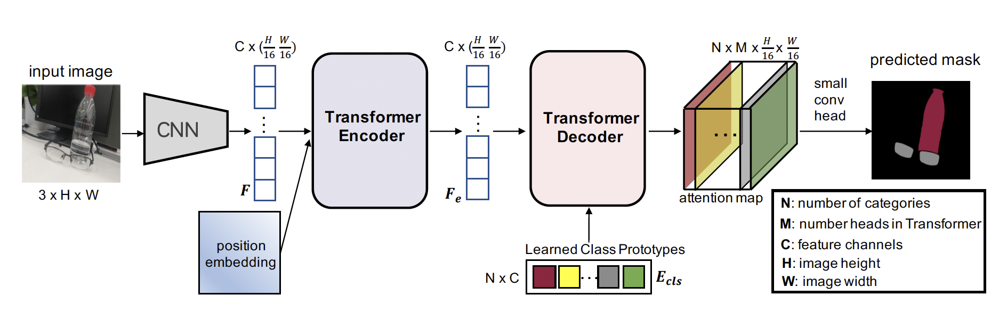

# Segmenting Transparent Object in the Wild with Transformer, [arxiv](https://arxiv.org/pdf/2101.08461.pdf)

The official pytorch implementation is [here](https://github.com/xieenze/Trans2Seg)
## Framework


## Model Zoo ##

### Trans10kV2 ###
|Model      | Backbone  | Batch_size | Iteration | mIoU (ss) | mIoU (ms+flip) | Backbone_checkpoint | Model_checkpoint     |     ConfigFile  |
|-----------|-----------|------------|-----------|-----------|----------------|-----------------------------------------------|-----------------------------------------------------------------------|------------|
|Trans2seg_Medium | Resnet50c |     16      |    80k    |  72.25  |      -        |   [google](https://drive.google.com/file/d/1C6nMg6DgQ73wzF21UwDVxmkcRTeKngnK/view?usp=sharing)/[baidu](https://pan.baidu.com/s/1hs0tbSGIeMLLGMq05NN--w)(4dd5)    | [google](https://drive.google.com/file/d/1zGEBEN27CQMgZBYqqAg_agJE6CPLOpYW/view?usp=sharing)/[baidu](https://pan.baidu.com/s/102GUBeoEPMqMEqF3smgyCA)(qcb0)   | [config](semantic_segmentation/configs/trans2seg/Trans2Seg_medium_512x512_80k_trans10kv2_bs_16.yaml)| 

## Reference
```
@article{xie2021segmenting,
  title={Segmenting transparent object in the wild with transformer},
  author={Xie, Enze and Wang, Wenjia and Wang, Wenhai and Sun, Peize and Xu, Hang and Liang, Ding and Luo, Ping},
  journal={arXiv preprint arXiv:2101.08461},
  year={2021}
}

```
